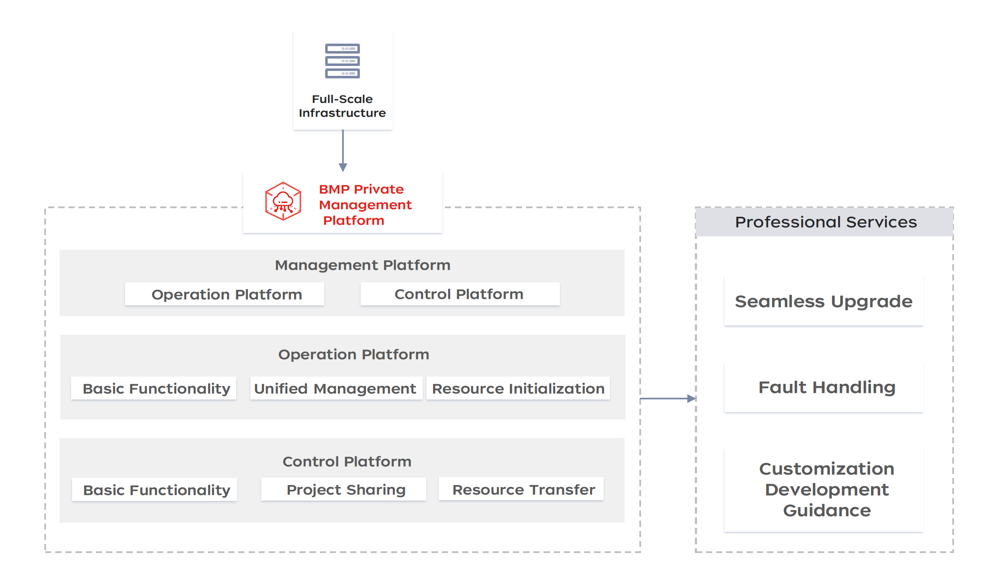

# Baremetal Manage Platform (BMP)

English | [简体中文](README.zh-CN.md) 

## Introduction

`Baremetal Manage Platform` is a private bare metal management platform that integrates local infrastructure resource management, server instance lifecycle management, operating system installation and initialization, network configuration initialization, and project-oriented basic resource management.

## Core functions
### Server full lifecycle management
- **Multi-brand server unified management**
Unified management of new and old models of domestic and foreign server brands, management of existing servers, regardless of server brand, no need to purchase new network equipment and install smart network cards/DPUs, and support adding custom models.
- **Server batch automatic deployment**
Supports batch large-scale import of equipment, realizes batch server installation and deployment in minutes, and provides server full lifecycle management after deployment.
- **Customized image management service**
Provides both general images and customized image services, pre-installed CentOS 7.9 and Ubuntu 18.04 images, which can be directly installed and used. It also supports importing multiple images, including CentOS, Ubuntu, Windows server, Debian, Open Euler, Kylin, Tongxin, etc. It provides image production guides and two-way linkage of image models.
- **Intelligent operation and maintenance monitoring management**
Supports in-band & out-of-band monitoring management, supports viewing the hardware device status of a single instance, viewing fault alarm log information and processing, and presetting multiple hardware alarm rules; it also supports in-band monitoring and alarm management of resources, displays the status of various monitoring indicators and sets alarm rules.

### Asset management
- **Comprehensive computer room resource management**
The overall access security verification is adopted, and the global setting of out-of-band server out-of-band login account, password, switch login account, and password information is supported; batch export of full computer room information is provided.
- **Project-dimensional resource management**
Supports logical grouping of users' infrastructure resources, facilitates unified management of resources within the project, supports project sharing and transfer, and improves resource utilization efficiency; supports project addition, editing, and deletion, etc.

### Permission management
- **User management and security center settings**
Preset three different roles with different permissions to meet the needs of different users, support setting basic user information, changing passwords, managing API keys, etc.
- **Unified operation role management**
Provide a self-service portal for platform administrators, operators, and ordinary users, support platform administrators to use the self-service portal to manage resources, operations, users and roles, and provide operators with unified management and operations of resources through the self-service portal. Ordinary users can apply for, use, operate and manage resources through the self-service portal, and change account names, passwords, etc.

## Documentation

- [Quick Experience](docs/setup.md) How to deploy the BMP system with one click.
- [Source code deployment](docs/develop.md) How to deploy the BMP system locally in a containerized manner
- [Local development](docs/local-develop.md) How to deploy and debug locally in a non-containerized manner