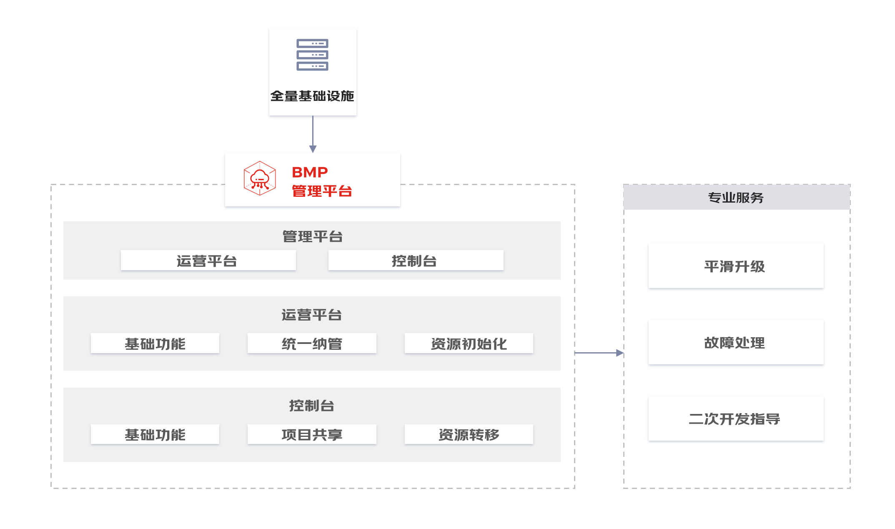

# Baremetal Manage Platform (BMP)

[English](README.md) | 简体中文

## 介绍

`Baremetal Manage Platform` 是一款集本地基础设施资源管理、服务器实例生命周期管理、操作系统安装与初始化、网络配置初始化、面向项目的基础资源管理等功能于一体的私有化裸金属管理平台。

## 核心功能
### 服务器全生命周期管理
- **多品牌服务器统一纳管**
  针对国内外服务器品牌的新旧机型进行统一管理，纳管存量服务器，不挑服务器品牌，无需购买新网络设备及加装智能网卡/DPU，支持添加自定义机型。
- **服务器批量自动化部署**
  支持批量大规模导入设备，实现批量服务器分钟级安装部署，部署后提供服务器全生命周期管理。
- **定制化镜像管理服务**
  既提供通用镜像，又提供了定制化镜像服务，预置CentOS 7.9、Ubuntu 18.04镜像，可直接进行装机使用。同时支持导入多种镜像，涵盖CentOS、Ubuntu、Windows server、Debian、Open Euler、麒麟、统信等，提供镜像制作指南，镜像机型双向联动。
- **智能运维监控管理**
  支持带内&带外监控管理，支持查看单个实例的硬件设备状态，查看故障报警日志信息及处理，预置多种硬件报警规则；同时支持资源带内监控和报警管理，展示各项监控指标情况并对设置报警规则。

### 资产管理
- **全面的机房资源管理**
整体采用访问安全验证，支持全局设置带外服务器带外登录账号，密码，交换机登录账号，密码信息；提供批量导出机房全量信息。
- **项目维度的资源管理**
支持对用户的基础设施资源进行逻辑分组，方便对项目内的资源进行统一管理，支持项目共享及转移，提升资源利用效率；支持项目添加、编辑、删除等。

### 权限管理
- **用户管理及安全中心设置**
预置三种不同角色关联不同权限，满足不同用户使用需求，支持设置用户基本信息、修改密码、管理API密钥等。
- **统一的运营角色管理**
为平台管理员、运营人员、普通用户提供自服务门户，支持平台管理员通过自服务门户进行资源的统一管理、运维、用户和角色的管理，提供运营人员通过自服务门户进行资源的统一管理、运维，普通用户可以通过自服务门户申请、使用、操作管理资源，修改账户名、密码等。

## 文档

- [快速体验](docs/zh/setup.md) 如何一键部署BMP系统。
- [源码部署](docs/zh/develop.md) 如何本地容器化部署BMP系统
- [本地开发](docs/zh/local-develop.md) 如何本地非容器化部署调试