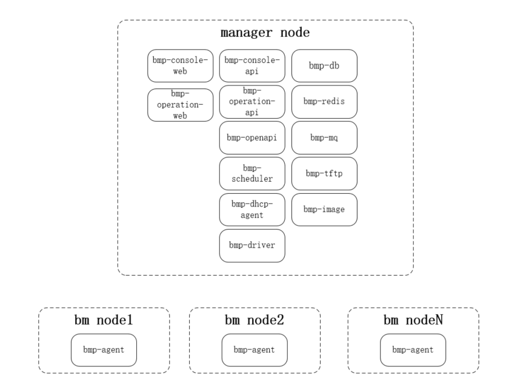

# [BMP Installation Guide](main.md) - Deployment Architecture

The standard deployment architecture consists of one manager node and multiple BM nodes. The manager node runs all BMP components (except for BMP-agent); the BM nodes only run BMP-agent (running in LiveOS) during the operating system installation phase, performing various operations required for installing GuestOS, and after installation, the BM nodes are taken over by GuestOS.

## Component Description

* bmp-console-web: Control console front-end pages. Built using the Vue3 scaffolding, it includes login pages, project management pages, personal center pages, instance management pages, and other page functions.
* bmp-console-api: Control console API. Go language back-end business, calling openapi interfaces to implement control console-related interfaces. Assembles various data needed by bmp-console-web, requiring multi-language adaptation.
* bmp-operation-web: Operation platform front-end pages. Built using the Vue3 scaffolding, it includes login pages, data center management pages, machine model management pages, image management pages, device management pages, role management pages, user management pages, and other page functions.
* bmp-operation-api: Operation platform API. Go language back-end business, calling openapi interfaces to implement operation platform-related interfaces. Assembles various data needed by bmp-operation-web, requiring multi-language adaptation.
* bmp-openapi: bmp-openapi is the core module of BMP. It implements RESTful API format interfaces that comply with the Swagger 2.0 specification. It provides all basic functions of BMP externally. Internally, it performs database operations and calls bmp-scheduler to complete instance lifecycle management-related operations.
* bmp-scheduler: Installation scheduling module. It receives instance lifecycle management requests from bmp-openapi, converts the upper-layer requests into corresponding commands, and drives the commands to execute, coordinating with the lower-level bmp-driver and bmp-agent to complete installation, reinstallation, power on, power off, and other functions.
* bmp-driver: Single data center application, which needs to be deployed in multiple sets in the case of multiple data centers. It receives MQ messages and performs power on, power off, restart, and PXE boot setting operations on servers in its own data center.
* bmp-dhcp-agent: Single data center application. Before installation, it needs to update the DHCP configuration in advance, storing the MAC-IP association relationship in the DHCP configuration. Subsequently, LiveOS can obtain the IP address from DHCP.
* bmp-db: Database
* bmp-redis: Redis cache
* bmp-mq: Message middleware
* bmp-tftp: TFTP server, storing PXE boot-related files, including the PXE boot program, PXE boot configuration, LiveOS kernel, and initramfs.
* bmp-image: HTTP server, storing GuestOS image files
* bmp-rsyslog: rsyslog log component
* bmp-oob-alert: Out-of-band alert component
* bmp-oob-agent: Out-of-band monitoring information collection component
* bmp-monitor-proxy: In-band monitoring forwarding component
* bmp-prometheus: Monitoring data collection component
* bmp-pushgateway: Collects monitoring data from bmp-monitor-proxy and pushes it to Prometheus
* bmp-alertmanager: Alert component
* bmp-pronoea: Receives alert information from bmp-alertmanager, converts the format, and transmits it to bmp-openapi

### Previous section [Overview](overview.md)
### Next section [Network Architecture](network-architecture.md)