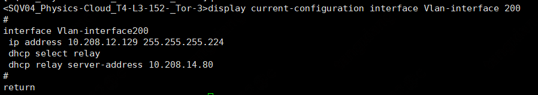

# [BMP Installation Guide](main.md) - Deploying BMP
## Deployment Instructions
* All commands are executed with root privileges
## Example Explanation
This example includes one manager node and one BM node, with the network structure shown below:

In this network structure, tor1 represents the upstream switch of the BM node's eth0 network card.
* Manager node  
  eth0 IP: 192.168.14.80/27
* BM node  
  ipmi IP: 192.168.11.130/27
* tor1  
  VLAN ID: 200  
  VLAN 200 interface IP: 192.168.12.129/27

## Deploying Manager Node
* SSH into the manager node
* Install docker-compose
  * CentOS 7
~~~
yum install -y yum-utils
yum-config-manager \
    --add-repo \
    https://download.docker.com/linux/centos/docker-ce.repo
yum install -y docker-ce docker-ce-cli containerd.io docker-compose-plugin
systemctl start docker
~~~
* Loongnix 8.4
~~~
yum install -y docker-ce docker-ce-cli containerd.io
curl https://bmp.s3-internal.cn-north-1.jdcloud-oss.com/data/docker-compose_v2.20.2_loongarch64  -o /usr/local/bin/docker-compose
chmod +x /usr/local/bin/docker-compose
systemctl start docker
~~~

* Download the deployment script, extract it, and enter the corresponding directory
~~~
curl https://bmp.s3-internal.cn-north-1.jdcloud-oss.com/release/bmp-deploy_${version}.tar.gz  -o bmp-deploy.tar.gz
mkdir bmp-deploy
tar -xvf bmp-deploy.tar.gz -C./bmp-deploy
cd bmp-deploy
~~~
Directory contents explanation: [bmp-deploy Files and Directories Explanation](bmp-deploy.md)

* Modify the configuration  
  Edit the.env file and modify BMP_HOST_IP to the manager node's management network card IP. In this example, it is xxx.xxx.xxx.xxx
~~~
BMP_HOST_IP=xxx.xxx.xxx.xxx
~~~
For more configuration options, please refer to [Configuration Management](config.md)
* Install BMP
~~~
chmod +x./bmp-deploy.sh
./bmp-deploy.sh start all
~~~

* Check the status of each service
~~~
./bmp-deploy.sh status all
~~~
In normal circumstances, the status of all services should be running. If some services are not running, please refer to [Troubleshooting](troubleshoot.md)
## Accessing BMP
Note: Default username: admin, password: df9Ydfd$c

Control Console: http://manager_ip:8080. In this example, it is http://xxx.xxx.xxx.xxx:8080.

Operation Platform: http://manager_ip:8081. In this example, it is http://xxx.xxx.xxx.xxx:8081.

## Uninstalling BMP
~~~
./bmp-deploy.sh uninstall all
~~~

## Configuring DHCP Relay (not required if the manager and node management network cards are on the same 2-layer network)
* Log in to tor1 and view the DHCP relay for VLAN 200. Check if the relay address is the manager node's management network card IP (xxx.xxx.xxx.xxx in this example)
  

## Adding BM Node to BMP Platform
Log in to the <u>BMP Operation Platform</u>, go to the <u>Device Management</u> interface, and import BM node information
### Note:
* Internal IPv4, network subnet mask, and gateway: Please fill in the correct addresses so that PXEClient, LiveOS, and GuestOS running on the BM node can normally access the manager network. In this example, Internal IPv4 can be any available IP in VLAN 200 (10.208.12.130 - 10.208.12.158), such as 10.208.12.130, and the subnet mask and gateway should be filled with the VLAN 200 subnet mask and gateway (255.255.255.224 and 10.208.12.129 in this example)
* [Device Information Table for This Example](device_import.xlsx)

### Previous section [Network Architecture](network-architecture.md)
### Next section [Service Management](service-manage.md)