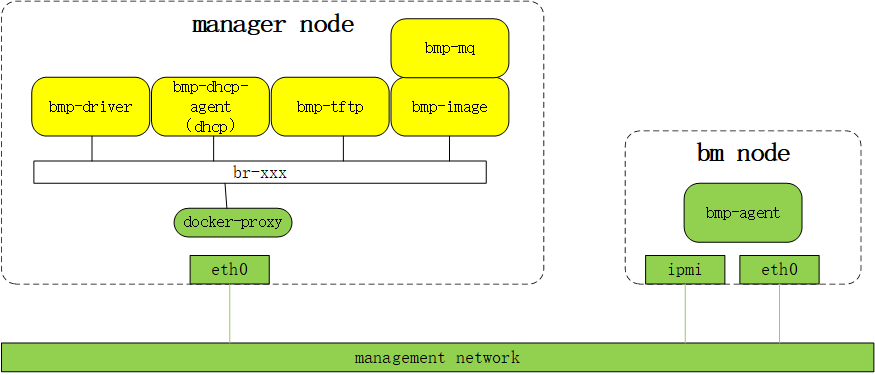

# [BMP Installation Guide](main.md) - Network Architecture
The standard network architecture of BMP is shown in the following diagram:

* The out-of-band network card ipmi, management network card eth0 of the physical machine, and the management network card eth0 of the manager node are all in the same 3-layer management network.
* The various BMP components running inside the manager node are containerized and expose their service ports to the management network through docker-proxy and the eth0 network card.
* The BMC management system built into the BM node exposes itself to the management network through the ipmi network card.
* Other services running on the BM node expose themselves to the management network through the eth0 network card.
* To ensure that the system running on the BM node can obtain IP configuration from the DHCP server built into the bmp-dhcp-agent container on the manager node, the upstream switch of the BM node's eth0 network card may need to be configured with DHCP relay, with the relay address set to the management IP of the manager node.
* At the beginning of the installation process, bmp-driver accesses the BM node's out-of-band IP through the management network to set the boot mode and control power on/off.
* During the PXE boot stage, the PXEClient built into the BM node's eth0 network card accesses the DHCP server built into the bmp-dhcp-agent container through the management network to obtain IP configuration and the download address of the PXE boot program, sets the eth0 IP, and downloads the LiveOS kernel and initramfs from bmp-tftp, and then starts LiveOS.
* When LiveOS starts, it also obtains IP configuration from the DHCP server built into the bmp-dhcp-agent container and sets the eth0 IP.
* During the GuestOS installation stage, bmp-agent can obtain the necessary installation information from bmp-mq and can also download the GuestOS image from bmp-tftp.
* Regardless of whether PXEClient, LiveOS, or GuestOS is running, the IP address of the BM node's management network card eth0 remains the same, and the specific IP address is set in the <u>Operation Platform - Device Management</u> section. Please assign the correct IP address to the BM node to ensure that the system running on the BM node in each stage can work normally.

### Previous section [Deployment Architecture](deploy-architecture.md)
### Next section [Deploying BMP](deploy.md)