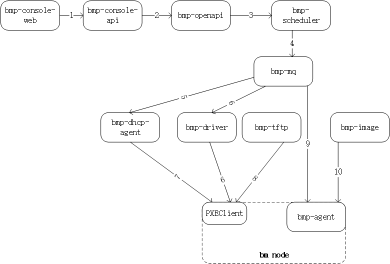

# [bmp安装指导](main.md) - 装机流程
bmp装机流程如下图所示

bmp装机流程图

## 装机流程说明
1.客户端（bmp-console-web）发起装机请求，bmp-console-api接收请求  
2.bmp-console-api检查请求参数，通过后将请求转发给bmp-openapi  
3.bmp-openapi执行权限检查等操作，生成装机参数，发送给bmp-scheduler  
4.bmp-scheduler调度装机任务，生成一系列装机指令，通过bmp-mq服务发送给bmp-dhcp-agent、bmp-driver和bmp-agent  
5.bmp-dhcp-agent收到指令，设置内置的dhcp服务器，使得bm节点在pxe启动阶段能够获取正确的ip配置和tftp地址(bmp-tftp地址)  
6.bmp-driver收到指令后，将bm节点设置为pxe启动并重启  
7.bm节点执行pxe启动，内置在网卡内的PXEClient启动，发送dhcp请求广播，bmp-dhcp-agent内置的dhcp服务器收到dhcp请求后，响应相应的ip配置和tftp地址  
8.PXEClient配置自身ip，之后从bmp-tftp下载pxe引导程序并执行，pxe引导程序继续从bmp-tftp获取其它引导参数，下载内核和initramfs，启动内存操作系统，内置在内存操作系统中bmp-agent服务开始启动  
9.bmp-agent接收指令，执行后续bm装机操作，如：设置raid，分区等  
10.bmp-agent从bmp-image下载客户操作系统镜像文件，写到bm节点磁盘中，然后初始化客户操作系统  
11.bmp-agent执行重启，完成操作系统安装  

# 上一节 [服务管理](service-manage.md)
# 下一节 [故障排查](troubleshoot.md)