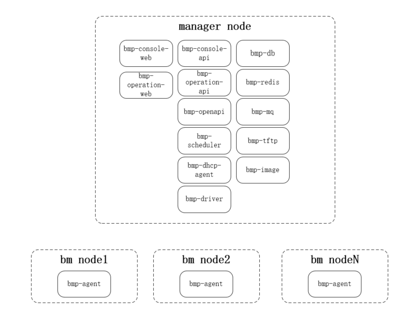

# [bmp安装指导](main.md) - 部署架构

标准部署架构由一个manger节点和多个bm节点组成。manager节点运行着所有bmp组件（除了bmp-agent）；bm节点只在安装操作系统阶段运行着bmp-agent（运行在LiveOS中），执行安装GuestOS需要的各种操作，安装完成后会重启bm节点，之后bm节点被GusetOS接管。

## 组件说明

* bmp-console-web 控制台前端页面。使用vue3脚手架搭建。包含登录页、项目管理页、个人中心页、实例管理页等页面功能。
* bmp-console-api 控制台api。go语言后端业务，调用openapi接口实现控制台相关接口。为bmp-console-web拼装各类需要的数据，需要进行多语言适配。
* bmp-operation-web 运营平台前端页面。使用vue3脚手架搭建，包含登录页、机房管理页、机型管理页、镜像管理页、设备管理页、角色管理页、用户管理页等页面功能。
* bmp-operation-api 运营平台api。go语言后端业务，调用openapi接口实现运营平台相关接口。为bmp-operation-web拼装各类需要的数据，需要进行多语言适配。
* bmp-openapi bmp-openapi是bmp的核心模块。实现了满足swagger2.0规范的restful api格式接口。对外提供了bmp所有基础功能。对内进行数据库操作、调用bmp-scheduler完成实例生命周期管理的相关操作。
* bmp-scheduler 装机调度模块。承接bmp-openapi的实例生命周期管理请求，将上层请求转换为对应的commands，并且驱动commands执行，协同下层的bmp-driver，bmp-agent共同完成装机、重装、开机、关机等功能。
* bmp-driver 单机房应用，在有多个机房情况下需要部署多套bmp-driver服务，接收mq，对本机房的服务器进行开机、关机、重启、设置pxe启动等操作。
* bmp-dhcp-agent 单机房应用，装机之前需要提前更新dhcp配置，将Mac-IP关联关系存入dhcp配置中。之后liveOS才能从dhcp中获取到ip地址。
* bmp-db 数据库
* bmp-redis redis缓存
* bmp-mq 消息中间件
* bmp-tftp tftp服务器，存储着pxe引导需要的相关文件，包括pxe引导程序，pxe引导配置,LiveOS的内核和initramfs。
* bmp-image http服务器，存储着GuestOS镜像
* bmp-rsyslog rsyslog 日志组件
* bmp-oob-alert 带外告警组件
* bmp-oob-agent 带外监控信息采集组件
* bmp-monitor-proxy 带内监控转发组件
* bmp-prometheus 监控数据收集组件
* bmp-pushgateway 从bmp-monitor-proxy收集监控数据，并推送到 Prometheus
* bmp-alertmanager 告警组件
* bmp-pronoea 从bmp-alertmanager接收告警信息并转换格式，传到给bmp-openapi

# 上一节 [概述](overview.md)
# 下一节 [网络架构](network-architecture.md)

