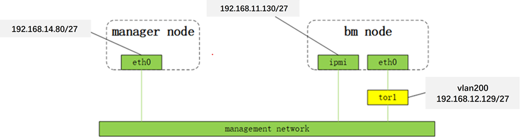
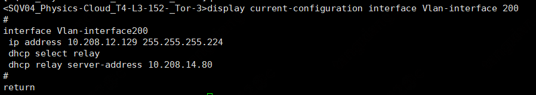

# [bmp安装指导](main.md) - 部署bmp
## 部署说明
* 所有命令用root权限执行
## 示例说明
本示例包含一个manager节点和一个bm节点，网络结构如下

此网络结构中，tor1分别代表bm节点eth0网卡上联交换机。
* manager节点  
eth0 ip: 192.168.14.80/27   
* bm节点  
ipmi ip: 192.168.11.130/27  
* tor1  
vlan id: 200  
vlan 200接口ip: 192.168.12.129/27  

## 部署manager节点
* ssh登陆manager节点
* 安装docker-compose
  *  centos 7
~~~
yum install -y yum-utils
yum-config-manager \
    --add-repo \
    https://download.docker.com/linux/centos/docker-ce.repo
yum install -y docker-ce docker-ce-cli containerd.io docker-compose-plugin
systemctl start docker
~~~
  * loongnix 8.4
~~~
yum install -y docker-ce docker-ce-cli containerd.io
curl https://bmp.s3-internal.cn-north-1.jdcloud-oss.com/data/docker-compose_v2.20.2_loongarch64  -o /usr/local/bin/docker-compose
chmod +x /usr/local/bin/docker-compose
systemctl start docker
~~~

* 下载部署脚本,解压并进入到相应目录
~~~
curl https://bmp.s3-internal.cn-north-1.jdcloud-oss.com/release/bmp-deploy_${version}.tar.gz  -o bmp-deploy.tar.gz
mkdir bmp-deploy
tar -xvf bmp-deploy.tar.gz -C ./bmp-deploy
cd bmp-deploy
~~~
目录内文件说明:[bmp-deploy文件和目录说明](bmp-deploy.md)

* 修改配置  
编辑.env文件，修改BMP_HOST_IP为manager节点管理网卡ip。本示例为xxx.xxx.xxx.xxx
~~~
BMP_HOST_IP=xxx.xxx.xxx.xxx
~~~
更多配置请参考[配置管理](config.md)
* 安装bmp
~~~
chmod +x ./bmp-deploy.sh
./bmp-deploy.sh start all
~~~

* 检查各服务状态
~~~
./bmp-deploy.sh status all
~~~
正常情况下所有服务的状态都是running，如果某些服务未运行，参考[故障排查](troubleshoot.md)
## 访问bmp
注：默认账号：admin，密码：df9Ydfd$c

控制台：http://manager_ip:8080。本示例是http://xxx.xxx.xxx.xxx:8080。

运营平台: http://manager_ip:8081。本示例是http://xxx.xxx.xxx.xxx:8081。

## 卸载bmp
~~~
./bmp-deploy.sh uninstall all
~~~

## 配置dhcp中继（manager与node的管理网口处于同一2层网络无需此步骤）
* 登陆tor1，查看vlan 200的dhcp中继，检查中继地址是否为manager节点管理网卡ip（本示例为xxx.xxx.xxx.xxx）

## 将bm节点添加到bmp平台
 登陆<u>bmp运营平台</u>，进入<u>设备管理</u>界面，导入bmp节点信息  
 ### 注意：
 * 内网IPv4，网络子网掩码和网关 请填写正确的地址，使得运行在bm节点的PXEClient，LiveOS，GuestOS能够正常的访问manager网络。本示例中，内网IPv4 可选择vlan 200内任意可用ip（10.208.12.130 - 10.208.12.158），比如10.208.12.130，子网掩码和网关分别填写vlan 200子网掩码和网关（本示例是255.255.255.224和10.208.12.129）
 * [本示例设备信息表](device_import.xlsx)

 
# 上一节 [网络架构](network-architecture.md)
# 下一节 [服务管理](service-manage.md)