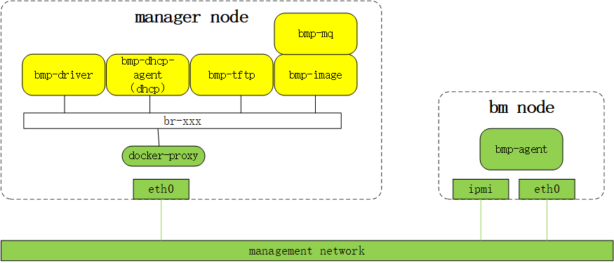

# [bmp安装指导](main.md) - 网络架构
bmp标准网络架构如下图所示

* 物理机的带外网卡ipmi、管理网卡eth0和manager节点的管理网卡eth0都在同一个3层管理网络中。
* manager节点内各个bmp组件以容器方式运行，通过docker-proxy和eth0
网卡将服务端口暴露给管理网络访问。
* bm节点内置的bmc管理系统通过ipmi网卡暴露给管理网络访问
* bm节点运行的其它服务通过eth0网卡暴露给管理网络访问
* 为了确保bm节点运行的系统能够从manager节点的bmp-dhcp-agent容器内置的dhcp服务器获取ip配置，bm节点eth0网卡的上联交换机可能需要配置dhcp中继，中继地址为manager节点管理ip。
* 装机开始时，bmp-driver通过管理网络访问bm节点的带外ip，设置物理机的引导模式和控制开关机。 
* pxe引导阶段，bm节点的eth0网卡内置的PXEClient通过管理网络访问bmp-dhcp-agent内置的dhcp服务器，获取ip配置和pxe引导程序下载地址，设置eth0 ip，并从bmp-tftp下载LiveOS内核和initramfs，之后启动LiveOS。
* LiveOS启动时，也会从bmp-dhcp-agent内置的dhcp服务器获取ip配置并设置eth0 ip。
* 安装GuesOS阶段，bmp-agent可以从bmp-mq获取所需安装信息，也可以从bmp-tftp下载GuestOS镜像
* 无论运行的是PXEClient、LiveOS还是GustOS，bm节点的管理网卡eth0的ip都是一样的，具体ip地址是在<u>运营平台-设备管理</u>中设置。请给bm节点分配正确的ip地址，确保bm节点在各个阶段运行的系统都能正常工作。

# 上一节 [部署架构](deploy-architecture.md)
# 下一节 [部署bmp](deploy.md)