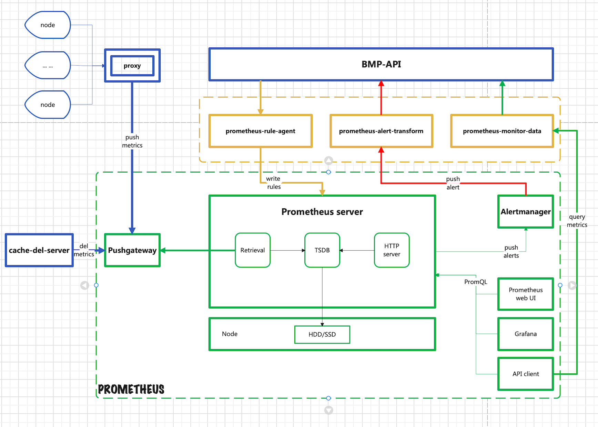

#  普罗诺亚 (bmp-pronoea)

[English](README.md) | 简体中文

## 介绍

`Bmp Pronoea` 为进一步完善私有化裸金属平台对实例管理监控的能力，同时实现监控和报警一体化管理，性能监控(带内监控)功能被提出。即支持针对用户名下的资源进行监控和报警管理等。因而引入了第三方告警服务Prometheus（官方网站：https://prometheus.io/）。
    自研版bmp-pronoea（普罗诺亚）以Prometheus服务为基础，集合产品需求，实现了资源监控和报警的管理。

## 核心功能
### 普罗诺亚系统模块
- **告警规则管理 (prometheus-rule-agent)**
  提供动态设置告警规则的功能。接收上层BMP-API下发的告警规则信息，将这些告警规则信息转换成Prometheus可识别的yml文件，写入指定目录。
- **告警信息管理 (prometheus-alert-transform)**
  接收Alertmanager模块的告警信息，转换信息格式后，将告警信息返给下游模块。可以是事件中心、BMP-API或其他可能有的系统模块。
- **监控数据管理 (prometheus-monitor-data)**
  Prometheus对外提供了API-client，用于查询收集到监控数据。此模块的设计初衷是，将API-clieng封装一层，对BMP-API提供数据查询服务。
- **监控数据清理 (cache-del-server)**
  Pushgateway接收的监控数据被Prometheus主服务拉取走之后，并不会主动删除，这样会造成无用数据的堆积，浪费资源。cache-del-server 被设计为定时主动删除这些垃圾数据。

### 外围依赖
- **Proxy（bmp-monitor-proxy）**
整合实例的监控数据，并将数据整合成可识别的特定数据格式，最后推送至Pushgateway。详见 bmp-monitor-proxy。
- **BMP API**
控制台、运营管理后台与Prometheus监控系统的交互，依赖BMP-API来完成，例如，设置告警规则、查询监控数据、接收处理告警信息等。
此处BMP API包含了 bmp-console-api 和 bmp-openapi。