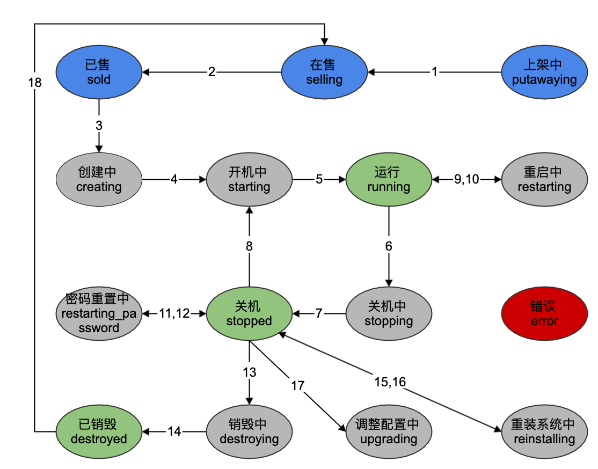

# bmp-scheduler

[English](README.md) | 简体中文

## 介绍

调度模块，主要功能是维护设备和实例的状态流转。

bmp架构图：
arch.png)

模块介绍：

- bmp-console-web：控制台前端
- bmp-operation-web:运营平台前端
- bmp-console-api：控制台和前端的适配层
- bmp-operation-api：运营平台和前端的适配层
- bmp-openapi-console:控制台使用的核心openapi接口层
- bmp-openapi：运营平台使用的核心openapi接口层
- bmp-scheduler：核心调度层，负责设备和实例的状态流转
- bmp-driver：带外控制层，负责向bm发送ipmitool命令控制
- bmp-agent：负责liveos的启动，以及和bmp-scheduler的交互
- inbond-agent：带内监控采集agent，负责bm的数据采集并上报到inbond-agent-proxy
- bmp-dhcp-agent：负责对dhcp配置的增删
- inbond-agent-proxy：负责将inbond-agent采集的数据进行清洗，并上报到pushgateway，最终存储在prometheus中
- push-gateway：prometheus内置模块，负责接收带内监控数据
- prometheus：开源prometheus组件
- pronoea:自制模块，负责接收告警规则，并将产生的告警发送到bmp-openapi-console，经业务告警出来
- oob-agent：带外监控采集agent
- oob-alert：负责将oob-agent采集的数据经指定规则过滤，触发报警时经业务告警出来。

bmp设备和实例状态流转：

## 2，核心功能

- 设备导入：裸金属设备可经运营平台导入到bmp系统中。
- 设备采集：采集裸金属设备的磁盘、网卡等信息。
- 设备上架：裸金属设备采集后绑定合适机型，即可上架，上架后的设备可以在控制台创建实例。
- 创建实例：在控制台可以将上架的设备指定各种配置，创建成一台运行操作系统的物理机。
- 销毁实例：将运行操作系统的物理机销毁系统盘，还原成裸金属设备。
- 重装实例：对已安装操作系统的设备重新安装操作系统。
- 实例开机：发送远程带外命令开机。
- 实例关机：发送远程带外命令关机。
- 实例重启：发送远程带外命令重启。
- 实例重置密码：重置操作系统root用户登陆密码。

