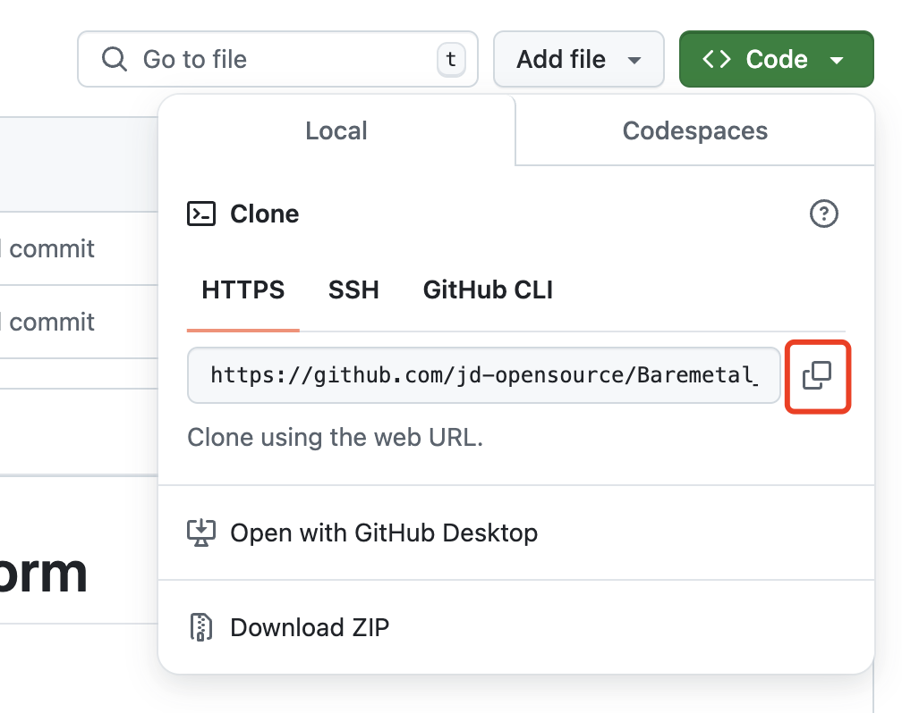

# Source Code Deployment

**Introduction**: In the previous chapter [Quick Start](setup.md), you can quickly deploy the BMP platform using the official BMP image. The relevant images have been uploaded to the quay.io image repository.
This chapter describes how to compile the corresponding images from the source code of each component and deploy the BMP platform.
It is divided into two parts:
1. **For operations personnel**: Through the [Source Code Deployment] chapter, understand the image creation process and complete the local containerized deployment of the BMP platform, including code pulling, environment preparation, component compilation, image creation, application deployment, etc.
2. **For R & D personnel**: After running the complete BMP platform through the [Quick Start](setup.md) or [Source Code Deployment](#1) chapter, understand how to conduct customized development for a certain component and how to update the corresponding component after development through the [Customized Development and Deployment] chapter.

## Table of Contents
- [Source Code Deployment](#1)
    - [Overview of Source Code Deployment](#1.1)
    - [Deployment Steps](#1.2)
        - [Environment Preparation](#1.2.1)
        - [Code Download](#1.2.2)
        - [Component Image Creation](#1.2.3)
        - [Application Deployment](#1.2.4)
        - [Accessing BMP](#1.2.5)
        - [Managing the Platform to Incorporate Bare Metal Servers](#1.2.6)
- [Customized Development and Deployment](#2)
    - [Overview of Customized Development and Deployment](#2.1)
    - [Component Introduction](#2.2)
    - [Customized Development](#2.3)
    - [Updating Component Images](#2.4)
    - [Redploying Components](#2.5)

## Source Code Deployment <a id="1"></a>

### Overview of Source Code Deployment <a id="1.1"></a>

As shown in the figure above, it is the overall architecture diagram of the BMP platform. The manager node in the figure refers to the management component node, and the bm node refers to the physical server to be installed with an operating system.

The overall deployment steps are divided into two parts:
- Prepare the overall environment, including network environment preparation and server preparation. The ideas are as follows:
    - The manager node and the bm node are in a large Layer 2 network.
    - Install the CentOS 7.9 operating system on the manager node.
    - Configure the dhcp-relay address of the bm node's uplink ToR as the IP address of the manager node (this step can be skipped if you only want to experience the BMP platform and do not plan to experience the BMP bare metal installation process).
    - For more details, please refer to the [Environment Preparation](env-prepare.md) part.
- Create container images through Docker on the manager node and deploy the BMP platform.
  The key steps are as follows:
    - Download the source code (corresponding to the [First Step: Deployment Preparation for the Management Node](#3.1) part).
    - Download the base images required for compilation, and use the Dockerfile under each component to create application images based on the base images (corresponding to the [Third Step: Component Image Creation](#3.3)). This part is the key step for containerized deployment of the BMP platform.
    - Use Docker Compose to deploy applications (corresponding to the [Fourth Step: Application Deployment](#3.4)).

### Deployment Steps <a id="1.2"></a>

**First Step**: [Deployment Preparation for the Management Node](#1.2.1)

**Second Step**: [Configure Environment Variables](#1.2.2)

**Third Step**: [Component Image Creation](#1.2.3)

**Fourth Step**: [Application Deployment](#1.2.4)

**Fifth Step**: [Accessing BMP](#1.2.5)

**Sixth Step**: [Managing the Platform to Incorporate Bare Metal Servers](#1.2.6)

### First Step: Deployment Preparation for the Management Node <a id="1.2.1"></a>

#### 1. Install Docker and Docker Compose
- Installation using yum (for CentOS 7.9 system):
```bash
yum install -y yum-utils
yum install -y docker-ce docker-ce-cli containerd.io docker-buildx-plugin docker-compose-plugin
systemctl start docker
```
For more installation methods, please refer to the Docker official website.
- Docker Official Documentation Address: https://docs.docker.com/
- Docker Compose Official Documentation Address: https://docs.docker.com/compose/

#### 2. Download the BMP Source Code to the Manager Node Server
Before downloading, first clarify the deployment directory of the BMP. In this example, it is installed in the user's home directory by default. First:
```bash
# Navigate to the home directory and then execute the subsequent download commands.
cd ~
```
Find the 【Code】 button in the upper right corner of the home page, click on the drop-down menu, as shown in the figure:

- **Method 1**: Use the `git clone` command:
```bash
# Execute on the management node, clone the HTTPS link copied above. For example:
git clone https://github.com/jd-opensource/Baremetal_Manage_Platform.git
```
- **Method 2**: Click 【Download ZIP】 to directly download the zip package and then manually transfer it to the management server.
  For more GitHub operations, please refer to the GitHub official operation documentation:  
  https://docs.github.com/en/repositories/creating-and-managing-repositories/cloning-a-repository
- **Method 3**: You can directly download the installation package from JD Cloud:
```bash
wget https://bmp.s3.cn-north-1.jdcloud-oss.com/opensource/Baremetal_Manage_Platform.zip
unzip Baremetal_Manage_Platform.zip -d Baremetal_Manage_Platform
```

### Second Step: Configure Environment Parameters <a id="1.2.2"></a>
- **Deployment Script Directory**:
  The deployment scripts are located in the `bmp-deploy` directory.
  For the description of the files and directories in the directory: [bmp-deploy File and Directory Description](bmp-deploy/bmp-deploy.md).

- **Modify the Configuration**:
  Edit the `.env` file.
    - Modify `BMP_HOST_IP` to the IP address of the management network card of the manager node. In this example, it is `192.168.14.80`. If the server has multiple network cards, please configure one of the IP addresses. If a bond is configured, use the bond network card. Otherwise, try to choose a private network IP address network card.
      The example figure of the `ifconfig` command - `bond0`:
      
      The example figure of the `ifconfig` command - `eth0`:
      
    - Modify `BASE_REGISTRY`. The deployment requires the use of base container images such as MySQL, Redis, MQ, and Nginx. In this example, it defaults to pulling from the quay.io repository. If there are network restrictions, please modify it to other public or private image repositories.
```bash
cd ~/Baremetal_Manage_Platform/bmp-deploy/
# Check the server IP address, first check the IP address of bond0, and then check the IP address of eth0. If you are unsure, please consult the operations personnel.
ifconfig

# Edit the environment variables.
# It must be consistent with the IP address of the manager node server.
# Set BMP_HOST_IP=192.168.14.80
vi.env
```
For more configurations, please refer to [Configuration Management](bmp-deploy/config.md).

### Third Step: Component Image Creation <a id="1.2.3"></a>
#### 1. Knowledge Points Related to Docker Image Creation
Docker image creation is based on a base image. Through the Dockerfile file, the application image is created. The Dockerfile file contains the construction process of the application image, including installing dependencies, compiling, and copying files.
For example, the Dockerfile file of `bmp-schedule` is as follows:
```dockerfile
FROM golang:1.17-alpine AS builder
ENV GOPROXY https://goproxy.cn
WORKDIR /usr/src/bmp-scheduler
COPY..
RUN go build -o /tmp/bmp-scheduler.

FROM alpine:3.16
WORKDIR /home/bmp/bmp-scheduler
COPY --from=builder /tmp/bmp-scheduler.
COPY./conf./conf
CMD ["./bmp-scheduler"]
```
In this Dockerfile, two build stages are defined:
- In the first stage, the `FROM` instruction specifies the base image. `FROM golang:1.17-alpine AS builder` means using the `golang:1.17-alpine` image as the base image. Then, on the basis of this base image, the `go build -o /tmp/bmp-scheduler.` command is executed to compile the code into a binary file.
- In the second stage, the `FROM` instruction specifies the base image. `FROM alpine:3.16` means using the `alpine:3.16` image as the base image. Then, on the basis of this base image, the `COPY --from=builder /tmp/bmp-scheduler.` command is executed to copy the binary file compiled in the first stage to the current directory, and then the `CMD ["./bmp-scheduler"]` command is executed to start the application.

Execute the compilation command:
```bash
docker build -f bmp-schedule.Dockerfile -t bmp-schedule:v1.0./
```
This means using `bmp-schedule.Dockerfile` as the Dockerfile, the source code in the `./` directory as the source code used for compilation, and generating the `bmp-schedule` image with the tag `v1.0` after compilation.

#### 2. Prepare the Base Images Required for Compilation
- `alpine:3.16`
- `golang:1.17-alpine`
- `nginx:1.22-alpine`
- `node:16.19-alpine3.16`
- `python:3.6-alpine`
- `quay.io/goswagger/swagger`

Pull the base images:
```bash
docker pull docker.io/alpine:3.16
docker pull docker.io/golang:1.17-alpine
docker pull docker.io/nginx:1.22-alpine
docker pull docker.io/node:16.19-alpine3.16
docker pull docker.io/python:3.6-alpine
docker pull quay.io/goswagger/swagger
```
If there are network restrictions, you can use the following method to use other image repositories and then modify the tags:
```bash
docker pull quay.io/jdcloudbmp/alpine:3.16
docker pull quay.io/jdcloudbmp/golang:1.17-alpine
docker pull quay.io/jdcloudbmp/nginx:1.22-alpine
docker pull quay.io/jdcloudbmp/node:16.19-alpine3.16
docker pull quay.io/jdcloudbmp/python:3.6-alpine
docker pull quay.io/goswagger/swagger

# docker tag
docker tag quay.io/jdcloudbmp/alpine:3.16 alpine:3.16
docker tag quay.io/jdcloudbmp/golang:1.17-alpine golang:1.17-alpine
docker tag quay.io/jdcloudbmp/nginx:1.22-alpine nginx:1.22-alpine
docker tag quay.io/jdcloudbmp/node:16.19-alpine3.16 node:16.19-alpine3.16
docker tag quay.io/jdcloudbmp/python:3.6-alpine python:3.6-alpine
```
After pulling the images, execute:
```bash
docker images
```
You will see the following newly added images locally, indicating that the image pulling is successful:
```bash
alpine         3.16                     d49a5025be10   11 months ago    5.54MB
nginx          1.22-alpine              88db8eea1453   21 months ago    41MB
node           16.19-alpine3.16         1e70b7adbb19   22 months ago    115MB
golang         1.17-alpine              270c4f58750f   2 years ago      314MB
python         3.6-alpine               3a9e80fa4606   3 years ago      40.7MB
```

#### 3. Image Creation
All component images are divided into four categories:
1. **Use Open Source Images and Directly Pull Images**

| Application Component | Category | Language/Component | Available Download Address |
|-------------------|------|---------|--------------------------------------------------|
| bmp-db            | Basic Component | mysql   | quay.io/jdcloudbmp/mysql:5.7-debian                 |
| bmp-redis         | Basic Component | redis   | quay.io/jdcloudbmp/redis:7.0-alpine                 |
| bmp-mq            | Basic Component | rabbitmq | quay.io/jdcloudbmp/rabbitmq:3.11-management-alpine  |
| bmp-image         | Basic Component | nginx |quay.io/jdcloudbmp/nginx:1.22-alpine|
| bmp-pushgateway   | Open Source Component | pushgateway |quay.io/prometheus/pushgateway:v1.9.0 |
| bmp-alertmanager  | Open Source Component | alertmanager |quay.io/prometheus/alertmanager:v0.27.0|
| bmp-prometheus    | Open Source Component | prometheus |quay.io/prometheus/prometheus:v2.52.0|

These components use open source images and can be directly pulled.
The default image source selected in the source code is `quay.io/jdcloudbmp`.
For example, the command to pull an image:
```bash
docker pull quay.io/jdcloudbmp/mysql:5.7-debian
```
If using other image sources, you first need to modify the variable `BASE_REGISTRY` in the `.env` file. For example: `BASE_REGISTRY=docker.io`, and then pull the image:
```bash
docker pull docker.io/mysql:5.7-debian
```

2. **Create Customized Images Based on Open Source Images**

| Application Component | Category | Language/Component | Dockerfile Path |
|-------------|------|---------|----------------------------------------------|
| bmp-rsyslog | Open Source Component | rsyslog | bmp-deploy/dockerfile/bmp-rsyslog.Dockerfile |
| bmp-tftp    | Open Source Component | tftp    | bmp-deploy/dockerfile/bmp-tftp.Dockerfile |

The pre-made images of these components have been uploaded to the image repository. If you do not need to customize the creation, you can directly pull and use them:
```bash
docker pull quay.io/jdcloudbmp/bmp-rsyslog:v1.0
docker  pull quay.io/jdcloudbmp/bmp-tftp:v1.0
```
If you need to manually create them, you can choose either of the following two methods to create images:
- **Use scripts to create images**:
```bash
cd ~/Baremetal_Manage_Platform/bmp-deploy
chmod +x bmp-build-image.sh
./bmp-build-image.sh build bmp-tftp
./bmp-build-image.sh build bmp-rsyslog
```
- **Manually create images**:
```bash
# Set relevant environment variables. The.env and images.cfg files define the image repository and version number and other information.
cd ~/Baremetal_Manage_Platform
. bmp-deploy/.env
. bmp-deploy/config/image.cfg
docker build -f bmp-deploy/dockerfile/bmp-rsyslog.Dockerfile -t ${bmp_rsyslog_image}./
docker build -f bmp-deploy/dockerfile/bmp-tftp.Dockerfile -t ${bmp_tftp_image}./
```

3. **Create Images by Compiling from Source Code**

| Application Component | Category | Language/Component |
|-------------|------|---------|
| bmp-console-web   | Front End | vue |
| bmp-operation-web | Front End | vue |
| bmp-openapi       | Back End | go |
| bmp-scheduler     | Back End | go |
| bmp-openapi-console | Back End | go |
| bmp-driver        | Back End | go |
| bmp-oob-agent     | Back End | go |
| bmp-pronoea       | Back End | go |
| bmp-monitor-proxy | Back End | go |
| bmp-dhcp-agent    | Back End | python |

You can choose either of the following two methods to create
### Third Step: Component Image Creation <a id="1.2.3"></a>
#### 3. Image Creation (continued)
images:
- **Use scripts to create images**:
```bash
Usage: ./bmp-build-image.sh build SERVICE...

COMMAND:
    build       Build image

SERVICE:
    all                 All SERVICES
    bmp-console-web
    bmp-operation-web
    bmp-console-api
    bmp-operation-api
    bmp-openapi
    bmp-openapi-console
    bmp-scheduler
    bmp-driver
    bmp-dhcp-agent
    bmp-oob-alert
    bmp-oob-agent
    bmp-monitor-proxy
    bmp-pronoea
    bmp-tftp
    bmp-rsyslog
    
# For example
cd ~/Baremetal_Manage_Platform/bmp-deploy
chmod +x bmp-build-image.sh
./bmp-build-image.sh build bmp-console-web
./bmp-build-image.sh build bmp-operation-web
./bmp-build-image.sh build bmp-openapi
./bmp-build-image.sh build bmp-openapi-console
./bmp-build-image.sh build bmp-scheduler
./bmp-build-image.sh build bmp-driver
./bmp-build-image.sh build bmp-dhcp-agent
./bmp-build-image.sh build bmp-oob-agent
./bmp-build-image.sh build bmp-monitor-proxy
./bmp-build-image.sh build bmp-pronoea
```
- **Manually create images**:
  Each component directory has a corresponding Dockerfile file. For example, for the `bmp-scheduler` component:
```bash
# Set relevant environment variables. The.env and images.cfg files define the image repository and version number and other information.
cd ~/Baremetal_Manage_Platform
. bmp-deploy/.env
. bmp-deploy/config/image.cfg
docker build -f./bmp-console-web/bmp-console-web.Dockerfile -t ${bmp_console_web_image}./bmp-console-web
docker build -f./bmp-operation-web/bmp-operation-web.Dockerfile -t ${bmp_operation_web_image}./bmp-operation-web
docker build -f./bmp-openapi/bmp-openapi.Dockerfile -t ${bmp_openapi_image}./bmp-openapi
docker build -f./bmp-openapi-console/bmp-openapi-console.Dockerfile -t ${bmp_openapi_console_image}./bmp-openapi-console
docker build -f./bmp-scheduler/bmp-scheduler.Dockerfile -t ${bmp_scheduler_image}./bmp-scheduler
docker build -f./bmp-driver/bmp-driver.Dockerfile -t ${bmp_driver_image}./bmp-driver
docker build -f./bmp-dhcp-agent/bmp-dhcp-agent.Dockerfile -t ${bmp_dhcp_agent_image}./bmp-dhcp-agent
docker build -f./oob-log-agent/oob-log-agent.Dockerfile -t ${bmp_oob_agent_image}./oob-log-agent
docker build -f./bmp-monitor-proxy/bmp-monitor-proxy.Dockerfile -t ${bmp_monitor_proxy_image}./bmp-monitor-proxy
docker build -f./bmp-pronoea/bmp-pronoea.Dockerfile -t ${bmp_pronoea_image}./bmp-pronoea
```

4. **Create Images by Compiling from Source Code but Depending on Other Components**

| Application Component | Category | Language/Component | Dependent Components |
|-------------|------|---------|----------------------|
| bmp-console-api   | Back End | go | bmp-openapi-console  |
| bmp-operation-api | Back End | go | bmp-openapi |
| bmp-oob-alert     | Back End | go | bmp-openapi |

If customized development has been carried out on the `bmp-openapi-console` and `bmp-openapi` components, please repackage and redeploy the `bmp-console-api`, `bmp-operation-api`, or `bmp-oob-alert` components.

You can choose either of the following two methods to create images:
- **Use scripts to create images**:
```bash
cd ~/Baremetal_Manage_Platform/bmp-deploy
chmod +x bmp-build-image.sh
./bmp-build-image.sh build bmp-console-api 
./bmp-build-image.sh build bmp-operation-api
./bmp-build-image.sh build bmp-oob-alert
```
- **Manually create images**:
```bash
cd ~/Baremetal_Manage_Platform
. bmp-deploy/.env
. bmp-deploy/config/image.cfg

# Note that the last parameter of docker build is./ (i.e., the Baremetal_Manage_Platform directory)
docker build -f./bmp-console-api/bmp-console-api.Dockerfile -t ${bmp_console_api_image}./
docker build -f./bmp-operation-api/bmp-operation-api.Dockerfile -t ${bmp_operation_api_image}./
docker build -f./oob-log-alert/oob-log-alert.Dockerfile -t ${bmp_oob_alert_image}./
```
After the image creation is completed, execute:
```bash
docker images
```
You can check whether all the images have been created successfully.

### Fourth Step: Application Deployment <a id="1.2.4"></a>
After completing the above **environment preparation** and **image creation** steps, you can deploy the application components.

For example, for `bmp-scheduler`:
```bash
cd ~/Baremetal_Manage_Platform/bmp-deploy
chmod +x./bmp-deploy.sh
./bmp-deploy.sh start bmp-scheduler
```
If you want to start all applications:
```bash
cd ~/Baremetal_Manage_Platform/bmp-deploy
chmod +x./bmp-deploy.sh
./bmp-deploy.sh start all
```
- **Check the status of each service**:
```bash
./bmp-deploy.sh status bmp-scheduler
# Check the status of all services
./bmp-deploy.sh status all
```
Under normal circumstances, the status of all services should be `running`. If some services are not running, please refer to [Troubleshooting](bmp-deploy/troubleshoot.md).
During the installation process, the relevant operating system images will be automatically downloaded from JD Object Storage. The download speed depends on the server's network speed. Please be patient.
For more service management operations, please refer to [Service Management](bmp-deploy/service-manage.md).

### Fifth Step: Access BMP <a id="1.2.5"></a>
Note: The default account is `admin` and the password is `df9Ydfd$c`.
The console: `http://manager_ip:8080`. In this example, it is `http://192.168.14.80:8080`.

The operation platform: `http://manager_ip:8081`. In this example, it is `http://192.168.14.80:8081`.

### Sixth Step: Managing the Platform to Incorporate Bare Metal Servers <a id="1.2.6"></a>
Log in to the <u>bmp operation platform</u>, enter the <u>Device Management</u> interface, and import the bmp node information.

### Note:
* For the IPv4 address of the internal network, the network subnet mask, and the gateway, please fill in the correct addresses to ensure that the PXEClient, LiveOS, and GuestOS running on the bm node can access the manager network normally.

## Customized Development and Deployment <a id="2"></a>

### Overview of Customized Development and Deployment <a id="2.1"></a>
Through [Quick Start](setup.md) or [Source Code Deployment](#1), the BMP platform has been run locally. This chapter will introduce how to conduct customized development for a single component on this basis and update it.
In the [Component Introduction](#2.2) section, the functions and interrelationships of each component will be introduced.
In the [Customized Development](#2.3) section, how to conduct customized development for a single component will be introduced.
In the [Update Component Images](#2.4) section, how to update component images will be introduced.
In the [Redploying Components](#2.5) section, how to redeploy components will be introduced.

### Component Introduction <a id="2.2"></a>

| Application Component | Category | Language/Component |
|-------------------|------| --- |
| bmp-image         | Basic Component | nginx |
| bmp-tftp          | Basic Component | tftp |
| bmp-db            | Basic Component | mysql |
| bmp-redis         | Basic Component | redis |
| bmp-mq            | Basic Component | rabbitmq |
| bmp-console-web   | Front End | vue |
| bmp-operation-web | Front End | vue |
| bmp-console-api   | Back End | go |
| bmp-operation-api | Back End | go |
| bmp-openapi       | Back End | go |
| bmp-scheduler     | Back End | go |
| bmp-openapi-console | Back End | go |
| bmp-driver        | Back End | go |
| bmp-oob-alert     | Back End | go |
| bmp-oob-agent     | Back End | go |
| bmp-pronoea       | Back End | go |
| bmp-monitor-proxy | Back End | go |
| bmp-dhcp-agent    | Back End | python |
| bmp-rsyslog       | Open Source Component | rsyslog |
| bmp-pushgateway   | Open Source Component | pushgateway |
| bmp-alertmanager  | Open Source Component | alertmanager |
| bmp-prometheus    | Open Source Component | prometheus |

* `bmp-console-web`: The front-end page of the console. Built using the Vue 3 scaffolding. It includes pages such as the login page, project management page, personal center page, and instance management page.
* `bmp-console-api`: The API of the console. It is a back-end business in the Go language. It calls the OpenAPI interface to implement the console-related interfaces. It assembles various required data for `bmp-console-web` and needs to support multi-language adaptation.
* `bmp-operation-web`: The front-end page of the operation platform. Built using the Vue 3 scaffolding. It includes pages such as the login page, computer room management page, machine type management page, image management page, equipment management page, role management page, and user management page.
* `bmp-operation-api`: The API of the operation platform. It is a back-end business in the Go language. It calls the OpenAPI interface to implement the operation platform-related interfaces. It assembles various required data for `bmp-operation-web` and needs to support multi-language adaptation.
* `bmp-openapi`: The core module of BMP. It implements the RESTful API format interfaces that meet the Swagger 2.0 specification. It provides all the basic functions of BMP externally. Internally, it performs database operations and calls `bmp-scheduler` to complete the relevant operations of the instance life cycle management.
* `bmp-scheduler`: The installation scheduling module. It undertakes the instance life cycle management requests from `bmp-openapi`, converts the upper-layer requests into corresponding commands, and drives the commands to execute. It cooperates with the lower-layer `bmp-driver` and `bmp-agent` to complete functions such as installation, reinstallation, startup, and shutdown.
* `bmp-driver`: A single computer room application. When there are multiple computer rooms, multiple sets of `bmp-driver` services need to be deployed. It receives messages from the message queue and performs operations such as starting up, shutting down, restarting, and setting PXE boot for the servers in this computer room.
* `bmp-dhcp-agent`: A single computer room application. Before installation, it is necessary to update the DHCP configuration in advance and store the Mac-IP association relationship in the DHCP configuration. Only then can the LiveOS obtain an IP address from the DHCP.
* `bmp-db`: Database.
* `bmp-redis`: Redis cache.
* `bmp-mq`: Message middleware.
* `bmp-tftp`: TFTP server. It stores files required for PXE boot, including the PXE boot program, PXE boot configuration, the kernel and initramfs of the LiveOS.
* `bmp-image`: HTTP server. It stores the GuestOS image.
* `bmp-rsyslog`: Rsyslog log component.
* `bmp-oob-alert`: Out-of-band alarm component.
* `bmp-oob-agent`: Out-of-band monitoring information collection component.
* `bmp-monitor-proxy`: In-band monitoring forwarding component.
* `bmp-prometheus`: Monitoring data collection component.
* `bmp-pushgateway`: It collects monitoring data from `bmp-monitor-proxy` and pushes it to Prometheus.
* `bmp-alertmanager`: Alarm component.
* `bmp-pronoea`: It receives alarm information from `bmp-alertmanager`, converts the format, and transmits it to `bmp-openapi`.

#### Installation Process


#### Installation Process Description
1. The client (`bmp-console-web`) initiates an installation request, and `bmp-console-api` receives the request.
2. `bmp-console-api` checks the request parameters. After passing the check, it forwards the request to `bmp-openapi`.
3. `bmp-openapi` performs permission checks and other operations, generates installation parameters, and sends them to `bmp-scheduler`.
4. `bmp-scheduler` schedules the installation task, generates a series of installation instructions, and sends them to `bmp-dhcp-agent`, `bmp-driver`, and `bmp-agent` through the `bmp-mq` service.
5. `bmp-dhcp-agent` receives the instructions, sets the built-in DHCP server, so that the bm node can obtain the correct IP configuration and TFTP address (`bmp-tftp` address) during the PXE boot stage.
6. `bmp-driver` receives the instructions, sets the bm node to PXE boot and restarts it.
7. The bm node executes PXE boot. The PXEClient built into the network card starts, sends a DHCP request broadcast, and the DHCP server built into `bmp-dhcp-agent` receives the DHCP request and responds with the corresponding IP configuration and TFTP address.
8. The PXEClient configures its own IP, then downloads the PXE boot program from `bmp-tftp` and executes it. The PXE boot program continues to obtain other boot parameters from `bmp-tftp`, downloads the kernel and initramfs, starts the in-memory operating system, and the `bmp-agent` service built into the in-memory operating system starts.
9. `bmp-agent` receives the instructions and executes subsequent bm installation operations, such as setting RAID and partitioning.
10. `bmp-agent` downloads the guest operating system image file from `bmp-image`, writes it to the disk of the bm node, and then initializes the guest operating system.
11. `bmp-agent` executes a restart to complete the installation of the operating system.

#### Monitoring Process

1. The monitoring probes collect the monitoring information of the host and summarize it to the `bmp-monitor-proxy` component.
2. The `bmp-monitor-proxy` transfers the monitoring information to the `bmp-pushgateway`.
3. `bmp-prometheus` regularly pulls the monitoring data from the `bmp-pushgateway`.
4. When the alarm rules are triggered by `bmp-prometheus`, the alarm information is transferred to the `bmp-alertmanager`.
5. The `bmp-alertmanager` transfers the alarm information to `bmp-pronoea` for format conversion.
6. `bmp-pronoea` transfers it to `bmp-api` for alarm display and alarm handling.

#### Noun Explanation
* **Manager Node**: The BMP management server, running all BMP components (except `bmp-agent`).
* **Bm Node**: Bare metal server, a physical server used for normal work. It has no operating system before installation. During the installation stage, it runs LiveOS, and after installation, it runs GuestOS.
* **GuestOS**: The normal operating system.
* **LiveOS**: In-memory operating system, with `bmp-agent` pre-installed.
* **Out-of-Band Network Card**: A special network card on the physical server used for communication with the BMC, also known as the IPMI network card.
* **Management Network Card**: The standard network card of the physical server, located in the management network.
* **Management Network**: A Layer 3 network. The management network card of the manager node and the management network card of the bm node communicate through the management network.

### Customized Development <a id="2.3"></a>
In the [Component Introduction](#2.2) section, the functions and interrelationships of each component are introduced. The components that can be customized mainly include front-end and back-end components.

| Application Component | Category | Language/Component |
|-------------------|------| --- |
| bmp-console-web   | Front End | vue |
| bmp-operation-web | Front End | vue |
| bmp-console-api   | Back End | go |
| bmp-operation-api | Back End | go |
| bmp-openapi       | Back End | go |
| bmp-scheduler     | Back End | go |
| bmp-openapi-console | Back End | go |
| bmp-driver        | Back End | go |
| bmp-oob-alert     | Back End | go |
| bmp-oob-agent     | Back End | go |
| bmp-pronoea       | Back End | go |
| bmp-monitor-proxy | Back End | go |
| bmp-dhcp-agent    | Back End | python |

Each component has its own separate source code folder. Under the source code folder of each component, there is a `README.md` file, which contains a detailed introduction to the component as well as instructions for customized development of the component.
R & D personnel can refer to the `README.md` of the component for customized development.

### Updating Component Images <a id="2.4"></a>
After customizing the above components, recreate the component images and then redeploy them.
The image-related information of each component is recorded in the `bmp-deploy/config/.env` and `bmp-deploy/config/image.cfg` files.
For example, the image information of the `bmp-scheduler` component is as follows:
In the `bmp-deploy/config/.env` file:
```bash
BMP_REGISTRY=quay.io/jdcloudbmp
BMP_VERSION='v1.0'
```
In the `bmp-deploy/config/image.cfg` file:
```bash
bmp_scheduler_image=${bmp_registry}/bmp-scheduler:${TAG}
```
During the image compilation and container deployment process, the parameters in `.env` and `image.cfg` will be read. The image of `bmp-scheduler` is:
```bash
quay.io/jdcloudbmp/bmp-scheduler:v1.0
```
If customized development is carried out on `bmp-scheduler` and a new image name and tag are planned to be used, for example:
```bash
docker.io/jdcloudbmp/bmp-scheduler:v2.0
```
You can directly modify the parameters in `bmp-deploy/config/image.cfg`:
```bash
bmp_scheduler_image=docker.io/jdcloudbmp/bmp-scheduler:v2.0
```
If it is planned that all components will uniformly use a new name and tag, you can directly modify the parameters in `bmp-deploy/config/.env`. For example:
```bash
BMP_REGISTRY=docker.io
BMP_VERSION='v2.0'
```
Then all components will use the new image name and tag during compilation and deployment.

For example of manually creating an image:
Before creating the image, view the image list. You can see the original image of `bmp-scheduler`:
```bash
docker images | grep bmp-scheduler
# 
quay.io/jdcloudbmp/bmp-scheduler   v1.0               76053df0e4a6   28 hours ago    24.8MB
```
Manually execute the image creation command:
```bash
docker build -f bmp-scheduler.Dockerfile -t bmp-scheduler:v2.0./
```
View the images again, and you can see the new image `bmp-scheduler:v2.0`:
```bash
docker images | grep bmp-scheduler

bmp-scheduler                      v2.0               76053df0e4a6   28 hours ago    24.8MB
quay.io/jdcloudbmp/bmp-scheduler   v1.0               76053df0e4a6   28 hours ago    24.8MB
```
For more details, please refer to [Knowledge Points of Image Creation](#1.2.3).

### Redploying Components <a id="2.5"></a>
To redeploy components:
```bash
# For example
./bmp-deploy.sh reinstall bmp-scheduler
# Check the status of all services
./bmp-deploy.sh status bmp-scheduler
```
After the status of the services is all `running`, perform function verification. 