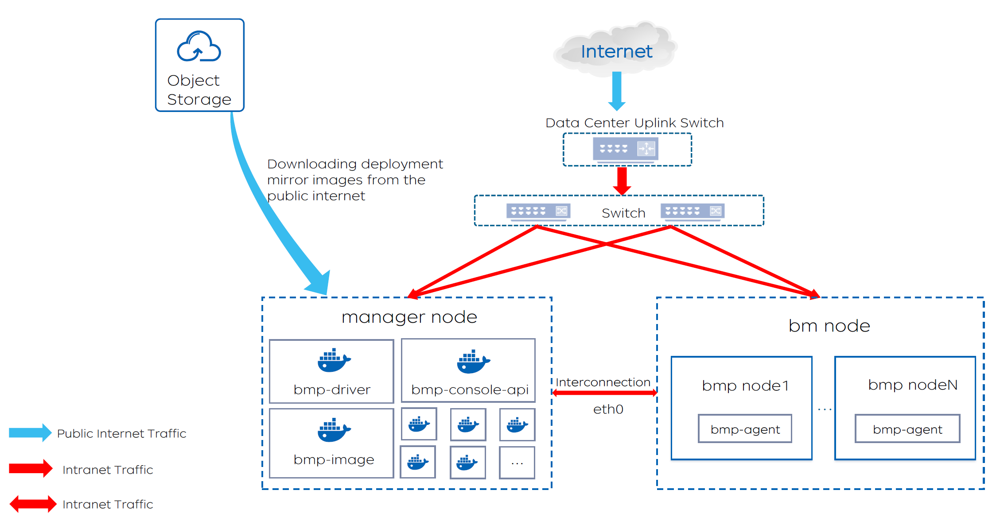
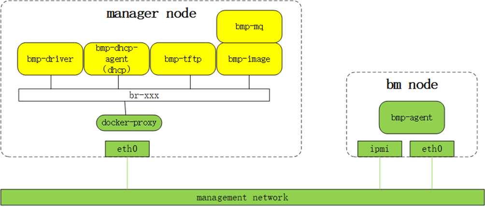

## Environment Preparation
**Environment preparation includes *network environment preparation* and *server preparation*. The overall architecture is as follows:**

### 1. Network Preparation
*Note: If you only want to experience the BMP management components, the following network environment configuration can be skipped. However, if you are preparing for actual installation, the following network configuration is mandatory.*

The manager node and bm nodes are located in ******, and the bm nodes need to obtain their IP addresses through the DHCP service.  
Before deploying the BMP platform, you need to configure the DHCP relay on the uplink switch of the installation nodes to point to the manager node.  
Below is an example of the network configuration:  
  
In this network structure, TOR1 represents the uplink switch of the eth0 network card of the installation node.

- **Manager Node**  
  eth0 IP: 192.168.14.80/27  
  This address is usually a private network address. The BMP DHCP service will run on this private network address. This private network address will also be communicated to the BMP platform through the configuration file.

- **BM Node**  
  IPMI IP: 192.168.11.130/27

- **TOR1**  
  IP: 192.168.12.129/27  
  VLAN ID: 200

- Log in to TOR1 and check the DHCP relay for VLAN 200 to ensure the relay address is the IP of the manager node's management network card (in this example, 192.168.14.80).  
  Log in to TOR1: `ssh switchuser@192.168.12.129`, then enter the password.  
  H3C switch command: `dis cu int Vlan-interface 200`.

~~~
Below are the steps to reconfigure the DHCP relay on an H3C switch:

# Enter system view:
   system-view
# Enter interface view, for example, VLAN interface 200:
   interface vlan 200
# Configure the DHCP relay server address, which is the manager node IP:
   dhcp relay server 192.168.14.80
# Save the configuration:
   save f
# Return to system view:
   quit
# Exit configuration mode:
   quit

Please note that the specific commands and parameters may vary depending on the switch model, software version, and configuration. Ensure you understand the specific configuration requirements of your switch.
~~~

#### BMP Standard Network Communication Process:

* The out-of-band network card (IPMI), management network card (eth0) of the physical machine, and the management network card (eth0) of the manager node are all on the same Layer 2 management network.
* Each BMP component in the manager node runs in a container and exposes service ports to the management network through docker-proxy and the eth0 network card.
* The BMC management system built into the bm node is exposed to the management network through the IPMI network card.
* Other services running on the bm node are exposed to the management network through the eth0 network card.
* To ensure that the system running on the bm node can obtain IP configuration from the DHCP server built into the bmp-dhcp-agent container on the manager node, the uplink switch of the bm node's eth0 network card may need to configure a DHCP relay, with the relay address being the manager node's management IP.
* At the beginning of the installation, the bmp-driver accesses the out-of-band IP of the bm node through the management network to set the boot mode and control the power state of the physical machine.
* During the PXE boot phase, the PXE client built into the eth0 network card of the bm node accesses the DHCP server built into the bmp-dhcp-agent through the management network to obtain IP configuration and the PXE boot program download address, sets the eth0 IP, and downloads the LiveOS kernel and initramfs from bmp-tftp, then boots LiveOS.
* When LiveOS starts, it also obtains IP configuration from the DHCP server built into the bmp-dhcp-agent and sets the eth0 IP.
* During the GuestOS installation phase, the bmp-agent can obtain the required installation information from bmp-mq or download the GuestOS image from bmp-tftp.
* Whether running PXE client, LiveOS, or GuestOS, the IP of the management network card (eth0) of the bm node remains the same. The specific IP address is set in the <u>Operations Platform - Device Management</u>. Ensure the bm node is assigned the correct IP address to ensure the system running on the bm node functions properly at all stages.

### 2. Server Preparation
**Manager Node:**
~~~
Resource Requirements:
CPU: 4 cores
Memory: 8 GB
Disk: 40 GB
Operating System: CentOS 7.9
Network Requirements:
Access to the public internet
Ports to be opened for client browser access: 8080, 8081
Ports to be opened for management network access: 10000, 5672, 67/udp, 69/udp
~~~

**Installation Node Minimum Configuration:**
~~~
CPU: 1 core
Memory: 2 GB
Disk: 40 GB
Must have one out-of-band network card and one management network card
~~~