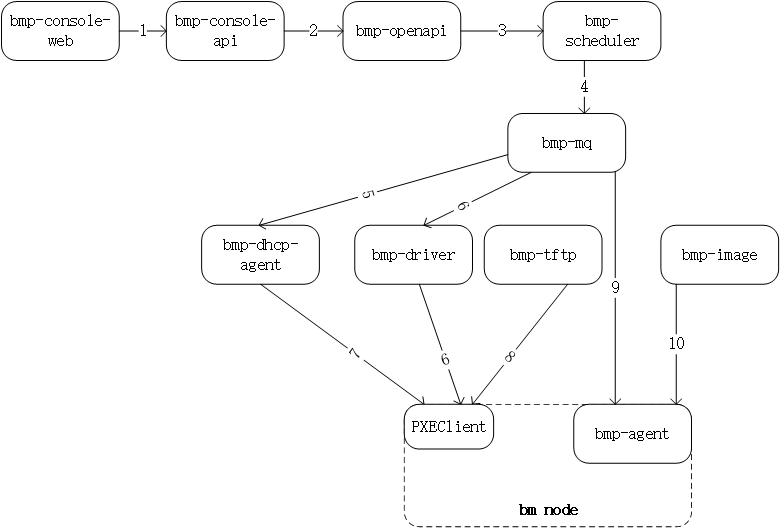

# Local development and deployment

## Development and deployment steps
- [Component introduction](#1)
- [Local development and debugging](#2)
- [Code introduction](#2.1)
- [Front-end component](#2.2)
- [Back-end go component](#2.3)
- [Back-end python component](#2.4)
- [Basic component](#2.5)
- [bmp-image](#2.5.1)
- [bmp-tftp](#2.5.2)
- [bmp-db](#2.5.3)
- [bmp-redis](#2.5.4)
- [bmp-mq](#2.5.5)
- [bmp-rsyslog](#2.5.6)
- [Open source component](#2.6)
- [bmp-pushgateway](#2.6.1)
- [bmp-prometheus](#2.6.2)
-[bmp-alertmanager](#2.6.3)

## Component Introduction
* bmp-console-web console front-end page. Use vue3 scaffolding to build. Includes login page, project management page, personal center page, instance management page and other page functions.
* bmp-console-api console api. Go language backend business, call openapi interface to implement console related interfaces. Assemble all kinds of required data for bmp-console-web, and need to adapt to multiple languages.
* bmp-operation-web operation platform front-end page. Use vue3 scaffolding to build, include login page, computer room management page, model management page, image management page, device management page, role management page, user management page and other page functions.
* bmp-operation-api operation platform api. Go language back-end business, call openapi interface to implement operation platform related interfaces. To assemble all kinds of required data for bmp-operation-web, multi-language adaptation is required.
* bmp-openapi bmp-openapi is the core module of bmp. It implements the restful api format interface that meets the swagger2.0 specification. It provides all basic functions of bmp to the outside world. It performs database operations internally and calls bmp-scheduler to complete the related operations of instance lifecycle management.
* bmp-scheduler installation scheduling module. It accepts the instance lifecycle management request of bmp-openapi, converts the upper-level request into the corresponding commands, and drives the execution of commands, and cooperates with the lower-level bmp-driver and bmp-agent to complete the installation, reinstallation, startup, shutdown and other functions.
* bmp-driver single computer room application. In the case of multiple computer rooms, multiple sets of bmp-driver services need to be deployed, receive mq, and start, shut down, restart, set pxe startup and other operations on the server in this computer room.
* bmp-dhcp-agent Single computer room application, before installation, you need to update the dhcp configuration in advance and store the Mac-IP association in the dhcp configuration. Only then can liveOS obtain the ip address from dhcp.
* bmp-db database
* bmp-redis redis cache
* bmp-mq message middleware
* bmp-tftp tftp server, which stores the relevant files required for pxe boot, including pxe boot program, pxe boot configuration, LiveOS kernel and initramfs.
* bmp-image http server, storing GuestOS image
* bmp-rsyslog rsyslog log component
* bmp-oob-alert out-of-band alarm component
* bmp-oob-agent out-of-band monitoring information collection component
* bmp-monitor-proxy in-band monitoring forwarding component
* bmp-prometheus monitoring data collection component
* bmp-pushgateway collects monitoring data from bmp-monitor-proxy and pushes it to Prometheus
* bmp-alertmanager alarm component
* bmp-pronoea receives alarm information from bmp-alertmanager and converts the format, and passes it to bmp-openapi

### Installation process

### Installation process description
1. The client (bmp-console-web) initiates the installation request, and bmp-console-api receives the request
2. bmp-console-api checks the request parameters and forwards the request to bmp-openapi if it passes.
3. bmp-openapi performs permission checks and other operations, generates installation parameters, and sends them to bmp-scheduler.
4. bmp-scheduler schedules installation tasks, generates a series of installation instructions, and sends them to bmp-dhcp-agent, bmp-driver, and bmp-agent through the bmp-mq service.
5. bmp-dhcp-agent receives the instructions and sets the built-in dhcp server so that the bm node can obtain the correct ip configuration and tftp address (bmp-tftp address) during the pxe startup phase.
6. After receiving the instructions, bmp-driver sets the bm node to pxe startup and restarts.
7. The bm node executes pxe startup, the PXEClient built into the network card starts, and sends a dhcp request broadcast. After receiving the dhcp request, the built-in dhcp server of bmp-dhcp-agent responds with the corresponding ip configuration and tftp address.
8. PXEClient configures its own IP, then downloads the pxe boot program from bmp-tftp and executes it. The pxe boot program continues to obtain other boot parameters from bmp-tftp, downloads the kernel and initramfs, starts the memory operating system, and the bmp-agent service built into the memory operating system starts to start
9. bmp-agent receives instructions and performs subsequent bm installation operations, such as setting up raid, partitioning, etc.
10. bmp-agent downloads the client operating system image file from bmp-image, writes it to the bm node disk, and then initializes the client operating system
11. bmp-agent executes a restart to complete the operating system installation

### Monitoring process

1. The monitoring probe collects host monitoring information and aggregates it to the bmp-monitor-proxy component
2. bmp-monitor-proxy passes the monitoring information to bmp-pushgateway
3. bmp-prometheus regularly pulls monitoring data from bmp-pushgateway
4. After bmp-prometheus triggers the alarm rule, the alarm information is passed to bmp-alertmanager
5. bmp-alertmanager transfers the alarm information to bmp-pronoea for format conversion
6. bmp-pronoea transfers it to bmp-api for alarm display and alarm

### Glossary
* manager node: bmp management server, running all bmp components (except bmp-agent)
* bm node: bare metal server, a physical server for normal operation, without an operating system before installation, running LiveOS during the installation phase, and running GuestOS after installation
* GuestOS: a normal operating operating system
* LiveOS: a memory operating system with bmp-agent pre-installed
* out-of-band network card: a special network card on a physical server used to communicate with bmc, also known as an ipmi network card
* management network card: a standard network card on a physical server, in the management network
* management network: 3-layer network, the management network card of the manager node communicates with the management network card of the bm node through the management network

## Local development and debugging 
### BMP codes are divided into the following categories: 

| Application components | Category | Language/component |
|-------------------|------| --- |
| bmp-console-web | front-end | vue |
| bmp-operation-web | front-end | vue |
| bmp-console-api | back-end | go |
| bmp-operation-api | back-end | go |
| bmp-openapi | back-end | go |
| bmp-scheduler | back-end | go |
| bmp-openapi-console | back-end | go |
| bmp-driver | back-end | go |
| bmp-oob-alert | back-end | go |
| bmp-oob-agent | back-end | go |
| bmp-pronoea | backend | go |
| bmp-monitor-proxy | backend | go |
| bmp-dhcp-agent | backend | python |
| bmp-image | basic components | nginx |
| bmp-tftp | basic components | tftp |
| bmp-db | basic components | mysql |
| bmp-redis | basic components | redis |
| bmp-mq | basic components | rabbitmq |
| bmp-rsyslog | open source components | rsyslog |
| bmp-pushgateway | open source components | pushgateway |
| bmp-alertmanager | open source components | alertmanager |
| bmp-prometheus | open source components | prometheus |

### front-end components vue

| application components | categories | language/components |
|-------------------|------| --- |
| bmp-console-web | front-end | vue |
| bmp-operation-web | front-end | vue |

~~~
# node version requirements
Version 16.19.0

# Install nodejs
wget https://nodejs.org/dist/v16.19.0/node-v16.19.0-linux-x64.tar.xz
tar -xvf node-v16.19.0-linux-x64.tar.xz
mv node-v16.19.0-linux-x64 /usr/local/nodejs
cd /usr/bin
ln -s /usr/local/nodejs/bin/node node
ln -s /usr/local/nodejs/bin/npm npm
ln -s /usr/local/nodejs/bin/npx npx

# Configure npm image
npm config set registry http://registry.m.jd.com

# Install dependencies
npm install --legacy-peer-deps

# Packaging
npm run build-pre

# Local development and testing
npm run dev
~~~
### Backend go component 

| Application component | Category | Language/component |
|-------------------|------| --- |
| bmp-console-web | Frontend | vue |
| bmp-operation-web | Frontend | vue |
| bmp-console-api | Backend | go |
| bmp-operation-api | Backend | go |
| bmp-openapi | Backend | go |
| bmp-scheduler | Backend | go |
| bmp-openapi-console | Backend | go |
| bmp-driver | Backend | go |
| bmp-oob-alert | Backend | go |
| bmp-oob-agent | Backend | go |
| bmp-pronoea | Backend | go |
| bmp-monitor-proxy | Backend | go |
~~~
# Version requirement: golang:1.17
# Example bmp-openapi

cd bmp-openapi

# Compile
go build -o bmp-openapi

# Run
./bmp-openapi
~~~
Please note: The backend service needs to rely on middleware and other components. If local joint debugging is required, the dependent components need to be deployed in advance. For specific dependencies, see the conf directory file in each go component. For example, the conf file bmp-openapi.ini of bmp-openapi is as follows
~~~
# mysql 
jdbc.url=
bmp_db_host=${BMP_DB_HOST}
bmp_db_port=${BMP_DB_PORT}
bmp_db_user=${BMP_DB_USER}
bmp_db_password=${BMP_DB_PASSWORD}
bmp_db_name=${BMP_DB_NAME}

bmp_redis_host=${BMP_REDIS_HOST}
bmp_redis_port=${BMP_REDIS_PORT}
bmp_redis_password=${BMP_REDIS_PASSWORD}

# RabbitMQ for Ironic
bmp_mq_host=${BMP_MQ_HOST}
bmp_mq_port=${BMP_MQ_PORT}
bmp_mq_user=${BMP_MQ_USER}
bmp_mq_password=${BMP_MQ_PASSWORD}
bmp_mq_vhost=${BMP_MQ_VHOST}
bmp_mq_exchange=CPS_IRONIC_SCHEDULER
bmp_mq_receive_routing_key=/test

bmp_monitor_proxy_host=${BMP_MONITOR_PROXY_HOST||192.168.12.72}
bmp_monitor_proxy_port=${BMP_MONITOR_PROXY_PORT||8805}

bmp_pronoea_host=${BMP_PRONOEA_HOST||192.168.12.75}
bmp_pronoea_port=${BMP_PRONOEA_PORT||9999}

bmp_image_host=${BMP_IMAGE_HOST||192.168.12.72}
bmp_image_port=${BMP_IMAGE_PORT||10000}
~~~
- Backend python component 

| Application component | Category | Language/component |
|-------------------|------| --- |
| bmp-dhcp-agent | Backend | python |
~~~
# Requires python3.6+ environment

# Locally install dhcp service, for example centos system
sudo yum install dhcp

# Install python dependencies
pip install -i https://mirrors.jd.com/pypi/web/simple -r requirements.txt

# Run
cd bmp-dhcp-agent
python3 bmp-dhcp-agent./bmpda/cmd/server.py
~~~
### Basic component 
#### bmp-image 
Main storage GuestOS image file, bmp-agent (installation node agent), device_import template (excel file), and use nginx to provide http service to the outside world
~~~
# Step 1: Install nginx, taking cetos as an example
yum install nginx
systemctl start nginx

# Step 2: Download files from JD Cloud Object Storage,
# The current downloadable images are recorded in config/image.cfg

# Download address:
bmp_oss_url=https://bmp.s3.cn-north-1.jdcloud-oss.com

# GuestOS image
bmp_oss_guestos_prefix=GuestOS
bmp_images_x86=(
    v1.7.0-centos-7.9-2022070716.tar.xz
    v1.7.0-ubuntu-18.04-2022062709.tar.xz
)
bmp_images_arm64=(
    v1.7.0-centos-7.9-arm-2023080716.tar.xz
    v1.7.0-ubuntu-18.04-arm-2023081111.tar.xz
)
bmp_images_loonarch64=(
    v1.7.0-loongnix-8.4-2023110218.tar.xz
)

# bmp-agent
bmp_oss_agent_prefix=others
bmp_agent_images=(
	bmp-agent.bin
	bmp-agent.bin.arm
	bmp-agent-windows.tgz
)
# Example of downloading bmp-agent
wget https://bmp.s3.cn-north-1.jdcloud-oss.com/others/bmp-agent.bin

# Step 3: Copy the downloaded file to the file directory of nginx, and take the default configuration of nginx as an example
cat default.conf
server {
    listen       80;
    listen  [::]:80;
    server_name  localhost;
    location / {
        root   /usr/share/nginx/html;
        index  index.html index.htm;
    }
    error_page   500 502 503 504  /50x.html;
    location = /50x.html {
        root   /usr/share/nginx/html;
    }
}
All files downloaded in step 2 need to be copied to the /usr/share/nginx/html directory
# Step 4: Start nginx
systemctl start nginx
# For more nginx configurations, please refer to the official website:
https://nginx.org/en/docs/
~~~

#### bmp-tftp 

| Application Components | Category | Language/Component |
|-------------------|------| --- |
| bmp-tftp | Basic Components | tftp |

Let's briefly review the role of the following tftp service in the installation process:
Step 1: The installation node executes pxe startup, the PXEClient built into the network card starts, and sends a dhcp request broadcast. After receiving the dhcp request, the dhcp server built into the bmp-dhcp-agent responds to the corresponding ip configuration and tftp address
Step 2: PXEClient configures its own IP, then downloads the pxe boot program from bmp-tftp and executes it. The pxe boot program continues to obtain other boot parameters from bmp-tftp, downloads the kernel and initramfs, starts the memory operating system, and the bmp-agent service built into the memory operating system starts to start (this process is automatically downloaded by the system and does not require manual configuration)
So: bmp-tftp provides services for downloading kernels and liveOS images related to system startup
~~~
# Step 1: Install tftp
yum install tftp-server
Configure the TFTP server. In CentOS 7 and later versions, the configuration file for the TFTP service is located in /etc/xinetd.d/tftp. Use a text editor (such as vi or nano) to open the file and change disable = yes to disable = no to enable the TFTP service.
Save and close the file, then restart the xinetd service:
systemctl restart xinetd

# Step 2: Download the kernel and liveOs files from JD Cloud Object Storage

# The current downloadable images are recorded in config/image.cfg

# Download address:
bmp_oss_url=https://bmp.s3.cn-north-1.jdcloud-oss.com

# bootloader
bmp_bootloader_prefix=bootloader
bmp_bootloader_images=(
    BOOTLOONGARCH64.EFI
    grubaa64.efi
    grubx64.efi
    pxelinux.0
)

# LiveOS image bmp_oss_liveos_prefix=LiveOS bmp_kernel_name_x86=v2.0.7-centos_7_9-2024082914-vmlinuz bmp_initramfs_name_x86=v2.0.7-centos_7_9-2024082914-initramfs.gz bmp_kernel_name_arm64=v2.0.7-centos_7_9_ arm64-2024082914-vmlinuz bmp_initramfs_name_arm64=v2.0.7-centos_7_9_arm64-2024082914-initramfs.gz bmp_kernel_name_loonarch64=vmlinuz-loongarch bmp_initramfs_name_loonarch64=initramfs-loongarch.gz # Example; wget https://bmp.s3.cn-north-1.jdcloud-oss.com/bootloader/BOOTLOONGARCH64.EFI wget https://bmp.s3.cn-north-1.jdcloud-oss.com/LiveOS/v2.0.7-centos_7_9-2024082914-vmlinuz

# Step 3: Copy the downloaded file to the tftp file directory
The location of the tftp file directory needs to be checked in the /etc/xinetd.d/tftp file, for example:
service tftp
{
        socket_type             = dgram
        protocol                = udp
        wait                    = yes
        user                    = root
        server                  = /usr/sbin/in.tftpd
        server_args             = -s /var/lib/tftpboot
        disable                 = yes
        per_source              = 11
        cps                     = 100 2
        flags                   = IPv4
}
The tftp file directory is /var/lib/tftpboot
Copy the file to the /var/lib/tftpboot directory, the structure is as follows:
.
├── images
│   ├── arm64
│   │   ├── v2.0.7-centos_7_9_arm64-2024082914-initramfs.gz
│   │   └── v2.0.7-centos_7_9_arm64-2024082914-vmlinuz
│   └── loongarch64
│       ├── initramfs-loongarch.gz
│       └── vmlinuz-loongarch
├── pxelinux.0
├── pxelinux.cfg
│   └── default
├── uefi
│   ├── arm64
│   │   ├── grubaa64.efi
│   │   └── grub.cfg
│   ├── loongarch64
│   │   ├── BOOTLOONGARCH64.EFI
│   │   └── grub.cfg
│   └── x86_64
│       ├── grub.cfg
│       └── grubx64.efi
├── v2.0.7-centos_7_9-2024082914-initramfs.gz
└── v2.0.7-centos_7_9-2024082914-vmlinuz

- pxelinux
- x86_64/grub.cfg
- arm64/grub.cfg
- loongarch64/grub.cfg
The configuration templates of these four files are located in the template directory and need to be copied manually

# Step 4: Start tftp service
systemctl restart xinetd
~~~

#### bmp-mysql

| Application Components | Category | Language/Components |
|-------------------|------| --- |
| bmp-db | Basic Components | mysql |

Here are the basic steps to install and deploy MySQL on a Linux system:
~~~
# Step 1: Install MySQL
sudo yum install mysql-server mysql -y

# Step 2: Start the MySQL service
sudo systemctl start mysqld

# Step 3: Run the security script

Run the MySQL security script to set the root password and other security options:
sudo mysql_secure_installation
Follow the prompts, including setting the root password, removing anonymous users, disabling root remote login, etc.

# Step 4: Log in to MySQL
mysql -u root -p
Enter the password you set in the previous step.

# Step 5: Create a new user and database
CREATE USER 'bmp_rw'@'%' IDENTIFIED BY 'LpK9Jq12Zf';
CREATE DATABASE bmp;
GRANT ALL PRIVILEGES ON bmp.* TO 'bmp_rw'@'%';
FLUSH PRIVILEGES;

# Step 6: Import initialization data
The data is located in sql/bmp.sql, import command
mysql -uroot -p bmp' < ./sql/bmp.sql
Enter the set root password
~~~
#### bmp-redis

| Application Components | Category | Language/Component |
|-------------------|------| --- |
| bmp-redis | Basic Components | redis |

~~~
To install Redis on CentOS 7, follow these steps:

# Step 1: Update System Packages
# First, update the system packages to get the latest package list:
sudo yum update -y

# Step 2: Install EPEL repository
# Redis is not part of the default software source of CentOS, so we need to add the EPEL (Extra Packages for Enterprise Linux) repository to get the Redis installation package:
sudo yum install epel-release -y

# Step 3: Install Redis
sudo yum install redis -y

# Step 4: Configure Redis password
The Redis configuration file is located in /etc/redis.conf
Uncomment the requirepass line and add the password you want to set after it. For example:
requirepass LpK9Jq12Zf

# Step 5: Start the Redis service
sudo systemctl start redis

# Step 6: Test the password
redis-cli -a mystrongpassword ping
~~~
#### bmp-mq

| Application Components | Category | Language/Component |
|-------------------|------| --- |
| bmp-mq | Basic Components | rabbitmq |

~~~
To install RabbitMQ on CentOS 7, follow these steps:

# Step 1: Add EPEL repository

First, you need to add the EPEL (Extra Packages for Enterprise Linux) repository to get the RabbitMQ installation package:
sudo yum install epel-release -y

# Step 2: Install Erlang
# RabbitMQ is written in Erlang, so we need to install Erlang first:
sudo yum install erlang -y

# Step 3: Install RabbitMQ
sudo yum install rabbitmq-server -y

# Step 4: Start the RabbitMQ service
sudo systemctl start rabbitmq-server

# Step 5: Create an administrator account
# By default, RabbitMQ does not have the management plugin enabled. We need to create an administrator account and enable the management plugin:
rabbitmqctl add_vhost /bmp
rabbitmqctl add_user bmp "LpK9Jq12Zf"
rabbitmqctl set_user_tags bmp administrator
rabbitmqctl set_permissions -p "/bmp" bmp '.*' '.*' '.*'
rabbitmqctl list_users
rabbitmqctl change_password $BMP_MQ_USER "$BMP_MQ_PASSWORD"
### 7. Access RabbitMQ Management Interface

You can now access the RabbitMQ management interface by accessing `http://your-server-ip:15672` through your browser. Log in using the administrator account you just created.
~~~~
#### bmp-rsyslog

| Application Components | Category | Language/Component |
|-------------------|------| --- |
| bmp-rsyslog | Open Source Components | rsyslog |

~~~
To install rsyslog on CentOS 7, follow these steps:

# Step 1: Update system packages
First, update system packages to get the latest package list:
sudo yum update -y

# Step 2: Install rsyslog
sudo yum install rsyslog -y

# Step 3: Configure rsyslog
cat << EOF > /etc/rsyslog.d/bmp-rsyslog.conf
module(load="imudp") # needs to be done just once
input(type="imudp" port="514")
$template RemoteLogs,"/var/log/bmp/bmp-rsyslog/%fromhost-ip%/%PROGRAMNAME%-%$YEAR%-%$MONTH%-%$DAY%.log"
$template DynamicDir,"/var/log/bmp/bmp-rsyslog/%fromhost-ip%"
:syslogtag, startswith, "ip" ?DynamicDir
if $fromhost-ip != "127.0.0.1" then ?RemoteLogs
& ~
EOF

# Step 4: Start the rsyslog service
sudo systemctl start rsyslog
~~~

### Open Source Components

| Application Components | Category | Language/Components |
|-------------------|------| --- |
| bmp-prometheus | Open Source Components | prometheus |
| bmp-pushgateway | Open Source Components | pushgateway |
| bmp-alertmanager | Open source component | alertmanager |
The above three monitoring and alarm components are open source Prometheus solutions and can be installed and used together.
The working principle of the three is
1. The application or service pushes the indicator data to Pushgateway.
2. The Prometheus server regularly pulls these indicator data from Pushgateway and stores them in its own time series database.
3. The information that triggers the alarm condition in Prometheus is sent by the alertmanager component
#### bmp-pushgateway
~~~
To install Pushgateway on CentOS 7, follow the steps below:

# Step 1: Download the Pushgateway binary file

First, download the Pushgateway binary file. You can get it from the official website of Prometheus or the GitHub repository. For example, use the following command to download Pushgateway v1.4.0:
wget https://github.com/prometheus/pushgateway/releases/download/v1.4.0/pushgateway-1.4.0.linux-amd64.tar.gz

# Step 2: Unzip the Pushgateway file
tar -xvf pushgateway-1.4.0.linux-amd64.tar.gz

# Step 3: Create the Pushgateway user and group
sudo groupadd --system pushgateway
sudo useradd --system -s /bin/false -g pushgateway pushgateway

# Step 4: Move the Pushgateway file to the appropriate location
sudo mv pushgateway-1.4.0.linux-amd64 /usr/local/pushgateway

# Step 5: Set file permissions
sudo chown -R pushgateway:pushgateway /usr/local/pushgateway
sudo chmod -R 755 /usr/local/pushgateway

# Step 6: Create Pushgateway configuration file
sudo mkdir /etc/pushgateway
sudo touch /etc/pushgateway/pushgateway.yml
Edit the `pushgateway.yml` file and add the configuration you want. For example:
web:
listen-address: ":9091"

# Step 7: Create Pushgateway service file
sudo cat << EOF > /etc/systemd/system/pushgateway.service
[Unit]
Description=Pushgateway
Wants=network-online.target
[Service]
User=pushgateway
Group=pushgateway
ExecStart=/usr/local/pushgateway/pushgateway \
--config.file /etc/pushgateway/pushgateway.yml \
--web.listen-address :9091
--web.enable-admin-api
Restart=always
[Install]
WantedBy=multi-user.target
EOF

# Step 8: Start Pushgateway service
sudo systemctl daemon-reload
sudo systemctl start pushgateway
~~~
#### bmp-prometheus
~~~
To install Prometheus on CentOS, follow these steps:

# Step 1: Download the Prometheus binary file
wget https://github.com/prometheus/prometheus/releases/download/v2.36.1/prometheus-2.36.1.linux-amd64.tar.gz

# Step 2: Unzip the Prometheus file
tar -xvf prometheus-2.36.1.linux-amd64.tar.gz

# Step 3: Create a Prometheus user and group
sudo groupadd --system prometheus
sudo useradd --system -s /bin/false -g prometheus prometheus

# Step 4: Move the Prometheus file to the appropriate location
sudo mv prometheus-2.36.1.linux-amd64 /usr/local/prometheus

# Step 5: Set file permissions
sudo chown -R prometheus:prometheus /usr/local/prometheus sudo chmod -R 755 /usr/local/prometheus 
# Step 6: Create Prometheus configuration file
sudo mkdir /etc/alertmanager
sudo cat << EOF > /etc/alertmanager/alertmanager.yml
global:
  resolve_timeout: 5s
route:
  group_by: ['alertname']
  group_wait: 0s
  group_interval: 60m
  repeat_interval: 10s
  receiver: 'bmpAlertReceiver'
  routes:
  - receiver: 'bmpAlertReceiver'
    group_interval: 5m
    match:
      noticePeriodLabel: NoticePeriod-5m
  - receiver: 'bmpAlertReceiver'
    group_interval: 10m
    match:
      noticePeriodLabel: NoticePeriod-10m
  - receiver: 'bmpAlertReceiver'
    group_interval: 15m
    match:
      noticePeriodLabel: NoticePeriod-15m
  - receiver: 'bmpAlertReceiver'
    group_interval: 30m
    match:
      noticePeriodLabel: NoticePeriod-30m
  - receiver: 'bmpAlertReceiver'
    group_interval: 60m
    match:
      noticePeriodLabel: NoticePeriod-60m
  - receiver: 'bmpAlertReceiver'
    group_interval: 180m
    match:
      noticePeriodLabel: NoticePeriod-180m
  - receiver: 'bmpAlertReceiver'
    group_interval: 720m
    match:
      noticePeriodLabel: NoticePeriod-720m
  - receiver: 'bmpAlertReceiver'
    group_interval: 1440m
    match:
      noticePeriodLabel: NoticePeriod-1440m
receivers:
  - name: 'bmpAlertReceiver'
    webhook_configs:
      - url: 'http://${BMP_PRONOEA_HOST}:${BMP_PRONOEA_PORT}/api/alert/receiver'
EOF
Please note that BMP_ALERTMANAGER_HOST and BMP_PUSHGATEWAY_PORT variables are set

# Step 7: Create Prometheus service file
sudo cat << EOF > /etc/systemd/system/alertmanager.service
[Unit]
Description=Alertmanager
Wants=network-online.target

[Service]
User=alertmanager
Group=alertmanager
ExecStart=/usr/local/alertmanager/alertmanager \
    --config.file /etc/alertmanager/alertmanager.yml \
    --web.listen-address :9093
    --log.level=debug
Restart=always

[Install]
WantedBy=multi-user.target
EOF

# Step 8: Start Prometheus service
sudo systemctl daemon-reload
sudo systemctl start prometheus
~~~

#### bmp-alertmanager
~~~
# Step 1: Download Alertmanager binary file
wget https://github.com/prometheus/alertmanager/releases/download/v0.24.0/alertmanager-0.24.0.linux-amd64.tar.gz

# Step 2: Unzip Alertmanager file
tar -xvf alertmanager-0.24.0.linux-amd64.tar.gz

# Step 3: Create Alertmanager user and group
sudo groupadd --system alertmanager
sudo useradd --system -s /bin/false -g alertmanager alertmanager

# Step 4: Move the Alertmanager file to the appropriate location
sudo mv alertmanager-0.24.0.linux-amd64 /usr/local/alertmanager

# Step 5: Set file permissions
sudo chown -R alertmanager:alertmanager /usr/local/alertmanager
sudo chmod -R 755 /usr/local/alertmanager

# Step 6: Create the Alertmanager configuration file
sudo mkdir /etc/alertmanager
sudo cat << EOF > /etc/alertmanager/alertmanager.yml
global:
  resolve_timeout: 5s
route:
  group_by: ['alertname']
  group_wait: 0s
  group_interval: 60m
  repeat_interval: 10s
  receiver: 'bmpAlertReceiver'
  routes:
  - receiver: 'bmpAlertReceiver'
    group_interval: 5m
    match:
      noticePeriodLabel: NoticePeriod-5m
  - receiver: 'bmpAlertReceiver'
    group_interval: 10m
    match:
      noticePeriodLabel: NoticePeriod-10m
  - receiver: 'bmpAlertReceiver'
    group_interval: 15m
    match:
      noticePeriodLabel: NoticePeriod-15m
  - receiver: 'bmpAlertReceiver'
    group_interval: 30m
    match:
      noticePeriodLabel: NoticePeriod-30m
  - receiver: 'bmpAlertReceiver'
    group_interval: 60m
    match:
      noticePeriodLabel: NoticePeriod-60m
  - receiver: 'bmpAlertReceiver'
    group_interval: 180m
    match:
      noticePeriodLabel: NoticePeriod-180m
  - receiver: 'bmpAlertReceiver'
    group_interval: 720m
    match:
      noticePeriodLabel: NoticePeriod-720m
  - receiver: 'bmpAlertReceiver'
    group_interval: 1440m
    match:
      noticePeriodLabel: NoticePeriod-1440m
receivers:
  - name: 'bmpAlertReceiver'
    webhook_configs:
      - url: 'http://${BMP_PRONOEA_HOST}:${BMP_PRONOEA_PORT}/api/alert/receiver'
EOF
Please pay attention to setting the service IP and port of pronoea: BMP_PRONOEA_HOST and BMP_PRONOEA_PORT
### 7. Create Alertmanager service file
sudo cat << EOF > /etc/systemd/system/alertmanager.service
[Unit]
Description=Alertmanager
Wants=network-online.target

[Service]
User=alertmanager
Group=alertmanager
ExecStart=/usr/local/alertmanager/alertmanager \
--config.file /etc/alertmanager/alertmanager.yml \
--web.listen-address :9093
--log.level=debug
Restart=always

[Install]
WantedBy=multi-user.target
EOF

# Step 8: Start Alertmanager service
sudo systemctl daemon-reload
sudo systemctl start alertmanager
~~~