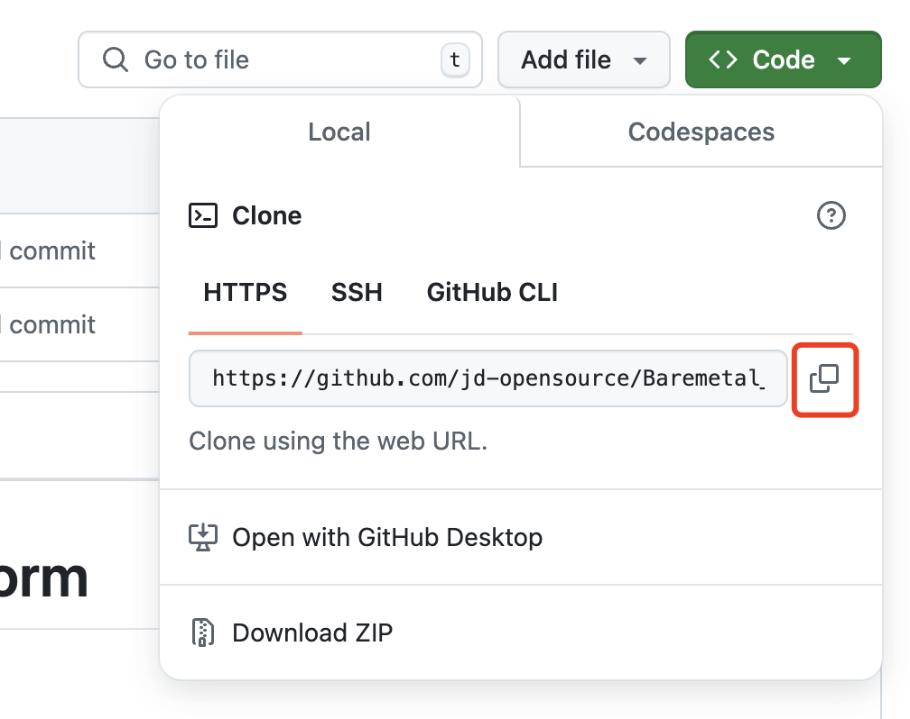
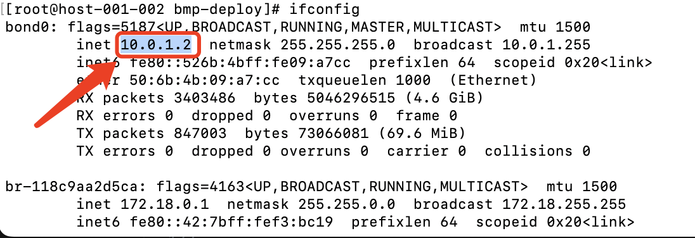
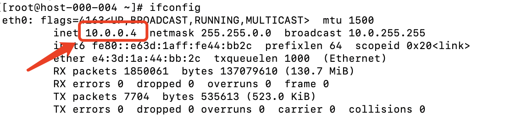

# One-click deployment of BMP system
- [One-click deployment overview](#1)
  - [Term explanation](#1.1)
  - [Overall deployment steps](#1.2)
- [Environment preparation](#2)
- [Management node deployment](#3)
  - [Environment preparation](#3.1)
  - [Configure environment parameters](#3.2)
  - [One-click deployment of BMP](#3.3)
  - [Access BMP](#3.4)
  - [BMP platform manages physical servers](#3.5)
## One-click deployment overview
### Term explanation
- BMP
Bare Metal Manage Platform, referred to as BMP.
- manager node
BMP management server (management node), running all BMP components (except bmp-agent)
- bm node
Installation node, a physical server for normal work, without operating system before installation, running LiveOS during installation, and running GuestOS after installation.
- GuestOS
A normal operating system
- LiveOS
A memory operating system with bmp-agent pre-installed
- Out-of-band network card
A special network card on a physical server used to communicate with bmc, also known as an ipmi network card
- Management network card
A standard network card on a physical server, located in the management network

### Overall deployment steps
- The manager node and the bm node are in a large layer 2 network (if you only experience the BMP platform and do not intend to experience the BMP bare metal installation process, this step can be skipped)
- Install the operating system CentOS 7.9 on the manager node
- Configure the dhcp-relay address of the bm node tor to the ip address of the manager node (if you only experience the BMP platform and do not intend to experience the BMP bare metal installation process, this step can be skipped)
- Deploy the BMP platform through docker on the manager node. Refer to [Management node deployment](#3)

## Environment Preparation
**Environment preparation includes *network environment preparation* and *server preparation*.  
For detailed steps, refer to the [Environment Preparation](env-prepare.md) section.**

## Management node deployment
~~~
Step 1: Environment preparation

Step 2: Configure environment parameters

Step 3: One-click deployment of BMP

Step 4: Access BMP

Step 5: BMP platform manages physical servers
~~~

### Step 1: Environment preparation id="3.1"></a>

#### 1. Install docker and docker compose
- yum installation method (CentOS 7.9 system)
~~~
#You can use domestic mirror sources, such as Tsinghua mirror sources
yum install -y yum-utils
yum-config-manager \
    --add-repo \
    https://mirrors.tuna.tsinghua.edu.cn/docker-ce/linux/centos/docker-ce.repo
sed -i 's+https://download.docker.com+https://mirrors.tuna.tsinghua.edu.cn/docker-ce+' /etc/yum.repos.d/docker-ce.repo

yum install -y docker-ce docker-ce-cli containerd.io docker-buildx-plugin docker-compose-plugin

systemctl start docker
~~~

For more installation methods, please refer to the docker official website
- Docker official document address: https://docs.docker.com/
- Docker Compose official document address: https://docs.docker.com/compose/

### 2. Download BMP source code to the manager node server
Before downloading, first clarify the deployment directory of BMP. This instance is installed in the user's home directory by default. First
~~~
# Jump to the home directory, and then execute the subsequent download command
cd ~
~~~
Find the [Code] button in the upper right corner of the homepage and click the drop-down menu, as shown in the figure

- Method 1: Use the git clone command
~~~
# Execute on the management node, clone the HTTPS link copied above, for example:
git clone https://github.com/jd-opensource/Baremetal_Manage_Platform.git
~~~
- Method 2: Click Download ZIP, download the zip package directly, and manually transfer it to the management server
For more github operations, refer to the official github operation document:
https://docs.github.com/en/repositories/creating-and-managing-repositories/cloning-a-repository
- Method 3: You can download the installation package directly from JD Cloud
~~~
wget https://bmp.s3.cn-north-1.jdcloud-oss.com/opensource/Baremetal_Manage_Platform.zip
unzip Baremetal_Manage_Platform.zip -d Baremetal_Manage_Platform
~~~

### Step 2: Configure environment parameters 
- Deployment script directory
The deployment script is located in the bmp-deploy directory
File description in the directory: [bmp-deploy file and directory description] (bmp-deploy/bmp-deploy.md)

- Modify configuration
Edit .env file
  - Modify BMP_HOST_IP to the manager node management network card IP. This example is 192.168.14.80. If the server has multiple network cards, please configure one of the IPs. If bond is configured, use the bond network card. Otherwise, try to choose a network card with a private network IP address.
ifconfig command-bond0 example image

ifconfig command-eth0 example image

  - Modify BASE_REGISTRY. Deployment requires the use of basic container images such as mysql/redis/mq/nginx. This example pulls from quay.io by default. If the network is restricted, please modify it to other public or private image repositories

~~~
cd ~/Baremetal_Manage_Platform/bmp-deploy/
# Check the server IP address, first check the IP address of bond0, and then check the IP address of eth0. If you are not sure, please consult the operation and maintenance personnel.
ifconfig

# Edit environment variables
# Must be consistent with the manager node server IP
# Set BMP_HOST_IP=192.168.14.80
vi .env
~~~

For more configurations, please refer to [Configuration Management](bmp-deploy/config.md)

### Step 3: One-click deployment of BMP
- Install BMP
~~~
cd ~/Baremetal_Manage_Platform/bmp-deploy/
bash bmp-deploy-precheck.sh -e public
bash bmp-deploy.sh start all
~~~

- Check the status of each service
~~~
bash bmp-deploy.sh status all
~~~
Under normal circumstances, the status of all services is running. If some services are not running, refer to [Troubleshooting](bmp-deploy/troubleshoot.md)
During the installation process, the relevant operating system image will be automatically downloaded from JD Object Storage. The download speed is related to the server network speed. Please wait patiently.
For more service management operations, refer to [Service Management](bmp-deploy/service-manage.md)

### Step 4: Access BMP
Note: Default account: admin, password: df9Ydfd$c

Console: http://manager_ip:8080. This example is http://192.168.14.80:8080.

Operation platform: http://manager_ip:8081. This example is http://192.168.14.80:8081.

### Step 5: Manage bare metal servers on the management platform
Log in to the <u>BMP operation platform</u>, enter the <u>device management</u> interface, and import the bm node information.