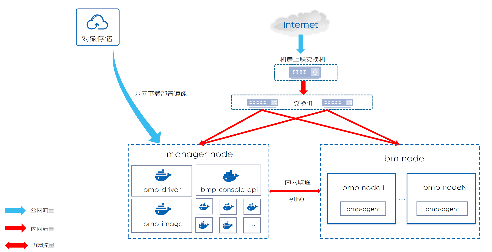
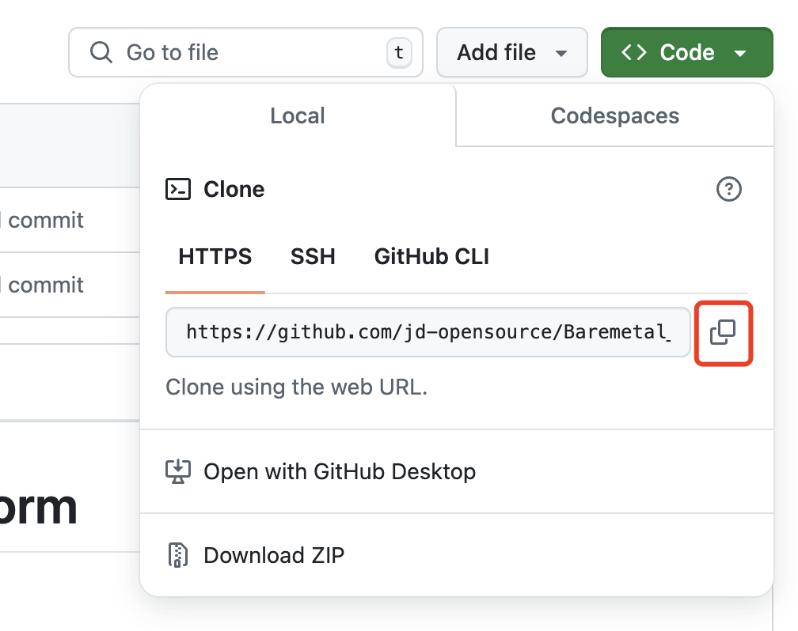
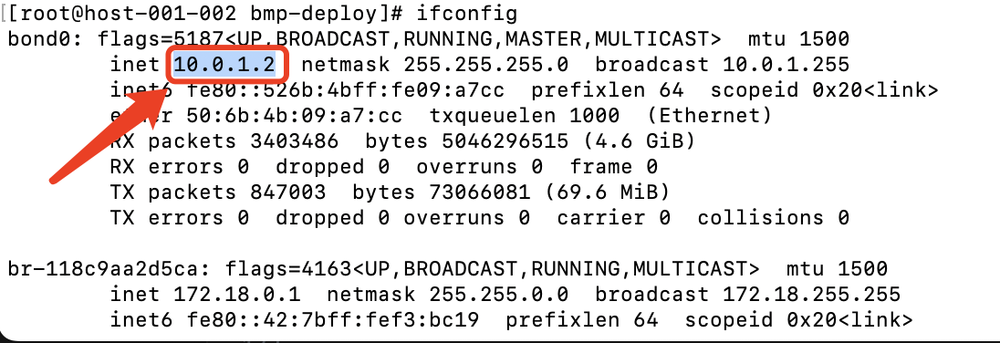
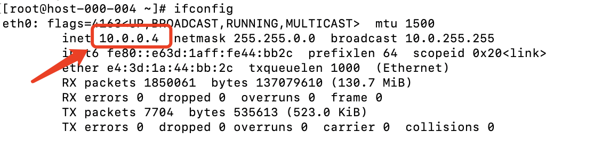
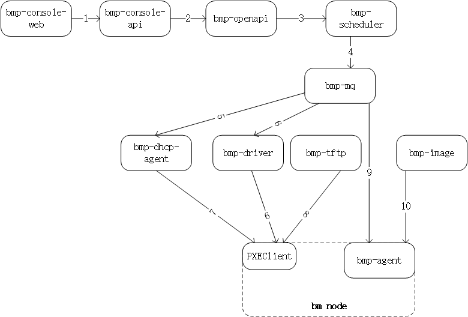
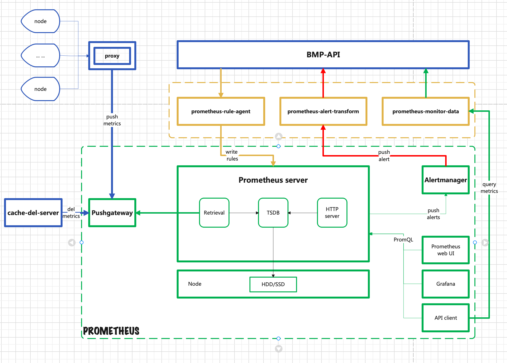

# 源码部署

介绍: 在上一章节[快速体验](setup.md)中，可以使用官方提供的BMP镜像快速部署bmp平台。相关镜像已经上传到quay.io镜像仓库   
本章节介绍如何通过各个组件源码，编译对应镜像，并部署BMP平台。
分为两部分内容: 
1. 对运维人员：通过【源码部署】章节，了解镜像制作过程，并完成在本地容器化部署BMP平台，包括代码拉取，环境准备，组件编译，镜像制作，应用部署等
2. 对研发人员：通过[快速体验](setup.md)或[源码部署](#1)章节已经运行起完整的BMP平台后，通过【定制化开发及部署】章节，了解如何对某一个组件进行定制化开发，及开发后如何更新相应组件 
## 目录结构如下：
- [源码部署](#1)
  - [源码部署概述](#1.1)
  - [部署步骤](#1.2)
    - [环境准备](#1.2.1)
    - [代码下载](#1.2.2)
    - [组件镜像制作](#1.2.3)
    - [应用部署](#1.2.4)
    - [访问BMP](#1.2.5)
    - [管理平台纳管裸金属服务器](#1.2.6)
- [定制化开发及部署](#2)
  - [定制化开发及部署概述](#2.1)
  - [组件介绍](#2.2)
  - [定制化开发](#2.3)
  - [更新组件镜像](#2.4)
  - [重新部署组件](#2.5)

## 源码部署
## 源码部署概述

如图是BMP平台整体架构图，图中manager node即管理组件节点，bm node即被装机物理服务器  

整体部署步骤分两部分：  
- 准备整体环境，包括网络环境准备，服务器准备，思路如下：
  - manager节点和bm节点在一个大二层网络中
  - manager节点安装操作系统CentOS 7.9
  - 配置bm节点上联tor的dhcp-relay地址为manager节点的ip地址（如果仅体验BMP平台，不打算体验BMP裸金属装机流程，此步骤可跳过）
  - 该部分内容参见[环境准备](env-prepare.md)部分
- 在manager节点通过docker制作容器镜像，部署BMP平台  
  关键步骤如下：
  - 下载源码(对应[第一步:管理节点部署准备](#3.1)部分)，
  - 下载编译需要的基础镜像，使用每个组件下的dockerfile，以基础镜像为底座，制作应用镜像(对应[第三步:组件镜像制作](#3.3)),该部分是是容器化部署BMP平台的关键步骤
  - 使用docker-compose部署应用(对应[第四步:应用部署](#3.4))  

## 部署步骤

第一步: [管理节点部署准备](#1.2.1)

第二步: [配置环境变量](#1.2.2)

第三步: [组件镜像制作](#1.2.3)

第四步: [应用部署](#1.2.4)

第五步: [访问BMP](#1.2.5)

第六步: [管理平台纳管裸金属服务器](#1.2.6)

### 第一步：管理节点部署准备

#### 1. 安装docker和docker compose
- yum安装方式(CentOS 7.9系统)
~~~
#可使用国内镜像源，比如清华镜像源
yum install -y yum-utils
yum-config-manager \
    --add-repo \
    https://mirrors.tuna.tsinghua.edu.cn/docker-ce/linux/centos/docker-ce.repo
sed -i 's+https://download.docker.com+https://mirrors.tuna.tsinghua.edu.cn/docker-ce+' /etc/yum.repos.d/docker-ce.repo

yum install -y docker-ce docker-ce-cli containerd.io docker-buildx-plugin docker-compose-plugin

systemctl start docker
~~~

更多安装方式请参考docker官网
- Docker官方文档地址：https://docs.docker.com/
- Docker Compose官方文档地址：https://docs.docker.com/compose/

#### 2. 下载BMP源码到manager节点服务器
下载前先明确BMP的部署目录，本实例默认安装在用户家目录，首先
~~~
# 跳转到家目录，再执行后续下载命令
cd ~
~~~
找到主页右上角的 【Code】 按钮，点开下拉菜单，如图

- 方式一：用git clone命令
~~~
# 在管理节点执行,clone 上面复制的 HTTPS 链接,举例：
  git clone https://github.com/jd-opensource/Baremetal_Manage_Platform.git
~~~
- 方式二：点击 Download ZIP ，直接下载zip包后，手动传到管理服务器上
  更多github操作，参考 github官方操作文档：  
  https://docs.github.com/en/repositories/creating-and-managing-repositories/cloning-a-repository
- 方式三：可直接从京东云下载安装包
~~~
wget https://bmp.s3.cn-north-1.jdcloud-oss.com/opensource/Baremetal_Manage_Platform.zip
unzip Baremetal_Manage_Platform.zip -d Baremetal_Manage_Platform
~~~

### 第二步：配置环境参数
- 部署脚本目录  
  部署脚本位于 bmp-deploy目录下  
  目录内文件说明:[bmp-deploy文件和目录说明](bmp-deploy/bmp-deploy.md)

- 修改配置  
  编辑.env文件  
  修改BMP_HOST_IP为manager节点管理网卡ip。如果服务器多网卡，请配置其中一个ip。如果配置了bond，使用bond网卡。否则尽量选择私网IP地址网卡。
    ifconfig命令-bond0示例图
    
    ifconfig命令-eth0示例图
    
  修改BASE_REGISTRY，部署需要使用mysql/redis/mq/nginx等基础容器镜像，本示例默认从quay.io拉取，如果网络限制，请修改为其他公共或私有镜像仓库
~~~
cd ~/Baremetal_Manage_Platform/bmp-deploy/
# 查看服务器ip地址,优先查看bond0的ip地址，再次查看eth0的ip地址。如果不确定请咨询运维人员。
ifconfig

# 编辑环境变量
# 必须和manager节点服务器ip保持一致
# 设置  BMP_HOST_IP=192.168.14.80
vi .env
~~~

更多配置请参考[配置管理](bmp-deploy/config.md)

### 第三步：组件镜像制作
#### 1. docker镜像制作相关知识点
docker镜像制作是在一个基础镜像的基础上，通过dockerfile文件，制作应用镜像，dockerfile文件中包含应用镜像的构建过程，包括安装依赖，编译，拷贝文件等。
举例: bmp-schedule的dockerfile文件如下：
~~~
FROM golang:1.17-alpine AS builder
ENV GOPROXY https://goproxy.cn
WORKDIR /usr/src/bmp-scheduler
COPY . .
RUN go build -o /tmp/bmp-scheduler .

FROM alpine:3.16
WORKDIR /home/bmp/bmp-scheduler
COPY --from=builder /tmp/bmp-scheduler .
COPY ./conf ./conf
CMD ["./bmp-scheduler"]
~~~
在该dockerfile中，定义了两个构建阶段，
- 在第一阶段中 FROM指令指定基础镜像，FROM golang:1.17-alpine AS builder 表示使用golang:1.17-alpine镜像作为基础镜像，然后在这个基础镜像基础上，执行go build -o /tmp/bmp-scheduler . 命令，将代码编译成二进制文件
- 在第二阶段中 FROM指令指定基础镜像，FROM alpine:3.16 表示使用alpine:3.16镜像作为基础镜像，然后在这个基础镜像基础上，执行COPY --from=builder /tmp/bmp-scheduler . 命令，将第一阶段编译好的二进制文件拷贝到当前目录，然后执行CMD ["./bmp-scheduler"] 命令，启动应用

执行编译命令 
~~~
docker build -f bmp-schedule.Dockerfile -t bmp-schedule:v1.0 ./
~~~
表示用bmp-schedule.Dockerfile作为dockerfile, ./目录下的源码作为编译用到的源码，编译后生成bmp-schedule镜像，tag为v1.0
#### 2. 准备编译需要的基础镜像
- alpine:3.16
- golang:1.17-alpine
- nginx:1.22-alpine
- node:16.19-alpine3.16
- python:3.6-alpine
- quay.io/goswagger/swagger
  拉取基础镜像
~~~
docker pull docker.io/alpine:3.16
docker pull docker.io/golang:1.17-alpine
docker pull docker.io/nginx:1.22-alpine
docker pull docker.io/node:16.19-alpine3.16
docker pull docker.io/python:3.6-alpine
docker pull quay.io/goswagger/swagger
~~~
如果网络限制，可采用如下方式，使用其他镜像仓库，然后修改tag
~~~
docker pull quay.io/jdcloudbmp/alpine:3.16
docker pull quay.io/jdcloudbmp/golang:1.17-alpine
docker pull quay.io/jdcloudbmp/nginx:1.22-alpine
docker pull quay.io/jdcloudbmp/node:16.19-alpine3.16
docker pull quay.io/jdcloudbmp/python:3.6-alpine
docker pull quay.io/goswagger/swagger

# docker tag
docker tag quay.io/jdcloudbmp/alpine:3.16 alpine:3.16
docker tag quay.io/jdcloudbmp/golang:1.17-alpine golang:1.17-alpine
docker tag quay.io/jdcloudbmp/nginx:1.22-alpine nginx:1.22-alpine
docker tag quay.io/jdcloudbmp/node:16.19-alpine3.16 node:16.19-alpine3.16
docker tag quay.io/jdcloudbmp/python:3.6-alpine python:3.6-alpine
~~~
拉取代码后执行
~~~
docker images
~~~
将会看到本地新增以下镜像，说明镜像拉取成功
~~~
alpine         3.16                     d49a5025be10   11 months ago    5.54MB
nginx          1.22-alpine              88db8eea1453   21 months ago    41MB
node           16.19-alpine3.16         1e70b7adbb19   22 months ago    115MB
golang         1.17-alpine              270c4f58750f   2 years ago      314MB
python         3.6-alpine               3a9e80fa4606   3 years ago      40.7MB
~~~

#### 3. 镜像制作
所有组件镜像分为四类：
1. **使用开源镜像，直接拉取镜像**

| 应用组件            | 类别   | 语言/组件   | 可用下载地址                                           |
|-------------------|------|---------|--------------------------------------------------|
| bmp-db            | 基础组件 | mysql   | quay.io/jdcloudbmp/mysql:5.7-debian                 |
| bmp-redis         | 基础组件 | redis   | quay.io/jdcloudbmp/redis:7.0-alpine                 |
| bmp-mq            | 基础组件 | rabbitmq | quay.io/jdcloudbmp/rabbitmq:3.11-management-alpine  |
| bmp-image         | 基础组件 | nginx |quay.io/jdcloudbmp/nginx:1.22-alpine|
| bmp-pushgateway   | 开源组件 | pushgateway |quay.io/prometheus/pushgateway:v1.9.0 |
| bmp-alertmanager  | 开源组件 | alertmanager |quay.io/prometheus/alertmanager:v0.27.0|
| bmp-prometheus    | 开源组件 | prometheus |quay.io/prometheus/prometheus:v2.52.0|

上述组件是使用开源的镜像，可直接拉取  
源码文件中默认选用镜像源 quay.io/jdcloudbmp  
拉取镜像命令举例:
~~~
docker pull quay.io/jdcloudbmp/mysql:5.7-debian
~~~
如使用其他镜像源，需首先修改 .env 文件中的变量 BASE_REGISTRY，如:BASE_REGISTRY=docker.io,然后拉取镜像
~~~
docker pull docker.io/mysql:5.7-debian
~~~

2. **在开源镜像基础上，制作定制化镜像**

| 应用组件        | 类别   | 语言/组件   | dockerfile路径                                 |
|-------------|------|---------|----------------------------------------------|
| bmp-rsyslog | 开源组件 | rsyslog | bmp-deploy/dockerfile/bmp-rsyslog.Dockerfile |
| bmp-tftp    | 开源组件 | tftp    | bmp-deploy/dockerfile/bmp-tftp.Dockerfile |

上述组件的预制镜像已经上传至镜像仓库，如果不需要定制化制作，可直接拉取使用
~~~
docker pull quay.io/jdcloudbmp/bmp-rsyslog:v1.0
docker  pull quay.io/jdcloudbmp/bmp-tftp:v1.0
~~~
如果需要手动制作，以下两种制作镜像方式任选其一:
- 使用脚本制作镜像
~~~
cd ~/Baremetal_Manage_Platform/bmp-deploy
chmod +x bmp-build-image.sh
./bmp-build-image.sh build bmp-tftp
./bmp-build-image.sh build bmp-rsyslog
~~~
- 手动制作镜像
~~~
# 设置相关环境变量，.env和images.cfg文件中定义了镜像的仓库及版本号等信息
cd ~/Baremetal_Manage_Platform
 . bmp-deploy/.env
 . bmp-deploy/config/image.cfg
docker build -f bmp-deploy/dockerfile/bmp-rsyslog.Dockerfile -t ${bmp_rsyslog_image} ./
docker build -f bmp-deploy/dockerfile/bmp-tftp.Dockerfile -t ${bmp_tftp_image} ./
~~~

3. 通过源码编译制作镜像

| 应用组件        | 类别   | 语言/组件   |
|-------------|------|---------|
| bmp-console-web   | 前端   | vue |
| bmp-operation-web | 前端   | vue |
| bmp-openapi       | 后端   | go |
| bmp-scheduler     | 后端   | go |
| bmp-openapi-console | 后端   | go |
| bmp-driver        | 后端   | go |
| bmp-oob-agent     | 后端   | go |
| bmp-pronoea       | 后端   | go |
| bmp-monitor-proxy | 后端   | go |
| bmp-dhcp-agent    | 后端   | python |

以下两种制作镜像方式任选其一:
- 使用脚本制作镜像
~~~

Usage:  ./bmp-build-image.sh build SERVICE...

COMMAND:
    build       Build image

SERVICE:
    all                 All SERVICES
    bmp-console-web
    bmp-operation-web
    bmp-console-api
    bmp-operation-api
    bmp-openapi
    bmp-openapi-console
    bmp-scheduler
    bmp-driver
    bmp-dhcp-agent
    bmp-oob-alert
    bmp-oob-agent
    bmp-monitor-proxy
    bmp-pronoea
    bmp-tftp
    bmp-rsyslog
    
#举例 
cd ~/Baremetal_Manage_Platform/bmp-deploy
chmod +x bmp-build-image.sh
./bmp-build-image.sh build bmp-console-web
./bmp-build-image.sh build bmp-operation-web
./bmp-build-image.sh build bmp-openapi
./bmp-build-image.sh build bmp-openapi-console
./bmp-build-image.sh build bmp-scheduler
./bmp-build-image.sh build bmp-driver
./bmp-build-image.sh build bmp-dhcp-agent
./bmp-build-image.sh build bmp-oob-agent
./bmp-build-image.sh build bmp-monitor-proxy
./bmp-build-image.sh build bmp-pronoea

~~~
- 手动制作镜像
每个组件目录下都有对应的dockerfile文件，举例：bmp-scheduler组件
~~~
# 设置相关环境变量，.env和images.cfg文件中定义了镜像的仓库及版本号等信息
cd ~/Baremetal_Manage_Platform
 . bmp-deploy/.env
 . bmp-deploy/config/image.cfg
docker build -f ./bmp-console-web/bmp-console-web.Dockerfile -t ${bmp_console_web_image} ./bmp-console-web
docker build -f ./bmp-operation-web/bmp-operation-web.Dockerfile -t ${bmp_operation_web_image} ./bmp-operation-web
docker build -f ./bmp-openapi/bmp-openapi.Dockerfile -t ${bmp_openapi_image} ./bmp-openapi
docker build -f ./bmp-openapi-console/bmp-openapi-console.Dockerfile -t ${bmp_openapi_console_image} ./bmp-openapi-console
docker build -f ./bmp-scheduler/bmp-scheduler.Dockerfile -t ${bmp_scheduler_image} ./bmp-scheduler
docker build -f ./bmp-driver/bmp-driver.Dockerfile -t ${bmp_driver_image} ./bmp-driver
docker build -f ./bmp-dhcp-agent/bmp-dhcp-agent.Dockerfile -t ${bmp_dhcp_agent_image} ./bmp-dhcp-agent
docker build -f ./oob-log-agent/oob-log-agent.Dockerfile -t ${bmp_oob_agent_image} ./oob-log-agent
docker build -f ./bmp-monitor-proxy/bmp-monitor-proxy.Dockerfile -t ${bmp_monitor_proxy_image} ./bmp-monitor-proxy
docker build -f ./bmp-pronoea/bmp-pronoea.Dockerfile -t ${bmp_pronoea_image} ./bmp-pronoea

~~~

4. **通过源码编译制作镜像，但依赖于其他组件**

| 应用组件        | 类别   | 语言/组件   | 依赖组件                 |
|-------------|------|---------|----------------------|
| bmp-console-api   | 后端   | go | bmp-openapi-console  |
| bmp-operation-api | 后端   | go | bmp-openapi |
| bmp-oob-alert     | 后端   | go | bmp-openapi |

如果对bmp-openapi-console和bmp-openapi 组件进行了定制化开发，请将bmp-console-api或bmp-operation-api、oob-log-alert组件重新打包部署

以下两种制作镜像方式任选其一:
- 使用脚本制作镜像
~~~
cd ~/Baremetal_Manage_Platform/bmp-deploy
chmod +x bmp-build-image.sh
./bmp-build-image.sh build bmp-console-api 
./bmp-build-image.sh build bmp-operation-api
./bmp-build-image.sh build bmp-oob-alert
~~~
- 手动制作镜像
~~~
cd ~/Baremetal_Manage_Platform
. bmp-deploy/.env
. bmp-deploy/config/image.cfg

# 注意docker build 最后一个参数是 ./ (即Baremetal_Manage_Platform目录)
docker build -f ./bmp-console-api/bmp-console-api.Dockerfile -t ${bmp_console_api_image} ./
docker build -f ./bmp-operation-api/bmp-operation-api.Dockerfile -t ${bmp_operation_api_image} ./
docker build -f ./oob-log-alert/oob-log-alert.Dockerfile -t ${bmp_oob_alert_image} ./

~~~
镜像制作完成之后，执行
~~~
docker images 
~~~
可以检查所有的镜像是否制作成功

### 第四步：应用部署
在完成以上**环境准备**和**镜像制作**步骤后，可进行应用组件部署

举例：bmp-scheduler
~~~
cd ~/Baremetal_Manage_Platform/bmp-deploy
chmod +x ./bmp-deploy.sh
./bmp-deploy.sh start bmp-scheduler
~~~
如果启动所有应用
~~~
cd ~/Baremetal_Manage_Platform/bmp-deploy
chmod +x ./bmp-deploy.sh
./bmp-deploy.sh start all
~~~
- 检查各服务状态
~~~
./bmp-deploy.sh status bmp-scheduler
# 检查全部服务状态
./bmp-deploy.sh status all
~~~
正常情况下所有服务的状态都是running，如果某些服务未运行，参考[故障排查](bmp-deploy/troubleshoot.md)  
安装过程中会自动从京东对象存储下相关操作系统镜像，下载速度与服务器网速相关，请耐心等待  
更多服务管理操作，参考[服务管理](bmp-deploy/service-manage.md)

### 第五步：访问 BMP
注：默认账号：admin，密码：df9Ydfd$c
控制台：http://manager_ip:8080。本示例是http://192.168.14.80:8080    

运营平台: http://manager_ip:8081。本示例是http://192.168.14.80:8081  

### 第六步：管理平台纳管裸金属服务器
登陆<u>bmp运营平台</u>，进入<u>设备管理</u>界面，导入bmp节点信息

### 注意：
* 内网IPv4，网络子网掩码和网关 请填写正确的地址，使得运行在bm节点的PXEClient，LiveOS，GuestOS能够正常的访问manager网络。

## 定制化开发及部署
### 定制化开发及部署概述
通过[快速体验](setup.md)或[源码部署](#1).已经在本地运行起BMP平台，本章节将介绍在此基础上如何定制化开发单个组件，并更新   
在 [组件介绍](#2.2) 小节介绍各个组件的功能，和相互关系  
在 [定制化开发](#2.3) 小节介绍如何定制化开发单个组件  
在 [更新组件镜像](#2.4) 小节介绍如何更新组件镜像  
在 [重新部署组件](#2.5) 小节介绍如何重新部署组件  

### 组件介绍

| 应用组件              | 类别   | 语言/组件 |
|-------------------|------| --- |
| bmp-image         | 基础组件 | nginx |
| bmp-tftp          | 基础组件 | tftp |
| bmp-db            | 基础组件 | mysql |
| bmp-redis         | 基础组件 | redis |
| bmp-mq            | 基础组件 | rabbitmq |
| bmp-console-web   | 前端   | vue |
| bmp-operation-web | 前端   | vue |
| bmp-console-api   | 后端   | go |
| bmp-operation-api | 后端   | go |
| bmp-openapi       | 后端   | go |
| bmp-scheduler     | 后端   | go |
| bmp-openapi-console | 后端   | go |
| bmp-driver        | 后端   | go |
| bmp-oob-alert     | 后端   | go |
| bmp-oob-agent     | 后端   | go |
| bmp-pronoea       | 后端   | go |
| bmp-monitor-proxy | 后端   | go |
| bmp-dhcp-agent    | 后端   | python |
| bmp-rsyslog       | 开源组件 | rsyslog |
| bmp-pushgateway   | 开源组件 | pushgateway |
| bmp-alertmanager  | 开源组件 | alertmanager |
| bmp-prometheus    | 开源组件 | prometheus |
* bmp-console-web 控制台前端页面。使用vue3脚手架搭建。包含登录页、项目管理页、个人中心页、实例管理页等页面功能。
* bmp-console-api 控制台api。go语言后端业务，调用openapi接口实现控制台相关接口。为bmp-console-web拼装各类需要的数据，需要进行多语言适配。
* bmp-operation-web 运营平台前端页面。使用vue3脚手架搭建，包含登录页、机房管理页、机型管理页、镜像管理页、设备管理页、角色管理页、用户管理页等页面功能。
* bmp-operation-api 运营平台api。go语言后端业务，调用openapi接口实现运营平台相关接口。为bmp-operation-web拼装各类需要的数据，需要进行多语言适配。
* bmp-openapi bmp-openapi是bmp的核心模块。实现了满足swagger2.0规范的restful api格式接口。对外提供了bmp所有基础功能。对内进行数据库操作、调用bmp-scheduler完成实例生命周期管理的相关操作。
* bmp-scheduler 装机调度模块。承接bmp-openapi的实例生命周期管理请求，将上层请求转换为对应的commands，并且驱动commands执行，协同下层的bmp-driver，bmp-agent共同完成装机、重装、开机、关机等功能。
* bmp-driver 单机房应用，在有多个机房情况下需要部署多套bmp-driver服务，接收mq，对本机房的服务器进行开机、关机、重启、设置pxe启动等操作。
* bmp-dhcp-agent 单机房应用，装机之前需要提前更新dhcp配置，将Mac-IP关联关系存入dhcp配置中。之后liveOS才能从dhcp中获取到ip地址。
* bmp-db 数据库
* bmp-redis redis缓存
* bmp-mq 消息中间件
* bmp-tftp tftp服务器，存储着pxe引导需要的相关文件，包括pxe引导程序，pxe引导配置,LiveOS的内核和initramfs。
* bmp-image http服务器，存储着GuestOS镜像
* bmp-rsyslog rsyslog 日志组件
* bmp-oob-alert 带外告警组件
* bmp-oob-agent 带外监控信息采集组件
* bmp-monitor-proxy 带内监控转发组件
* bmp-prometheus 监控数据收集组件
* bmp-pushgateway 从bmp-monitor-proxy收集监控数据，并推送到 Prometheus
* bmp-alertmanager 告警组件
* bmp-pronoea 从bmp-alertmanager接收告警信息并转换格式，传到给bmp-openapi

#### 装机流程

#### 装机流程说明
1. 客户端（bmp-console-web）发起装机请求，bmp-console-api接收请求
2. bmp-console-api检查请求参数，通过后将请求转发给bmp-openapi
3. bmp-openapi执行权限检查等操作，生成装机参数，发送给bmp-scheduler
4. bmp-scheduler调度装机任务，生成一系列装机指令，通过bmp-mq服务发送给bmp-dhcp-agent、bmp-driver和bmp-agent
5. bmp-dhcp-agent收到指令，设置内置的dhcp服务器，使得bm节点在pxe启动阶段能够获取正确的ip配置和tftp地址(bmp-tftp地址)
6. bmp-driver收到指令后，将bm节点设置为pxe启动并重启
7. bm节点执行pxe启动，内置在网卡内的PXEClient启动，发送dhcp请求广播，bmp-dhcp-agent内置的dhcp服务器收到dhcp请求后，响应相应的ip配置和tftp地址
8. PXEClient配置自身ip，之后从bmp-tftp下载pxe引导程序并执行，pxe引导程序继续从bmp-tftp获取其它引导参数，下载内核和initramfs，启动内存操作系统，内置在内存操作系统中bmp-agent服务开始启动
9. bmp-agent接收指令，执行后续bm装机操作，如：设置raid，分区等
10. bmp-agent从bmp-image下载客户操作系统镜像文件，写到bm节点磁盘中，然后初始化客户操作系统
11. bmp-agent执行重启，完成操作系统安装

#### 监控流程

1. 监控探针收集宿主机监控信息，汇总到bmp-monitor-proxy组件
2. bmp-monitor-proxy将监控信息传递到bmp-pushgateway
3. bmp-prometheus定时从bmp-pushgateway拉取监控数据
4. bmp-prometheus触发告警规则后，告警信息传递到bmp-alertmanager
5. bmp-alertmanager将告警信息转给bmp-pronoea，进行格式转换
6. bmp-pronoea转给bmp-api，进行告警展示和告警

#### 名词解释
* manager节点: bmp管理服务器，运行着所有bmp组件（除了bmp-agent）
* bm节点：裸金属服务器，正常工作用的物理服务器，未装机前无操作系统，装机阶段运行LiveOS，装机完成后运行GuestOS
* GuestOS: 正常工作的操作系统
* LiveOS: 内存操作系统，里面预装了bmp-agent
* 带外网卡：物理服务器上用于与bmc通信的特殊网卡，又称ipmi网卡
* 管理网卡：物理服务器的标准的网卡，处在管理网络中
* 管理网络: 3层网络，manager节点的管理网卡与bm节点的管理网卡通过管理网络通信

### 定制化开发
在[组件介绍](#2.2)章节介绍各个组件的功能，和相互关系，其中可定制化开发组件主要包括前后端组件  

| 应用组件              | 类别   | 语言/组件 |
|-------------------|------| --- |
| bmp-console-web   | 前端   | vue |
| bmp-operation-web | 前端   | vue |
| bmp-console-api   | 后端   | go |
| bmp-operation-api | 后端   | go |
| bmp-openapi       | 后端   | go |
| bmp-scheduler     | 后端   | go |
| bmp-openapi-console | 后端   | go |
| bmp-driver        | 后端   | go |
| bmp-oob-alert     | 后端   | go |
| bmp-oob-agent     | 后端   | go |
| bmp-pronoea       | 后端   | go |
| bmp-monitor-proxy | 后端   | go |
| bmp-dhcp-agent    | 后端   | python |

每个组件都有单独的源码文件夹，组件的源码文件夹下有README.md文件，里面有组件的详细介绍，以及组件的定制化开发说明。
研发人员可以参考组件的README.md进行定制化开发。
### 更新组件镜像
当对上述组件进行定制化开发后，重新制作组件的镜像，然后重新部署
每个组件对应的镜像相关信息，记录在bmp-deploy/config/.env 和 bmp-deploy/config/image.cfg文件中，
举例说明：
bmp-scheduler组件的镜像信息如下：
bmp-deploy/config/.env文件中
~~~
BMP_REGISTRY=quay.io/jdcloudbmp
BMP_VERSION='v1.0'
~~~
bmp-deploy/config/image.cfg文件中
~~~
bmp_scheduler_image=${bmp_registry}/bmp-scheduler:${TAG}
~~~
镜像编译和容器部署过程中会读取.env和 image.cfg参数，bmp-scheduler的镜像即为
~~~
quay.io/jdcloudbmp/bmp-scheduler:v1.0
~~~
如果对bmp-scheduler进行定制化开发后，规划用新的镜像name和tag，举例
~~~
docker.io/jdcloudbmp/bmp-scheduler:v2.0
~~~
可直接修改 bmp-deploy/config/image.cfg 中的参数
~~~
bmp_scheduler_image=docker.io/jdcloudbmp/bmp-scheduler:v2.0
~~~
如果规划所有组件都统一用新的name和tag，可直接修改bmp-deploy/config/.env中参数，举例
~~~
BMP_REGISTRY=docker.io
BMP_VERSION='v2.0'
~~~
则所有组件在编译和部署的时候，将使用新的镜像name和tag  
手动镜像制作命令举例
制作镜像前查看镜像列表，可查看到bmp-scheduler原有镜像
~~~
docker images | grep bmp-scheduler
# 
quay.io/jdcloudbmp/bmp-scheduler   v1.0               76053df0e4a6   28 hours ago    24.8MB
~~~
手动执行镜像制作命令
~~~
docker build -f bmp-scheduler.Dockerfile -t bmp-scheduler:v2.0 ./
~~~
再次查看镜像，可以看到新的镜像bmp-scheduler:v2.0
~~~
docker images | grep bmp-scheduler

bmp-scheduler                      v2.0               76053df0e4a6   28 hours ago    24.8MB
quay.io/jdcloudbmp/bmp-scheduler   v1.0               76053df0e4a6   28 hours ago    24.8MB
~~~
更多细节参考[镜像制作知识点](#1.2.3)

### 重新部署组件
重新部署组件
~~~
# 举例
./bmp-deploy.sh reinstall bmp-scheduler
# 检查全部服务状态
./bmp-deploy.sh status bmp-scheduler
~~~
服务的状态都是running后，进行功能验证

