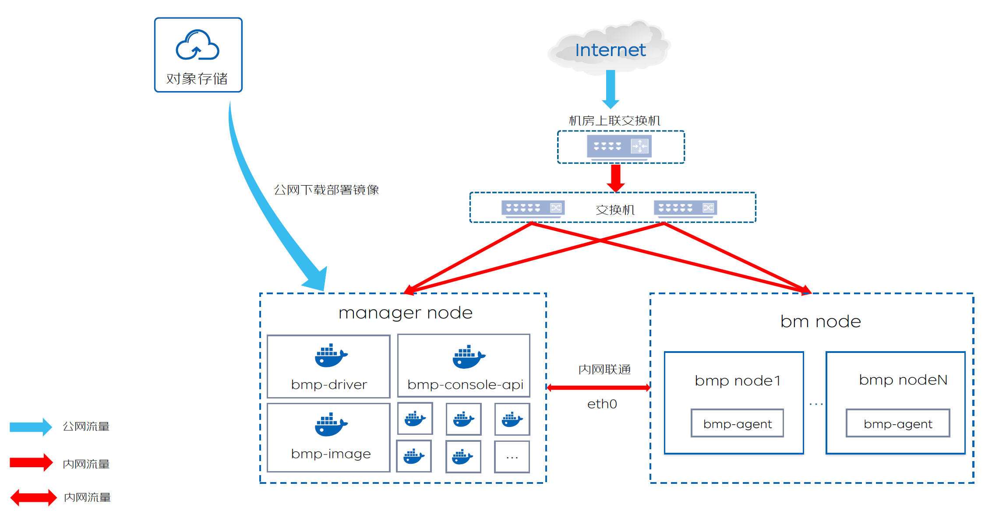

## 环境准备
**环境准备包括 *网络环境准备* 和 *服务器准备* 两部分，整体架构如下**

### 1. 网络准备
*请注意: 如果只体验BMP管理组件,以下网络环境配置可跳过；如果准备真实装机，必须进行以下网络配置*
manager节点和bm节点在一个大二层网络中，bm节点需要根据DHCP服务获取其IP地址。
在进行BMP平台部署之前，需要配置装机节点的上联交换机的dhcp-relay到manager节点。  
如下展示示例网络配置  
  
此网络结构中，TOR1代表装机节点eth0网卡上联交换机。
- manager节点  
  eth0 ip: 192.168.14.80/27  
  此地址一般为私有网络地址，BMP的DHCP服务会启动在这个私有网络地址上。此私有网络地址也会通过配置文件告知BMP平台
- bm节点  
  ipmi ip: 192.168.11.130/27
- TOR1  
  ip: 192.168.12.129/27  
  vlan id: 200
- 登录TOR1，查看vlan 200的dhcp中继，检查中继地址是否为manager节点管理网卡ip（本示例为192.168.14.80）  
  登录TOR1：ssh switchuser@192.168.12.129，输入密码。  
  H3C交换机指令：dis cu int Vlan-interface 200
~~~
以下是使用H3C交换机重新配置DHCP中继的步骤：

#进入系统视图：
   system-view
# 进入接口视图，例如VLAN接口200：
   interface vlan 200
# 配置DHCP中继的服务器地址，即管理节点ip：
   dhcp relay server 192.168.14.80
# 保存配置：
   save f
# 返回到系统视图：
   quit
# 退出配置模式：
   quit

请注意，具体的命令和参数可能会因交换机型号、软件版本和配置而有所不同。确保你已经了解了你的交换机的具体配置要求。
~~~

#### BMP标准网络通信过程如图:

* 物理机的带外网卡ipmi、管理网卡eth0和manager节点的管理网卡eth0都在同一个2层管理网络中。
* manager节点内各个bmp组件以容器方式运行，通过docker-proxy和eth0网卡将服务端口暴露给管理网络访问。
* bm节点内置的bmc管理系统通过ipmi网卡暴露给管理网络访问
* bm节点运行的其它服务通过eth0网卡暴露给管理网络访问
* 为了确保bm节点运行的系统能够从manager节点的bmp-dhcp-agent容器内置的dhcp服务器获取ip配置，bm节点eth0网卡的上联交换机可能需要配置dhcp中继，中继地址为manager节点管理ip。
* 装机开始时，bmp-driver通过管理网络访问bm节点的带外ip，设置物理机的引导模式和控制开关机。
* pxe引导阶段，bm节点的eth0网卡内置的PXEClient通过管理网络访问bmp-dhcp-agent内置的dhcp服务器，获取ip配置和pxe引导程序下载地址，设置eth0 ip，并从bmp-tftp下载LiveOS内核和initramfs，之后启动LiveOS。
* LiveOS启动时，也会从bmp-dhcp-agent内置的dhcp服务器获取ip配置并设置eth0 ip。
* 安装GuesOS阶段，bmp-agent可以从bmp-mq获取所需安装信息，也可以从bmp-tftp下载GuestOS镜像
* 无论运行的是PXEClient、LiveOS还是GustOS，bm节点的管理网卡eth0的ip都是一样的，具体ip地址是在<u>运营平台-设备管理</u>中设置。请给bm节点分配正确的ip地址，确保bm节点在各个阶段运行的系统都能正常工作。

### 2. 服务器准备
manager节点：
~~~
资源要求
cpu: 4 核
内存: 8 GB
磁盘: 40 GB
操作系统：CentOS 7.9
网络要求
能够访问公网
需要开放给客户端浏览器访问的端口：8080，8081
需要开放给管理网络访问的端口: 10000, 5672，67/udp, 69/udp
~~~
装机节点最小配置
~~~
cpu: 1 核
内存: 2 GB
磁盘: 40 GB
拥有一个带外网卡和管理网卡
~~~
