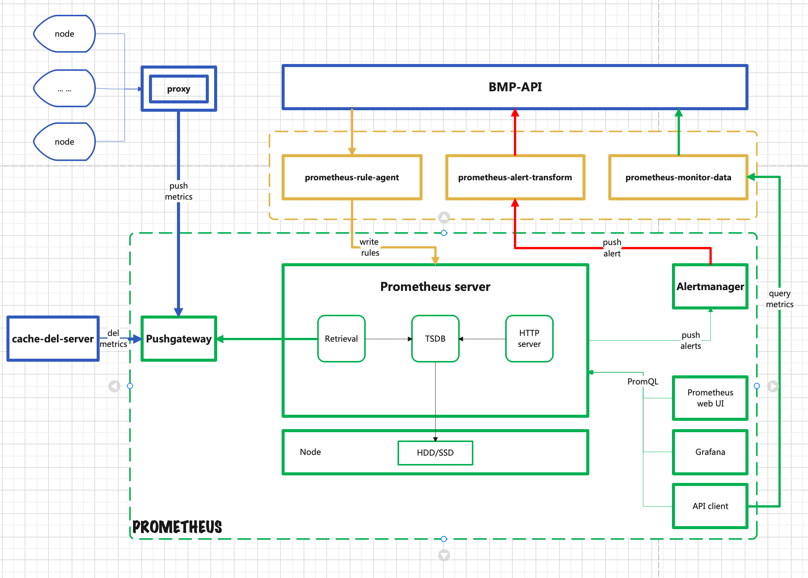

# 本地开发部署
本章节介绍：
- 如何本地非容器部署和调试各个单组件(单组件调试适用于本地开发调试)
- 如何将各组件之间部署联调(联调适用于非容器化部署BMP平台)

## 开发及部署步骤
- [组件介绍](#1)
- [单组件部署调试](#2)
  - [代码介绍及端口规划](#2.1)
    - [代码介绍](#2.1.1)
    - [设置环境变量](#2.1.2)
  - [基础组件](#2.2)
    - [bmp-image](#2.2.1)
    - [bmp-tftp](#2.2.2)
    - [bmp-db](#2.2.3)
    - [bmp-redis](#2.2.4)
    - [bmp-mq](#2.2.5)
    - [bmp-rsyslog](#2.2.6)
  - [前端组件](#2.3)
  - [后端组件](#2.4)
    - [后端go组件](#2.4.1)
    - [后端python组件](#2.4.2)
  - [开源组件](#2.5)
    - [bmp-pushgateway](#2.5.1)
    - [bmp-prometheus](#2.5.2)
    - [bmp-alertmanager](#2.5.3)
- [组件联调部署](#3)
  - [环境准备](#3.1)
  - [设置环境变量](#3.2)
  - [组件按顺序启动](#3.3)
  - [访问 BMP](#3.4)
  - [管理平台纳管裸金属服务器](#3.5)

## 组件介绍
* bmp-console-web 控制台前端页面。使用vue3脚手架搭建。包含登录页、项目管理页、个人中心页、实例管理页等页面功能。
* bmp-console-api 控制台api。go语言后端业务，调用openapi接口实现控制台相关接口。为bmp-console-web拼装各类需要的数据，需要进行多语言适配。
* bmp-operation-web 运营平台前端页面。使用vue3脚手架搭建，包含登录页、机房管理页、机型管理页、镜像管理页、设备管理页、角色管理页、用户管理页等页面功能。
* bmp-operation-api 运营平台api。go语言后端业务，调用openapi接口实现运营平台相关接口。为bmp-operation-web拼装各类需要的数据，需要进行多语言适配。
* bmp-openapi bmp-openapi是bmp的核心模块。实现了满足swagger2.0规范的restful api格式接口。对外提供了bmp所有基础功能。对内进行数据库操作、调用bmp-scheduler完成实例生命周期管理的相关操作。
* bmp-scheduler 装机调度模块。承接bmp-openapi的实例生命周期管理请求，将上层请求转换为对应的commands，并且驱动commands执行，协同下层的bmp-driver，bmp-agent共同完成装机、重装、开机、关机等功能。
* bmp-driver 单机房应用，在有多个机房情况下需要部署多套bmp-driver服务，接收mq，对本机房的服务器进行开机、关机、重启、设置pxe启动等操作。
* bmp-dhcp-agent 单机房应用，装机之前需要提前更新dhcp配置，将Mac-IP关联关系存入dhcp配置中。之后liveOS才能从dhcp中获取到ip地址。
* bmp-db 数据库
* bmp-redis redis缓存
* bmp-mq 消息中间件
* bmp-tftp tftp服务器，存储着pxe引导需要的相关文件，包括pxe引导程序，pxe引导配置,LiveOS的内核和initramfs。
* bmp-image http服务器，存储着GuestOS镜像
* bmp-rsyslog rsyslog 日志组件
* bmp-oob-alert 带外告警组件
* bmp-oob-agent 带外监控信息采集组件
* bmp-monitor-proxy 带内监控转发组件
* bmp-prometheus 监控数据收集组件
* bmp-pushgateway 从bmp-monitor-proxy收集监控数据，并推送到 Prometheus
* bmp-alertmanager 告警组件
* bmp-pronoea 从bmp-alertmanager接收告警信息并转换格式，传到给bmp-openapi

### 装机流程

### 装机流程说明
1. 客户端（bmp-console-web）发起装机请求，bmp-console-api接收请求
2. bmp-console-api检查请求参数，通过后将请求转发给bmp-openapi
3. bmp-openapi执行权限检查等操作，生成装机参数，发送给bmp-scheduler
4. bmp-scheduler调度装机任务，生成一系列装机指令，通过bmp-mq服务发送给bmp-dhcp-agent、bmp-driver和bmp-agent
5. bmp-dhcp-agent收到指令，设置内置的dhcp服务器，使得bm节点在pxe启动阶段能够获取正确的ip配置和tftp地址(bmp-tftp地址)
6. bmp-driver收到指令后，将bm节点设置为pxe启动并重启
7. bm节点执行pxe启动，内置在网卡内的PXEClient启动，发送dhcp请求广播，bmp-dhcp-agent内置的dhcp服务器收到dhcp请求后，响应相应的ip配置和tftp地址
8. PXEClient配置自身ip，之后从bmp-tftp下载pxe引导程序并执行，pxe引导程序继续从bmp-tftp获取其它引导参数，下载内核和initramfs，启动内存操作系统，内置在内存操作系统中bmp-agent服务开始启动
9. bmp-agent接收指令，执行后续bm装机操作，如：设置raid，分区等
10. bmp-agent从bmp-image下载客户操作系统镜像文件，写到bm节点磁盘中，然后初始化客户操作系统
11. bmp-agent执行重启，完成操作系统安装

### 监控流程

1. 监控探针收集宿主机监控信息，汇总到bmp-monitor-proxy组件
2. bmp-monitor-proxy将监控信息传递到bmp-pushgateway
3. bmp-prometheus定时从bmp-pushgateway拉取监控数据
4. bmp-prometheus触发告警规则后，告警信息传递到bmp-alertmanager
5. bmp-alertmanager将告警信息转给bmp-pronoea，进行格式转换
6. bmp-pronoea转给bmp-api，进行告警展示和告警

### 名词解释
* manager节点: bmp管理服务器，运行着所有bmp组件（除了bmp-agent）
* bm节点：裸金属服务器，正常工作用的物理服务器，未装机前无操作系统，装机阶段运行LiveOS，装机完成后运行GuestOS
* GuestOS: 正常工作的操作系统
* LiveOS: 内存操作系统，里面预装了bmp-agent
* 带外网卡：物理服务器上用于与bmc通信的特殊网卡，又称ipmi网卡
* 管理网卡：物理服务器的标准的网卡，处在管理网络中
* 管理网络: 3层网络，manager节点的管理网卡与bm节点的管理网卡通过管理网络通信

## 单组件部署调试
### BMP代码
#### 代码介绍

| 应用组件              | 类别   | 语言/组件 |
|-------------------|------| --- |
| bmp-image         | 基础组件 | nginx |
| bmp-tftp          | 基础组件 | tftp |
| bmp-db            | 基础组件 | mysql |
| bmp-redis         | 基础组件 | redis |
| bmp-mq            | 基础组件 | rabbitmq |
| bmp-console-web   | 前端   | vue |
| bmp-operation-web | 前端   | vue |
| bmp-console-api   | 后端   | go |
| bmp-operation-api | 后端   | go |
| bmp-openapi       | 后端   | go |
| bmp-scheduler     | 后端   | go |
| bmp-openapi-console | 后端   | go |
| bmp-driver        | 后端   | go |
| bmp-oob-alert     | 后端   | go |
| bmp-oob-agent     | 后端   | go |
| bmp-pronoea       | 后端   | go |
| bmp-monitor-proxy | 后端   | go |
| bmp-dhcp-agent    | 后端   | python |
| bmp-rsyslog       | 开源组件 | rsyslog |
| bmp-pushgateway   | 开源组件 | pushgateway |
| bmp-alertmanager  | 开源组件 | alertmanager |
| bmp-prometheus    | 开源组件 | prometheus |

#### 设置环境变量
后端组件会相互调用，规划好各组件的端口,写入配置文件 .env  
举例：本环境部署在ip 192.168.14.80，配置文件 .env 如下,请将ip地址修改为实际ip地址

~~~
set -a
BMP_DB_HOST=192.168.14.80
BMP_DB_PORT=3306
BMP_DB_USER=bmp_rw
BMP_DB_PASSWORD='LpK9Jq12Zf!'
BMP_DB_NAME=bmp
BMP_REDIS_HOST=192.168.14.80
BMP_REDIS_PORT=6379
BMP_REDIS_PASSWORD='LpK9Jq12Zf'
BMP_MQ_HOST=192.168.14.80
BMP_MQ_PORT=5672
BMP_MQ_USER=bmp
BMP_MQ_PASSWORD='LpK9Jq12Zf'
BMP_MQ_VHOST=/bmp
BMP_OMAPI_HOST=192.168.14.80
BMP_OMAPI_PORT=7911
BMP_OMAPI_TOKEN="LpK9Jq12Zf"
BMP_OPENAPI_HOST=192.168.14.80
BMP_OPENAPI_PORT=8801
BMP_OPENAPI_CONSOLE_HOST=192.168.14.80
BMP_OPENAPI_CONSOLE_PORT=8802
BMP_OOB_ALERT_HOST=192.168.14.80
BMP_OOB_ALERT_PORT=8804
BMP_MQ_EXCHANGE_ROUTING_KEY=idc-vm4xsulx1k2d9z4xkctrttig02zl
BMP_IMAGE_PORT=10000
BMP_MONITOR_PROXY_PORT=8805
BMP_PROMETHEUS_HOST=192.168.14.80
BMP_PROMETHEUS_PORT=9090
BMP_PROMETHEUS_DATA_DIR=/data/prometheus
BMP_PUSHGATEWAY_HOST=192.168.14.80
BMP_PUSHGATEWAY_PORT=9091
BMP_ALERTMANAGER_HOST=192.168.14.80
BMP_ALERTMANAGER_PORT=9093
BMP_PRONOEA_HOST=192.168.14.80
BMP_PRONOEA_PORT=9999
BMP_RSYSLOG_PORT=1514
set +a
~~~

环境变量生效
~~~
source .env
~~~
### 基础组件
#### bmp-image 
主要存储 GuestOS镜像文件，bmp-agent(装机节点agent)，device_import template(excel文件)，并以nginx对外提供http服务
~~~
# 第一步：安装nginx，以cetos为例
yum install nginx
systemctl start nginx

# 第二步：从京东云对象存储下载以下文件,并保存到/home/bmp/image
mkdir -p /home/bmp/bmp-image
chmod -R 755 /home/bmp/bmp-image
cd /home/bmp/bmp-image
# GuestOS image
wget https://bmp.s3.cn-north-1.jdcloud-oss.com/GuestOS/v1.7.0-centos-7.9-2022070716.tar.xz 
wget https://bmp.s3.cn-north-1.jdcloud-oss.com/GuestOS/v1.7.0-ubuntu-18.04-2022062709.tar.xz
wget https://bmp.s3.cn-north-1.jdcloud-oss.com/GuestOS/v1.7.0-centos-7.9-arm-2023080716.tar.xz
wget https://bmp.s3.cn-north-1.jdcloud-oss.com/GuestOS/v1.7.0-ubuntu-18.04-arm-2023081111.tar.xz
wget https://bmp.s3.cn-north-1.jdcloud-oss.com/GuestOS/v1.7.0-loongnix-8.4-2023110218.tar.xz

# bmp-agent
wget https://bmp.s3.cn-north-1.jdcloud-oss.com/others/bmp-agent.bin
wget https://bmp.s3.cn-north-1.jdcloud-oss.com/others/bmp-agent.bin.arm
wget https://bmp.s3.cn-north-1.jdcloud-oss.com/others/bmp-agent-windows.tgz
wget https://bmp.s3.cn-north-1.jdcloud-oss.com/others/device_import.xlsx

# 第三步：增加nginx配置文件
cat << EOF > /etc/nginx/conf.d/bmp-image.conf
server {
    listen       10000;
    listen  [::]:10000;
    server_name  localhost;
    location / {
        root   /home/bmp/bmp-image;
        index  index.html index.htm;
    }
    error_page   500 502 503 504  /50x.html;
    location = /50x.html {
        root   /home/bmp/bmp-image;
    }
}
EOF

# 第四步：启动nginx
nginx -s reload

# 更多nginx的配置请参考官网：
https://nginx.org/en/docs/
~~~

#### bmp-tftp 

| 应用组件              | 类别   | 语言/组件 |
|-------------------|------| --- |
| bmp-tftp          | 基础组件 | tftp |

再简要回顾以下tftp服务在装机过程中的作用：  
第一步：装机节点执行pxe启动，内置在网卡内的PXEClient启动，发送dhcp请求广播，bmp-dhcp-agent内置的dhcp服务器收到dhcp请求后，响应相应的ip配置和tftp地址  
第二步：PXEClient配置自身ip，之后从bmp-tftp下载pxe引导程序并执行，pxe引导程序继续从bmp-tftp获取其它引导参数，下载内核和initramfs，启动内存操作系统，内置在内存操作系统中bmp-agent服务开始启动(该过程是系统自动下载，不需要人工配置)  
所以：bmp-tftp提供下载系统启动相关的内核及liveOS镜像的服务

部署tftp步骤如下：
- 第一步：安装tftp
~~~
yum install tftp-server
systemctl start tftp
~~~

- 第二步：从京东云对象存储下载下载内核及liveOs文件
~~~
mkdir -p /var/lib/tftpboot/images/{arm64,loongarch64}
mkdir -p /var/lib/tftpboot/uefi/{arm64,loongarch64,x86_64}
mkdir -p /var/lib/tftpboot/pxelinux.cfg

# arm64-image
wget https://bmp.s3.cn-north-1.jdcloud-oss.com/LiveOS/v2.0.7-centos_7_9_arm64-2024082914-initramfs.gz -P /var/lib/tftpboot/images/arm64
wget https://bmp.s3.cn-north-1.jdcloud-oss.com/LiveOS/v2.0.7-centos_7_9_arm64-2024082914-vmlinuz -P /var/lib/tftpboot/images/arm64
# loongarch64-image
wget https://bmp.s3.cn-north-1.jdcloud-oss.com/LiveOS/initramfs-loongarch.gz -P /var/lib/tftpboot/images/loongarch64
wget https://bmp.s3.cn-north-1.jdcloud-oss.com/LiveOS/initramfs-loongarch.gz -P /var/lib/tftpboot/images/loongarch64
# x86_64-image
wget https://bmp.s3.cn-north-1.jdcloud-oss.com/LiveOS/v2.0.7-centos_7_9-2024082914-initramfs.gz -P /var/lib/tftpboot/images/
wget https://bmp.s3.cn-north-1.jdcloud-oss.com/LiveOS/v2.0.7-centos_7_9-2024082914-vmlinuz -P /var/lib/tftpboot/images/
# bootloader
wget https://bmp.s3.cn-north-1.jdcloud-oss.com/bootloader/BOOTLOONGARCH64.EFI -P /var/lib/tftpboot/uefi/loongarch64
wget https://bmp.s3.cn-north-1.jdcloud-oss.com/bootloader/grubaa64.efi -P /var/lib/tftpboot/uefi/x86_64
wget https://bmp.s3.cn-north-1.jdcloud-oss.com/bootloader/grubx64.efi -P /var/lib/tftpboot/uefi/x86_64
wget https://bmp.s3.cn-north-1.jdcloud-oss.com/bootloader/pxelinux.0 -P /var/lib/tftpboot/
~~~
# 第三步：设置配置文件
~~~
cat << EOF > /var/lib/tftpboot/pxelinux.cfg/default
default bmp agent
    prompt 0
    timeout 1
    label bmp agent
    kernel \${BMP_KERNEL_PATH_x86}
    append initrd=\${BMP_INITRAMFS_PATH_x86} net.ifnames=0 biosdevname=0 BMP_MQ_HOST=\${BMP_HOST_IP} BMP_MQ_PORT=\${BMP_MQ_PORT} BMP_MQ_USER=\${BMP_MQ_USER} BMP_MQ_PASSWORD=\${BMP_MQ_PASSWORD} BMP_MQ_VHOST=\${BMP_MQ_VHOST} BMP_MQ_EXCHANGE_ROUTING_KEY=\${BMP_MQ_EXCHANGE_ROUTING_KEY} BMP_IMAGE_HOST=\${BMP_HOST_IP} BMP_IMAGE_PORT=\${BMP_IMAGE_PORT} BMP_RSYSLOG_HSOT=\${BMP_HOST_IP} BMP_RSYSLOG_PORT=\${BMP_RSYSLOG_PORT}
EOF

cat << EOF > /var/lib/tftpboot/uefi/arm64/grub.cfg
set timeout=1
set default=1
menuentry "bmp agent arm64 uefi" {
    linux \${BMP_KERNEL_PATH_arm64} console=ttyAMA0 console=tty0 net.ifnames=0 biosdevname=0 ksdevice=bootif kssendmac text BMP_MQ_HOST=\${BMP_HOST_IP} BMP_MQ_PORT=\${BMP_MQ_PORT} BMP_MQ_USER=\${BMP_MQ_USER} BMP_MQ_PASSWORD='\${BMP_MQ_PASSWORD}' BMP_MQ_VHOST=\${BMP_MQ_VHOST} BMP_MQ_EXCHANGE_ROUTING_KEY=\${BMP_MQ_EXCHANGE_ROUTING_KEY} BMP_IMAGE_HOST=\${BMP_HOST_IP} BMP_IMAGE_PORT=\${BMP_IMAGE_PORT}
    initrd \${BMP_INITRAMFS_PATH_arm64}
}
EOF

cat << EOF > /var/lib/tftpboot/uefi/loongarch64/grub.cfg
set timeout=1
set default=1
menuentry 'bmp agent loongarch64 uefi' {
    linux \${BMP_KERNEL_PATH_loonarch64} console=ttyS0,115200 console=tty0 net.ifnames=0 biosdevname=0 ksdevice=bootif kssendmac text BMP_MQ_HOST=\${BMP_HOST_IP} BMP_MQ_PORT=\${BMP_MQ_PORT} BMP_MQ_USER=\${BMP_MQ_USER} BMP_MQ_PASSWORD=\${BMP_MQ_PASSWORD} BMP_MQ_VHOST=\${BMP_MQ_VHOST} BMP_MQ_EXCHANGE_ROUTING_KEY=\${BMP_MQ_EXCHANGE_ROUTING_KEY} BMP_IMAGE_HOST=\${BMP_HOST_IP} BMP_IMAGE_PORT=\${BMP_IMAGE_PORT}
    initrd \${BMP_INITRAMFS_PATH_loonarch64}
}
EOF

cat << EOF > /var/lib/tftpboot/uefi/x86_64/grub.cfg
set timeout=1
set default=1
menuentry 'bmp agent x86_64 uefi' {
    linuxefi \${BMP_KERNEL_PATH_x86}  net.ifnames=0 biosdevname=0 ksdevice=bootif kssendmac text BMP_MQ_HOST=\${BMP_HOST_IP} BMP_MQ_PORT=\${BMP_MQ_PORT} BMP_MQ_USER=\${BMP_MQ_USER} BMP_MQ_PASSWORD=\${BMP_MQ_PASSWORD} BMP_MQ_VHOST=\${BMP_MQ_VHOST} BMP_MQ_EXCHANGE_ROUTING_KEY=\${BMP_MQ_EXCHANGE_ROUTING_KEY} BMP_IMAGE_HOST=\${BMP_HOST_IP} BMP_IMAGE_PORT=\${BMP_IMAGE_PORT}
    initrdefi \${BMP_INITRAMFS_PATH_x86}
}
EOF

最终目录结构如图：
.
├── images
│   ├── arm64
│   │   ├── v2.0.7-centos_7_9_arm64-2024082914-initramfs.gz
│   │   └── v2.0.7-centos_7_9_arm64-2024082914-vmlinuz
│   └── loongarch64
│       ├── initramfs-loongarch.gz
│       └── vmlinuz-loongarch
├── pxelinux.0
├── pxelinux.cfg
│   └── default
├── uefi
│   ├── arm64
│   │   ├── grubaa64.efi
│   │   └── grub.cfg
│   ├── loongarch64
│   │   ├── BOOTLOONGARCH64.EFI
│   │   └── grub.cfg
│   └── x86_64
│       ├── grub.cfg
│       └── grubx64.efi
├── v2.0.7-centos_7_9-2024082914-initramfs.gz
└── v2.0.7-centos_7_9-2024082914-vmlinuz
~~~
# 第四步: 设置环境变量 tftp.env
~~~
set -a
BMP_DB_HOST=192.168.14.80
BMP_DB_PORT=3306
BMP_DB_USER=bmp_rw
BMP_DB_PASSWORD='LpK9Jq12Zf!'
BMP_DB_NAME=bmp
BMP_REDIS_HOST=192.168.14.80
BMP_REDIS_PORT=6379
BMP_REDIS_PASSWORD='LpK9Jq12Zf'
BMP_MQ_HOST=192.168.14.80
BMP_MQ_PORT=5672
BMP_MQ_USER=bmp
BMP_MQ_PASSWORD='LpK9Jq12Zf'
BMP_MQ_VHOST=/bmp
BMP_OMAPI_HOST=192.168.14.80
BMP_OMAPI_PORT=7911
BMP_OMAPI_TOKEN="LpK9Jq12Zf"
BMP_OPENAPI_HOST=192.168.14.80
BMP_OPENAPI_PORT=8801
BMP_OPENAPI_CONSOLE_HOST=192.168.14.80
BMP_OPENAPI_CONSOLE_PORT=8802
BMP_OOB_ALERT_HOST=192.168.14.80
BMP_OOB_ALERT_PORT=8804
BMP_MQ_EXCHANGE_ROUTING_KEY=idc-vm4xsulx1k2d9z4xkctrttig02zl
BMP_IMAGE_PORT=10000
BMP_MONITOR_PROXY_PORT=8805
BMP_PROMETHEUS_HOST=192.168.14.80
BMP_PROMETHEUS_PORT=9090
BMP_PROMETHEUS_DATA_DIR=/data/prometheus
BMP_PUSHGATEWAY_HOST=192.168.14.80
BMP_PUSHGATEWAY_PORT=9091
BMP_ALERTMANAGER_HOST=192.168.14.80
BMP_ALERTMANAGER_PORT=9093
BMP_PRONOEA_HOST=192.168.14.80
BMP_PRONOEA_PORT=9999
BMP_RSYSLOG_PORT=1514

# bootloader
bmp_bootloader_prefix=bootloader
bmp_bootloader_images=(
    BOOTLOONGARCH64.EFI
    grubaa64.efi
    grubx64.efi
    pxelinux.0
)

# LiveOS image
bmp_oss_liveos_prefix=LiveOS

bmp_kernel_name_x86=v2.0.7-centos_7_9-2024082914-vmlinuz
bmp_initramfs_name_x86=v2.0.7-centos_7_9-2024082914-initramfs.gz

bmp_kernel_name_arm64=v2.0.7-centos_7_9_arm64-2024082914-vmlinuz
bmp_initramfs_name_arm64=v2.0.7-centos_7_9_arm64-2024082914-initramfs.gz

bmp_kernel_name_loonarch64=vmlinuz-loongarch
bmp_initramfs_name_loonarch64=initramfs-loongarch.gz

bmp_liveos_images=(
    ${bmp_kernel_name_x86}
    ${bmp_initramfs_name_x86}
    ${bmp_kernel_name_arm64}
    ${bmp_initramfs_name_arm64}
    ${bmp_kernel_name_loonarch64}
    ${bmp_initramfs_name_loonarch64}
)
BMP_KERNEL_PATH_x86=/${bmp_kernel_name_x86}
BMP_INITRAMFS_PATH_x86=/${bmp_initramfs_name_x86}
BMP_KERNEL_PATH_arm64=/images/arm64/${bmp_kernel_name_arm64}
BMP_INITRAMFS_PATH_arm64=/images/arm64/${bmp_initramfs_name_arm64}
BMP_KERNEL_PATH_loonarch64=/images/loongarch64/${bmp_kernel_name_loonarch64}
BMP_INITRAMFS_PATH_loonarch64=/images/loongarch64/${bmp_initramfs_name_loonarch64}
set +a
~~~
并生效
~~~
source tftp.env
~~~

# 第五步：启动tftp服务
~~~
systemctl restart tftp
# 检查状态
systemctl status tftp
~~~

#### bmp-mysql

| 应用组件              | 类别   | 语言/组件 |
|-------------------|------| --- |
| bmp-db            | 基础组件 | mysql |

以下是在Linux系统上安装和部署MySQL的基本步骤：
~~~
# 第一步：安装MySQL
# 本章节介绍使用清华镜像源进行安装
cat << EOF > /etc/yum.repos.d/tsinghua-mysql-community.repo
[mysql57-community]
name=MySQL 5.7 Community Server
baseurl=https://mirrors.tuna.tsinghua.edu.cn/mysql/yum/mysql-5.7-community-el7-\$basearch
enabled=1
gpgcheck=0
EOF

sudo yum clean all
sudo yum makecache
sudo yum install mysql-community-server

# 第二步：启动MySQL服务
sudo systemctl start mysqld

# 第三步：安装完成后，MySQL 会生成一个临时密码。你可以通过查看日志文件来获取这个临时密码
grep 'temporary password' /var/log/mysqld.log

# 第四步：登录MySQL
mysql -u root -p
输入你在上一步中找到的临时密码。

# 第五步：创建新用户和数据库
ALTER USER 'root'@'localhost' IDENTIFIED BY 'LpK9Jq12Zf!';
CREATE USER 'bmp_rw'@'%' IDENTIFIED BY 'LpK9Jq12Zf!';
CREATE DATABASE bmp;
GRANT ALL PRIVILEGES ON bmp.* TO 'bmp_rw'@'%';
FLUSH PRIVILEGES;

# 第六步：导入初始化数据
数据位于 bmp-deploy/sql/bmp.sql,导入命令
cd bmp-deploy
mysql -uroot -p bmp < ./sql/bmp.sql
输入设置的root密码即可
~~~

#### bmp-redis

| 应用组件              | 类别   | 语言/组件 |
|-------------------|------| --- |
| bmp-redis         | 基础组件 | redis |

~~~
在CentOS 7上安装Redis可以按照以下步骤进行：

# 第一步： 更新系统包
# 首先，更新系统包以获取最新的软件包列表：
sudo yum update -y

# 第二步：安装EPEL仓库
# Redis不是CentOS默认的软件源中的一部分，所以我们需要添加EPEL（Extra Packages for Enterprise Linux）仓库来获取Redis安装包：
sudo yum install epel-release -y

# 第三步：安装Redis
sudo yum install redis -y

# 第四步：配置Redis密码
Redis的配置文件位于/etc/redis.conf
vi /etc/redis.conf
追加一行，设置密码
requirepass LpK9Jq12Zf
追加一行，设置bind地址，即允许哪些地址可访问该redis，本实例用于测试，设置0.0.0.0，即所有地址可访问，生产环境请根据实际情况设置
bind 0.0.0.0

# 第五步：启动Redis服务
sudo systemctl start redis

# 第六步：测试密码
redis-cli -a LpK9Jq12Zf ping
~~~
#### bmp-mq

| 应用组件              | 类别   | 语言/组件 |
|-------------------|------| --- |
| bmp-mq            | 基础组件 | rabbitmq |

~~~
在CentOS 7上安装RabbitMQ可以按照以下步骤进行：

# 第一步：添加EPEL仓库

首先，需要添加EPEL（Extra Packages for Enterprise Linux）仓库来获取RabbitMQ安装包：
sudo yum install epel-release -y

# 第二步：安装Erlang
# RabbitMQ是用Erlang编写的，所以我们需要先安装Erlang：
sudo yum install erlang -y

# 第三步：安装RabbitMQ
sudo yum install rabbitmq-server -y

# 第四步：启动RabbitMQ服务
sudo systemctl start rabbitmq-server

# 第五步：创建管理员账户
# 默认情况下，RabbitMQ没有启用管理插件。我们需要创建一个管理员账户并启用管理插件：
rabbitmqctl add_vhost /bmp
rabbitmqctl add_user bmp "LpK9Jq12Zf"
rabbitmqctl set_user_tags bmp administrator
rabbitmqctl set_permissions -p "/bmp" bmp '.*' '.*' '.*'
rabbitmqctl list_users

### 第六步：访问RabbitMQ管理界面
现在，你可以通过浏览器访问`http://your-server-ip:15672`来访问RabbitMQ的管理界面。使用你刚刚创建的管理员账户登录。
~~~

#### bmp-rsyslog

| 应用组件              | 类别   | 语言/组件 |
|-------------------|------| --- |
| bmp-rsyslog       | 开源组件 | rsyslog |

~~~
在CentOS 7上安装rsyslog可以按照以下步骤进行：

# 第一步：更新系统包
首先，更新系统包以获取最新的软件包列表：
sudo yum update -y

# 第二步：安装rsyslog
sudo yum install rsyslog -y

# 第三步：配置rsyslog
cat << EOF > /etc/rsyslog.d/bmp-rsyslog.conf
module(load="imudp") # needs to be done just once
input(type="imudp" port="514")
\$template RemoteLogs,"/var/log/bmp/bmp-rsyslog/%fromhost-ip%/%PROGRAMNAME%-%\$YEAR%-%\$MONTH%-%\$DAY%.log"
\$template DynamicDir,"/var/log/bmp/bmp-rsyslog/%fromhost-ip%"
:syslogtag, startswith, "ip" ?DynamicDir
if $fromhost-ip != "127.0.0.1" then ?RemoteLogs
& ~
EOF

# 第四步：启动rsyslog服务
sudo systemctl start rsyslog
~~~

### 前端组件 vue

  | 应用组件              | 类别   | 语言/组件 |
  |-------------------|------| --- |
  | bmp-console-web   | 前端   | vue |
  | bmp-operation-web | 前端   | vue |

~~~
# node 版本要求
版本 16.19.0

# 安装nodejs
wget https://nodejs.org/dist/v16.19.0/node-v16.19.0-linux-x64.tar.xz
tar -xvf node-v16.19.0-linux-x64.tar.xz 
mv node-v16.19.0-linux-x64 /usr/local/nodejs
cd /usr/bin
ln -s /usr/local/nodejs/bin/node node
ln -s /usr/local/nodejs/bin/npm npm
ln -s /usr/local/nodejs/bin/npx npx

# 配置npm镜像源
npm config set registry https://registry.npmjs.org 
# 可根据自己的网络情况配置国内镜像源
npm config set registry https://registry.npmmirror.com

# 安装依赖
npm install --legacy-peer-deps 

# 打包
npm run build-pre

# 本地开发测试
npm run dev
~~~
上述编译打包命令，会生成dist目录，将dist目录分别拷贝到nginx的主目录下
- /home/bmp/bmp-console-web
- /home/bmp/bmp-operation-web

~~~
mkdir -p /home/bmp/bmp-console-web
mkdir -p /home/bmp/bmp-operation-web
cp -r bmp-console-web/dist/* /home/bmp/bmp-console-web
cp -r bmp-operation-web/dist/* /home/bmp/bmp-operation-web
~~~
- 然后配置nginx  
  如果已安装nginx，请跳过安装步骤
  ~~~
  # 安装nginx
  yum install nginx
  systemctl start nginx
  ~~~

    - 配置bmp-console-web  
      将以下内容复制到/etc/nginx/conf.d/bmp-console-web.conf

~~~
    log_format  main1  '$time_local | $remote_addr | $upstream_addr | $http_host | $status | $body_bytes_sent | $upstream_response_time | $request_time | $http_host | $request | $http_referer';

    server {
    listen 8080;
    server_name bmp-console.bmp.local;
    charset utf-8;
    access_log  /var/log/nginx/access.log  main1;

    error_page 500 502 503 504 /50x.html;
    location = /50x.html {
        root html;
    }

    root /home/bmp/bmp-console-web;
    index index.html;

    location /console-web/ {
        set $bmp_console_api "127.0.0.1:8800";
        rewrite ^/console-web/(.*) /$1 break;
        proxy_pass http://$bmp_console_api;
    }
    
    location /oob-alert/ {
        client_max_body_size 51200M;
        set $bmp_oob_alert "127.0.0.1:8804";
        rewrite ^/oob-alert/(.*) /$1 break;
        proxy_pass http://$bmp_oob_alert;      
    }   

    location / {
        try_files $uri $uri/ @router;
        index index.html;
    }

    location @router {
        rewrite ^.*$ /index.html last;
    }
    location ~.*\.(html)$ {
	   add_header Cache-Control no-cache;
    }

    }
~~~

- 配置bmp-operation-web
  将以下内容复制到/etc/nginx/conf.d/bmp-operation-web.conf
~~~
    server {
    listen 8081;
    server_name bmp-operation.bmp.local;
    charset utf-8;
    access_log  /var/log/nginx/access.log  main1;

    error_page 500 502 503 504 /50x.html;
    location = /50x.html {
        root html;
    }

    root /home/bmp/bmp-operation-web;
    index index.html;

    # compression-webpack-plugin 配置
    #gzip on;
    #gzip_min_length 1k;
    #gzip_comp_level 9;
    #gzip_types text/plain application/javascript application/x-javascript text/css application/xml text/javascript applicationx-httpd-php image/jpeg image/gif image/png;
    #gzip_vary on;
    # 配置禁用 gzip 条件，支持正则，此处表示 ie6 及以下不启用 gzip（因为ie低版本不支持）
    #gzip_disable "MSIE [1-6]\.";

    location /operation-web/ {
        client_max_body_size 51200M;
        set $bmp_operation_api "127.0.0.1:8799";
        rewrite ^/operation-web/(.*) /$1 break;
        proxy_pass http://$bmp_operation_api;      
    }
    
    location /oob-alert/ {
        client_max_body_size 51200M;
        set $bmp_oob_alert "127.0.0.1:8804";
        rewrite ^/oob-alert/(.*) /$1 break;
        proxy_pass http://$bmp_oob_alert;      
    }
    
    location / {
        try_files $uri $uri/ @router;
        index index.html;
    }

    location @router {
        rewrite ^.*$ /index.html last;
    }
    location ~.*\.(html)$ {
	add_header Cache-Control no-cache;
    }

}
~~~
重新加载nginx配置
~~~
nginx -s reload
~~~

### 后端组件
#### 后端go组件

  | 应用组件              | 类别   | 语言/组件 |
  |-------------------|------| --- |
  | bmp-console-api   | 后端   | go |
  | bmp-operation-api | 后端   | go |
  | bmp-openapi       | 后端   | go |
  | bmp-scheduler     | 后端   | go |
  | bmp-openapi-console | 后端   | go |
  | bmp-driver        | 后端   | go |
  | bmp-oob-alert     | 后端   | go |
  | bmp-oob-agent     | 后端   | go |
  | bmp-pronoea       | 后端   | go |
  | bmp-monitor-proxy | 后端   | go |

1. 后端组件会依赖以下基础组件，本地调试后端代码前，先启动以下组件：
  - [bmp-db](#2.2.3)
  - [bmp-redis](#2.2.4)
  - [bmp-mq](#2.2.5)

2. 先创建各个组件的日志目录
~~~
# 举例
mkdir -p /var/log/bmp/bmp-openapi
~~~
3. [设置环境变量](#2.1.2)
4. 编译运行
~~~
# 版本要求: golang:1.17

# 安装 golang:1.17
wget https://golang.google.cn/dl/go1.17.linux-amd64.tar.gz
tar -zxf go1.17.linux-amd64.tar.gz -C /usr/local

# 在/etc/profile文件末尾添加以下配置。按esc后，输入 :wq保存
#golang config
export GOROOT=/usr/local/go 
export GOPATH=/local/gopath
export PATH=$PATH:$GOROOT/bin:$GOPATH/bin

# 创建/local/gopath
mkdir -p /local/gopath

# 环境变量生效
source /etc/profile

# 查看Go版本
go version

# 设置代理，可根据自身网络选择不同的代理
export GOPROXY=https://goproxy.cn

# 本地运编译调试，举例 bmp-openapi
cd bmp-openapi

# 编译
go build -o bmp-openapi

# 运行
./bmp-openapi
# 联调阶段各个组件需要在后台运行
nohup ./bmp-openapi &
~~~
请注意: 后端服务需要依赖中间件，及其他组件，如果进行本地联调，需要将*依赖组件*提前部署，具体依赖见每个go代码中的conf目录文件，举例bmp-openapi的conf文件bmp-openapi.ini如下
~~~
# mysql
jdbc.url=
bmp_db_host=${BMP_DB_HOST}
bmp_db_port=${BMP_DB_PORT}
bmp_db_user=${BMP_DB_USER}
bmp_db_password=${BMP_DB_PASSWORD}
bmp_db_name=${BMP_DB_NAME}

bmp_redis_host=${BMP_REDIS_HOST}
bmp_redis_port=${BMP_REDIS_PORT}
bmp_redis_password=${BMP_REDIS_PASSWORD}

# RabbitMQ for Ironic
bmp_mq_host=${BMP_MQ_HOST}
bmp_mq_port=${BMP_MQ_PORT}
bmp_mq_user=${BMP_MQ_USER}
bmp_mq_password=${BMP_MQ_PASSWORD}
bmp_mq_vhost=${BMP_MQ_VHOST}
bmp_mq_exchange=CPS_IRONIC_SCHEDULER
bmp_mq_receive_routing_key=/test

bmp_monitor_proxy_host=${BMP_MONITOR_PROXY_HOST||192.168.12.72}
bmp_monitor_proxy_port=${BMP_MONITOR_PROXY_PORT||8805}

bmp_pronoea_host=${BMP_PRONOEA_HOST||192.168.12.75}
bmp_pronoea_port=${BMP_PRONOEA_PORT||9999}

bmp_image_host=${BMP_IMAGE_HOST||192.168.12.72}
bmp_image_port=${BMP_IMAGE_PORT||10000}
~~~

### 后端 python 组件

| 应用组件              | 类别   | 语言/组件 |
|-------------------|------| --- |
| bmp-dhcp-agent    | 后端   | python |

该组件依赖环境变量，请先完成 [端口规划](#2.1.2)部分
并设置以下环境变量  
cat bmp-dhcp-agent.env
~~~
set -a
BMP_MQ_PORT=5672
BMP_MQ_USER=bmp
BMP_MQ_PASSWORD='LpK9Jq12Zf'
BMP_MQ_VHOST=/bmp
BMP_OMAPI_HOST=${BMP_HOST_IP}
BMP_OMAPI_PORT=7911
BMP_OMAPI_TOKEN="LpK9Jq12Zf"

BMP_MQ_HOST=${BMP_HOST_IP}
BMP_OMAPI_HOST=${BMP_HOST_IP}
BMP_DHCP_CONFIG_DIR=/home/dhcp/data
BMP_DHCP_CONTROL_BIN=/home/dhcp/dhcpd_control.sh
# BMP_TFTP_CONFIG_DIR需要与tftp安装步骤中的tftp文档路径保持一致
BMP_TFTP_CONFIG_DIR=/var/lib/tftpboot
BMP_TFTP_MQ_HOST=${BMP_HOST_IP}
BMP_TFTP_MQ_PORT=${BMP_MQ_PORT}
BMP_TFTP_MQ_USER=${BMP_MQ_USER}
BMP_TFTP_MQ_PASSWORD=${BMP_MQ_PASSWORD}
BMP_TFTP_MQ_VHOST=${BMP_MQ_VHOST}
BMP_TFTP_MQ_EXCHANGE_ROUTING_KEY=${BMP_MQ_EXCHANGE_ROUTING_KEY}
BMP_TFTP_IMAGE_HOST=${BMP_HOST_IP}
BMP_TFTP_IMAGE_PORT=${BMP_IMAGE_PORT}
BMP_TFTP_RSYSLOG_HSOT=${BMP_HOST_IP}
BMP_TFTP_RSYSLOG_PORT=${BMP_RSYSLOG_PORT}
set +a
~~~
~~~
source  bmp-dhcp-agent.env
~~~
创建dhcp目录
~~~
mkdir -p /home/dhcp/data
~~~
编辑配置文件 /home/dhcp/data/dhcpd.conf
~~~
ddns-update-style none;
ignore client-updates;
ddns-update-style none;
ignore client-updates;

next-server ${BMP_HOST_IP};
filename \"pxelinux.0\";

default-lease-time         600;
max-lease-time             1200;
option domain-name \"localhost\";
option domain-name-servers 114.114.114.114,8.8.8.8;

#pxe
option client-system-architecture code 93 = unsigned integer 16;
class \"pxe-clients\" {
    match if (substring (option vendor-class-identifier, 0, 9) = \"PXEClient\") or
             (substring (option vendor-class-identifier, 0, 9) = \"HW-Client\");
    if option client-system-architecture = 00:00 {
        filename \"pxelinux.0\";
    }else if option client-system-architecture = 00:07 {
        filename \"/uefi/x86_64/grubx64.efi\";
    }else if option client-system-architecture = 00:0b {
        filename \"/uefi/arm64/grubaa64.efi\";
    }else if option client-system-architecture = 00:0c {
        filename \"/uefi/loongarch64/BOOTLOONGARCH64.EFI\";
    }else if option client-system-architecture = 00:27 {
        filename \"/uefi/loongarch64/BOOTLOONGARCH64.EFI\";
    }
}

key omapi_key {
	algorithm hmac-md5;
	secret ${BMP_OMAPI_KEY};
};
omapi-key omapi_key;
omapi-port ${BMP_OMAPI_PORT};

subnet ${BMP_HOST_IP} netmask 255.255.255.255 {
    
}
~~~
编辑启动文件/home/dhcp/dhcpd_control.sh
~~~
#!/bin/sh
set -ue

[ -z "$BMP_DHCP_CONFIG_DIR" ] && echo "error! BMP_DHCP_CONFIG_DIR is unset!" && exit 1

if [ ! -e $BMP_DHCP_CONFIG_DIR/dhcpd.conf ] && [ -e /dhcpd.conf.tpl ]; then
    eval "echo \"$(cat /dhcpd.conf.tpl)\"" > $BMP_DHCP_CONFIG_DIR/dhcpd.conf
fi

LOG_FILE=/var/log/bmp/bmp-dhcp-agent/dhcpd.log
exec_file=/usr/sbin/dhcpd
data_dir=$BMP_DHCP_CONFIG_DIR
dhcpd_conf="$data_dir/dhcpd.conf"
PID=""
if [ ! -r "$dhcpd_conf" ]; then
    echo "Please ensure '$dhcpd_conf' exists and is readable."
    echo "Run the container with arguments 'man dhcpd.conf' if you need help with creating the configuration."
    exit 1
fi

[ -e "$data_dir/dhcpd.leases" ] || touch "$data_dir/dhcpd.leases"

help(){
    echo "${0} <start|stop|restart|status>"
    exit 1
}

get_pid()
{
    local pid=""
    pid=$(ps -ef | grep "$exec_file" | grep -v 'grep' | awk '{print $1}')
    PID=$pid
}

checkhealth(){
    get_pid
    [ X"$PID" != X"" ] && echo "dhcpd is running" && return 0
    echo "dhcpd is not running" && return 1
}

start(){
    /usr/sbin/dhcpd -f -d --no-pid -cf "$data_dir/dhcpd.conf" -lf "$data_dir/dhcpd.leases" >> $LOG_FILE 2>&1 &
}

stop(){
    checkhealth || return 0
    [ X"$PID" != X"" ] && kill $PID
    sleep 2
    checkhealth || return 0
    return 1
}

case "${1}" in
    start)
        start
        ;;
    stop)
        stop
        ;;
    status|health|checkhealth)
        checkhealth
        ;;
    restart)
        stop && start
        ;;
    *)
        help
        ;;
esac
~~~
~~~
# 要求 python3.6+ 环境

# 本地安装dhcp服务，举例centos系统
sudo yum install dhcp
sudo yum install python3
# 安装python依赖
pip3 install -i https://pypi.tuna.tsinghua.edu.cn/simple/ -r requirements.txt

# 运行
cd bmp-dhcp-agent
export PYTHONPATH=$(pwd)
python3 ./bmpda/cmd/server.py
~~~

### 开源组件

| 应用组件              | 类别   | 语言/组件 |
|-------------------|------| --- |
| bmp-prometheus    | 开源组件 | prometheus |
| bmp-pushgateway   | 开源组件 | pushgateway |
| bmp-alertmanager  | 开源组件 | alertmanager |
以上三个监控告警组件是开源prometheus解决方案，可一起安装使用
三者工作原理是
1. 应用程序或服务将指标数据推送到Pushgateway。
2. Prometheus服务器定期从Pushgateway中拉取这些指标数据，并将其存储在自己的时间序列数据库中。
3. Prometheus中触发告警条件的信息，由alertmanager组件发送告警信息
#### bmp-pushgateway
~~~
在CentOS 7上安装Pushgateway可以按照以下步骤进行：

# 第一步：下载Pushgateway二进制文件

首先，下载Pushgateway二进制文件。可以从Prometheus的官方网站或GitHub仓库中获取。例如，使用以下命令下载Pushgateway v1.4.0：
wget https://github.com/prometheus/pushgateway/releases/download/v1.4.0/pushgateway-1.4.0.linux-amd64.tar.gz
如果网络受限，可以使用其他方式下载
wget https://bmp.s3.cn-north-1.jdcloud-oss.com/opensource/pushgateway-1.4.0.linux-amd64.tar.gz

# 第二步：解压缩Pushgateway文件
tar -xvf pushgateway-1.4.0.linux-amd64.tar.gz

# 第三步：创建Pushgateway用户和组
sudo groupadd --system pushgateway
sudo useradd --system -s /bin/false -g pushgateway pushgateway

# 第四步：移动Pushgateway文件到合适的位置
sudo mv pushgateway-1.4.0.linux-amd64 /usr/local/pushgateway

# 第五步：设置文件权限
sudo chown -R pushgateway:pushgateway /usr/local/pushgateway
sudo chmod -R 755 /usr/local/pushgateway

# 第六步：创建Pushgateway配置文件
sudo mkdir /etc/pushgateway
sudo touch /etc/pushgateway/pushgateway.yml

# 第七步：创建Pushgateway服务文件
sudo cat << EOF > /etc/systemd/system/pushgateway.service
[Unit]
Description=Pushgateway
Wants=network-online.target
[Service]
User=pushgateway
Group=pushgateway
ExecStart=/usr/local/pushgateway/pushgateway \
    --web.config.file /etc/pushgateway/pushgateway.yml \
    --web.listen-address :9091 \
    --web.enable-admin-api
Restart=always
[Install]
WantedBy=multi-user.target
EOF

# 第八步：启动Pushgateway服务
sudo systemctl daemon-reload
sudo systemctl start pushgateway
# 第九步：检查服务状态
sudo systemctl status pushgateway
~~~
#### bmp-prometheus
~~~

在CentOS上安装Prometheus可以按照以下步骤进行：

# 第一步：下载Prometheus二进制文件
wget https://github.com/prometheus/prometheus/releases/download/v2.36.1/prometheus-2.36.1.linux-amd64.tar.gz
如果网络受限.可以使用其他方式下载
wget https://bmp.s3.cn-north-1.jdcloud-oss.com/opensource/prometheus-2.36.1.linux-amd64.tar.gz

# 第二步：解压缩Prometheus文件
tar -xzvf prometheus-2.36.1.linux-amd64.tar.gz

# 第三步：创建Prometheus用户和组
sudo groupadd prometheus
sudo useradd -g prometheus  -d /home/prometheus prometheus

# 第四步：移动Prometheus文件到合适的位置
sudo mv prometheus-2.36.1.linux-amd64 /usr/local/prometheus

# 第五步：设置文件权限
sudo chown -R prometheus:prometheus /usr/local/prometheus
sudo chmod -R 755 /usr/local/prometheus

# 第六步：创建Prometheus配置文件
sudo mkdir /etc/prometheus
sudo cat << EOF > /etc/prometheus/prometheus.yml
scrape_configs:
  - job_name: 'pushgateway'
    scrape_interval: 60s
    honor_labels: true
    static_configs:
      - targets: ['\${BMP_PUSHGATEWAY_HOST}:\${BMP_PUSHGATEWAY_PORT}']
alerting:
  alertmanagers:
    - static_configs:
       - targets: ['\${BMP_ALERTMANAGER_HOST}:\${BMP_ALERTMANAGER_PORT}']
rule_files:
  - /home/prometheus/conf/rules/*.yml
EOF
# 请注意，设置以下四个变量值
BMP_ALERTMANAGER_HOST / BMP_PUSHGATEWAY_PORT / BMP_ALERTMANAGER_HOST / BMP_ALERTMANAGER_PORT

# 第七步：创建Prometheus服务文件
sudo cat << EOF > /etc/systemd/system/prometheus.service
[Unit]
Description=Prometheus
Wants=network-online.target

[Service]
User=prometheus
Group=prometheus
ExecStart=/usr/local/prometheus/prometheus \
    --config.file /etc/prometheus/prometheus.yml \
    --storage.tsdb.path /home/prometheus \
    --web.console.libraries /usr/local/prometheus/console-libraries \
    --web.console.templates /usr/local/prometheus/consoles \
    --web.enable-lifecycle
Restart=always
[Install]
WantedBy=multi-user.target
EOF

# 第八步：启动Prometheus服务
sudo systemctl daemon-reload
sudo systemctl start prometheus

## 第九步：检查Prometheus服务状态
sudo systemctl status prometheus
~~~

#### bmp-alertmanager
~~~
# 第一步：下载Alertmanager二进制文件
wget https://github.com/prometheus/alertmanager/releases/download/v0.24.0/alertmanager-0.24.0.linux-amd64.tar.gz
如果网络受限，可以使用其他方式下载
wget https://bmp.s3.cn-north-1.jdcloud-oss.com/opensource/alertmanager-0.24.0.linux-amd64.tar.gz
# 第二步：解压缩Alertmanager文件
tar -xzvf alertmanager-0.24.0.linux-amd64.tar.gz

# 第三步：创建Alertmanager用户和组
sudo groupadd alertmanager
sudo useradd -g alertmanager -d /home/alertmanager alertmanager

# 第四步：移动Alertmanager文件到合适的位置
sudo mv alertmanager-0.24.0.linux-amd64 /usr/local/alertmanager

# 第五步：设置文件权限
sudo chown -R alertmanager:alertmanager /usr/local/alertmanager
sudo chmod -R 755 /usr/local/alertmanager

# 第六步：创建Alertmanager配置文件
sudo mkdir /etc/alertmanager
sudo cat << EOF > /etc/alertmanager/alertmanager.yml
global:
  resolve_timeout: 5s
route:
  group_by: ['alertname']
  group_wait: 0s
  group_interval: 60m
  repeat_interval: 10s
  receiver: 'bmpAlertReceiver'
  routes:
  - receiver: 'bmpAlertReceiver'
    group_interval: 5m
    match:
      noticePeriodLabel: NoticePeriod-5m
  - receiver: 'bmpAlertReceiver'
    group_interval: 10m
    match:
      noticePeriodLabel: NoticePeriod-10m
  - receiver: 'bmpAlertReceiver'
    group_interval: 15m
    match:
      noticePeriodLabel: NoticePeriod-15m
  - receiver: 'bmpAlertReceiver'
    group_interval: 30m
    match:
      noticePeriodLabel: NoticePeriod-30m
  - receiver: 'bmpAlertReceiver'
    group_interval: 60m
    match:
      noticePeriodLabel: NoticePeriod-60m
  - receiver: 'bmpAlertReceiver'
    group_interval: 180m
    match:
      noticePeriodLabel: NoticePeriod-180m
  - receiver: 'bmpAlertReceiver'
    group_interval: 720m
    match:
      noticePeriodLabel: NoticePeriod-720m
  - receiver: 'bmpAlertReceiver'
    group_interval: 1440m
    match:
      noticePeriodLabel: NoticePeriod-1440m
receivers:
  - name: 'bmpAlertReceiver'
    webhook_configs:
      - url: 'http://127.0.0.1:9999/api/alert/receiver'
EOF
# 请注意127.0.0.1:9999为${BMP_PRONOEA_HOST}:${BMP_PRONOEA_PORT},可根据实际情况修改

### 7. 创建Alertmanager服务文件
sudo cat << EOF > /etc/systemd/system/alertmanager.service
[Unit]
Description=Alertmanager
Wants=network-online.target

[Service]
User=alertmanager
Group=alertmanager
ExecStart=/usr/local/alertmanager/alertmanager \
    --config.file /etc/alertmanager/alertmanager.yml \
    --web.listen-address :9093
    --log.level=debug
Restart=always

[Install]
WantedBy=multi-user.target
EOF

# 第八步：启动Alertmanager服务
sudo systemctl daemon-reload
sudo systemctl start alertmanager

## 第九步：检查Alertmanager服务状态
sudo systemctl status alertmanager
~~~

## 组件联调部署
在上述步骤中分别介绍了单个组件的非容器部署命令，本小节介绍如何按顺序依次启动各个组件，进行联调
### 第一步: 环境准备
**环境准备包括 *网络环境准备* 和 *服务器准备* 两部分  
具体步骤参见：[环境准备](env-prepare.md)部分**
### 第二步: [设置环境变量](#2.1.2)
### 第三步: 组件按顺序启动
请按照以下顺序依次启动各个组件:
1. 启动底层中间件,并初始化
    - [bmp-db](#2.2.3)
    - [bmp-redis](#2.2.4)
    - [bmp-mq](#2.2.5)
2. 启动 [bmp-scheduler](#2.4.1)
3. 启动 [bmp-openapi 和 bmp-openapi-console](#2.4.1)
4. 启动 后端相关组件
   - [bmp-image](#2.2.1)
   - [bmp-tftp](#2.2.2)
   - [bmp-rsyslog](#2.2.6)
   - [其他后端组件](#2.4.1)

   | 应用组件              | 类别   | 语言/组件 |
   |-------------------|------| --- |
   | bmp-console-api   | 后端   | go |
   | bmp-operation-api | 后端   | go |
   | bmp-driver        | 后端   | go |
   | bmp-oob-alert     | 后端   | go |
   | bmp-oob-agent     | 后端   | go |
   | bmp-pronoea       | 后端   | go |
   | bmp-monitor-proxy | 后端   | go |
   | bmp-dhcp-agent    | 后端   | python |
5. 启动 监控组件  
请注意: 顺序不能乱
    - [bmp-pushgateway](#2.5.1)
    - [bmp-alertmanager](#2.5.3)
    - [bmp-prometheus](#2.5.2)
    - [bmp-pronoea](#2.4.1)

6. 启动 前端组件

   | 应用组件              | 类别   | 语言/组件 |
   |-------------------|------| --- |
   | bmp-console-web   | 前端   | vue |
   | bmp-operation-web | 前端   | vue |

### 第四步：访问 BMP
注：默认账号：admin，密码：df9Ydfd$c  
控制台：http://manager_ip:8080。本示例是http://192.168.14.80:8080。

运营平台: http://manager_ip:8081。本示例是http://192.168.14.80:8081。

### 第五步：管理平台纳管裸金属服务器
登陆<u>bmp运营平台</u>，进入<u>设备管理</u>界面，导入bmp节点信息

