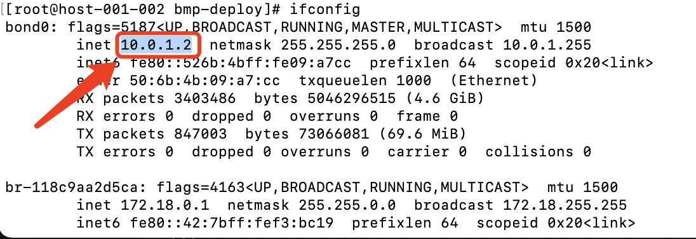

# 一键部署 BMP 系统
- [一键部署概述](#1)
  - [名词解释](#1.1)
  - [整体部署步骤](#1.2)
- [环境准备](#2)
- [管理节点部署](#3)
  - [环境准备](#3.1)
  - [配置环境参数](#3.2)
  - [一键部署 BMP](#3.3)
  - [访问 BMP](#3.4)
  - [BMP平台纳管物理服务器](#3.5)

## 一键部署概述
### 名词解释
-	BMP
裸金属管理平台，Bare Metal Manage Platform ，简称 BMP 。
-	manager节点
BMP管理服务器（管理节点），运行着所有BMP组件（除了bmp-agent）
-	bm节点
装机节点，正常工作用的物理服务器，未装机前无操作系统，装机阶段运行LiveOS，装机完成后运行GuestOS。
-	GuestOS 
正常工作的操作系统
-	LiveOS 
内存操作系统，里面预装了bmp-agent
-	带外网卡
物理服务器上用于与bmc通信的特殊网卡，又称ipmi网卡
-	管理网卡
物理服务器的标准的网卡，处在管理网络中

### 整体部署步骤
-	manager节点和bm节点在一个大二层网络中（如果仅体验BMP平台，不打算体验BMP裸金属装机流程，此步骤可跳过）
-	manager节点安装操作系统CentOS 7.9
-	配置bm节点上联tor的dhcp-relay地址为manager节点的ip地址（如果仅体验BMP平台，不打算体验BMP裸金属装机流程，此步骤可跳过）
-	在manager节点通过docker部署BMP平台 参考 [管理节点部署](#3)

## 环境准备
**环境准备包括 *网络环境准备* 和 *服务器准备* 两部分  
具体步骤参见：[环境准备](env-prepare.md)部分**

## 管理节点部署
~~~
第一步：环境准备  

第二步：配置环境参数  

第三步：一键部署 BMP

第四步：访问 BMP

第五步：BMP平台纳管物理服务器
~~~

### 第一步：环境准备

#### 1. 安装docker和docker compose
- yum安装方式(CentOS 7.9系统)
~~~
#可使用国内镜像源，比如清华镜像源
yum install -y yum-utils
yum-config-manager \
    --add-repo \
    https://mirrors.tuna.tsinghua.edu.cn/docker-ce/linux/centos/docker-ce.repo
sed -i 's+https://download.docker.com+https://mirrors.tuna.tsinghua.edu.cn/docker-ce+' /etc/yum.repos.d/docker-ce.repo

yum install -y docker-ce docker-ce-cli containerd.io docker-buildx-plugin docker-compose-plugin

systemctl start docker
~~~

更多安装方式请参考docker官网
- Docker官方文档地址：https://docs.docker.com/
- Docker Compose官方文档地址：https://docs.docker.com/compose/

### 2. 下载BMP源码到manager节点服务器
下载前先明确BMP的部署目录，本实例默认安装在用户家目录，首先
~~~
# 跳转到家目录，再执行后续下载命令
cd ~
~~~
找到主页右上角的 【Code】 按钮，点开下拉菜单，如图

- 方式一：用git clone命令
~~~
# 在管理节点执行,clone 上面复制的 HTTPS 链接,举例：
  git clone https://github.com/jd-opensource/Baremetal_Manage_Platform.git
~~~
- 方式二：点击 Download ZIP ，直接下载zip包后，手动传到管理服务器上
更多github操作，参考 github官方操作文档：  
https://docs.github.com/en/repositories/creating-and-managing-repositories/cloning-a-repository
- 方式三：可直接从京东云下载安装包
~~~
wget https://bmp.s3.cn-north-1.jdcloud-oss.com/opensource/Baremetal_Manage_Platform.zip
unzip Baremetal_Manage_Platform.zip -d Baremetal_Manage_Platform
~~~

### 第二步：配置环境参数
- 部署脚本目录 
  部署脚本位于 bmp-deploy目录下  
  目录内文件说明:[bmp-deploy文件和目录说明](bmp-deploy/bmp-deploy.md)

- 修改配置  
  编辑.env文件  
  - 修改BMP_HOST_IP为manager节点管理网卡ip。本示例为192.168.14.80，如果服务器多网卡，请配置其中一个ip。如果配置了bond，使用bond网卡。否则尽量选择私网IP地址网卡。
  ifconfig命令-bond0示例图

  ifconfig命令-eth0示例图

  - 修改BASE_REGISTRY，部署需要使用mysql/redis/mq/nginx等基础容器镜像，本示例默认从quay.io拉取，如果网络限制，请修改为其他公共或私有镜像仓库

  
~~~
cd ~/Baremetal_Manage_Platform/bmp-deploy/
# 查看服务器ip地址,优先查看bond0的ip地址，再次查看eth0的ip地址。如果不确定请咨询运维人员。
ifconfig

# 编辑环境变量
# 必须和manager节点服务器ip保持一致
# 设置  BMP_HOST_IP=192.168.14.80
vi .env
~~~

更多配置请参考[配置管理](bmp-deploy/config.md)

### 第三步：一键部署 BMP
- 安装BMP
~~~
cd ~/Baremetal_Manage_Platform/bmp-deploy/
bash bmp-deploy-precheck.sh -e public
bash bmp-deploy.sh start all
~~~

- 检查各服务状态
~~~
bash bmp-deploy.sh status all
~~~
正常情况下所有服务的状态都是running，如果某些服务未运行，参考[故障排查](bmp-deploy/troubleshoot.md)  
安装过程中会自动从京东对象存储下相关操作系统镜像，下载速度与服务器网速相关，请耐心等待  
更多服务管理操作，参考[服务管理](bmp-deploy/service-manage.md)

### 第四步：访问 BMP
注：默认账号：admin，密码：df9Ydfd$c

控制台：http://manager_ip:8080。本示例是http://192.168.14.80:8080。

运营平台: http://manager_ip:8081。本示例是http://192.168.14.80:8081。

### 第五步：管理平台纳管裸金属服务器
登录<u>BMP运营平台</u>，进入<u>设备管理</u>界面，导入bm节点信息

